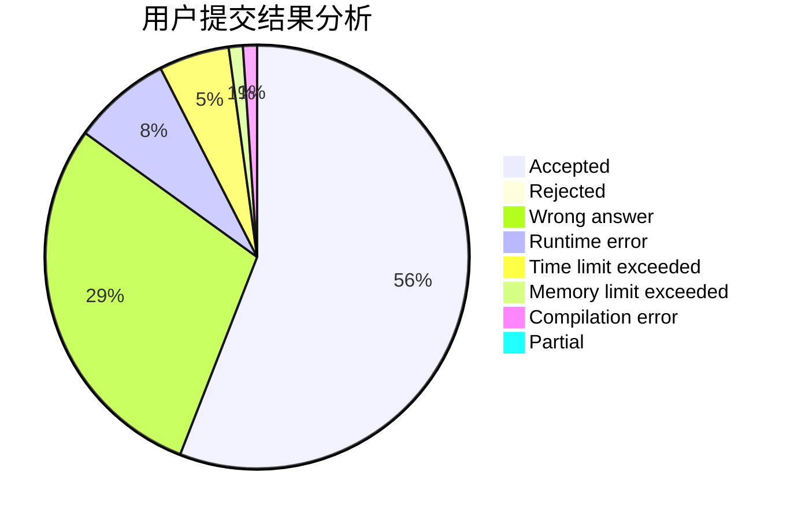
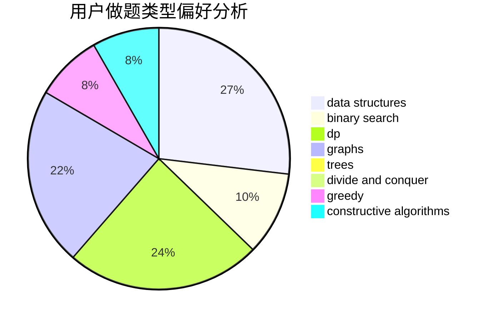
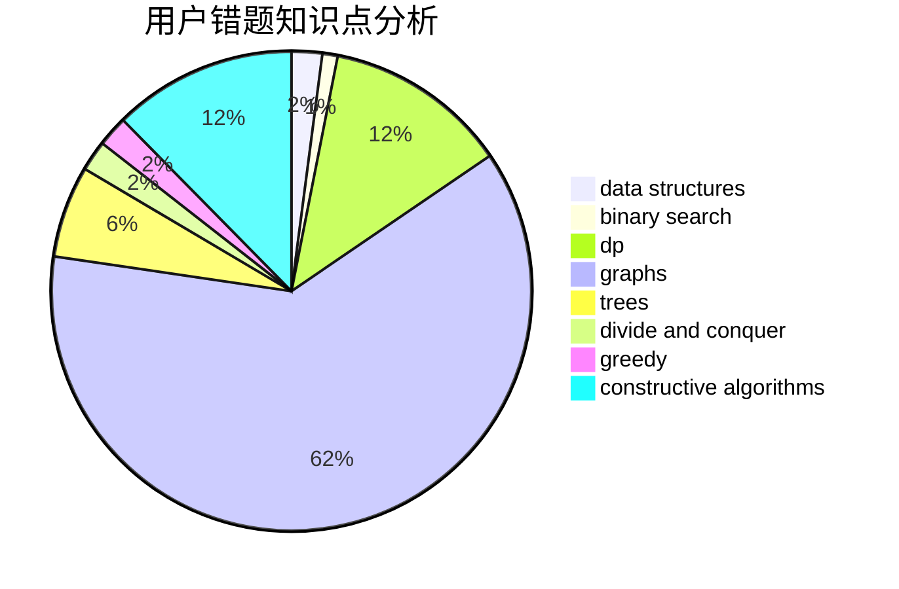

# HXLLL

<!-- tabs:start -->

#### **用户提交结果分析**

#### **用户做题类型偏好分析**

#### **用户错题知识点分析**

<!-- tabs:end -->
# 推荐题目
[412D](https://codeforces.com/contest/412/problem/D)		dfs and similar		  
[915F](https://codeforces.com/contest/915/problem/F)		data structures,
                        dsu,
                        graphs,
                        trees		  
[1434C](https://codeforces.com/contest/1434/problem/C)		dsu,graphs,sortings,trees		  
[1505G](https://codeforces.com/contest/1505/problem/G)		implementation		  
[1315F](https://codeforces.com/contest/1315/problem/F)		dsu,graphs,sortings,trees		  
[5132](https://codeforces.com/contest/513/problem/2)		dsu,graphs,sortings,trees		  
[838E](https://codeforces.com/contest/838/problem/E)		dp		  
[915D](https://codeforces.com/contest/915/problem/D)		dfs and similar,
                        graphs		  
[398A](https://codeforces.com/contest/398/problem/A)		constructive algorithms,
                        implementation		  
[915G](https://codeforces.com/contest/915/problem/G)		math,
                        number theory		  
