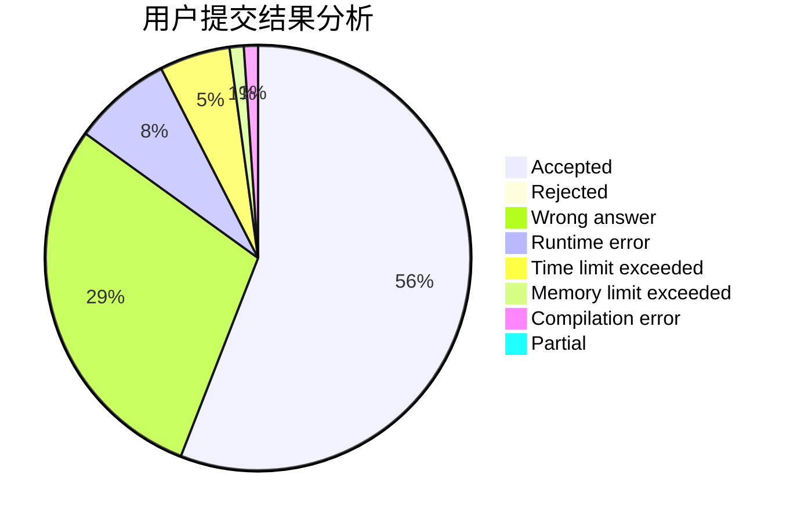
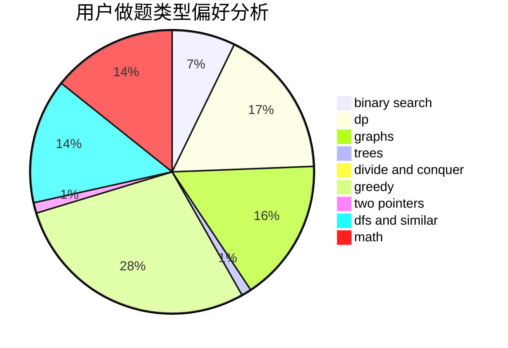

# HXLLL

<!-- tabs:start -->

#### **用户提交结果分析**

#### **用户做题类型偏好分析**

<!-- tabs:end -->
# 推荐题目
[412D](https://codeforces.com/contest/412/problem/D)
[915F](https://codeforces.com/contest/915/problem/F)
[1434C](https://codeforces.com/contest/1434/problem/C)
[1505G](https://codeforces.com/contest/1505/problem/G)
[1315F](https://codeforces.com/contest/1315/problem/F)
[5132](https://codeforces.com/contest/513/problem/2)
[838E](https://codeforces.com/contest/838/problem/E)
[915D](https://codeforces.com/contest/915/problem/D)
[398A](https://codeforces.com/contest/398/problem/A)
[915G](https://codeforces.com/contest/915/problem/G)
