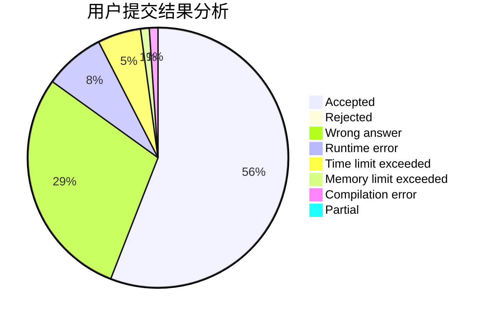
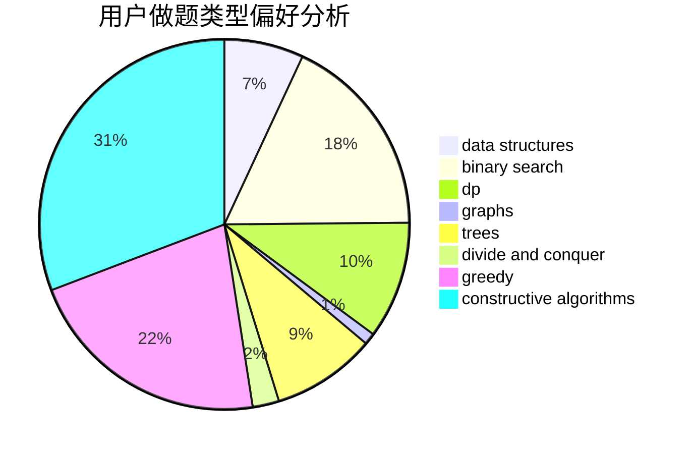
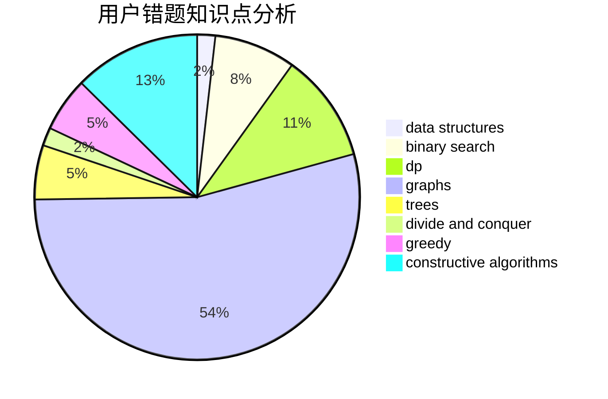

# HXLLL

<!-- tabs:start -->

#### **用户提交结果分析**

#### **用户做题类型偏好分析**

#### **用户错题知识点分析**

<!-- tabs:end -->
# 推荐题目
[380E](https://codeforces.com/contest/380/problem/E)		data structures		  
[899F](https://codeforces.com/contest/899/problem/F)		data structures,
                        strings		  
[1426A](https://codeforces.com/contest/1426/problem/A)		implementation,
                        math		  
[1497A](https://codeforces.com/contest/1497/problem/A)		brute force,
                        data structures,
                        greedy,
                        sortings		  
[1307D](https://codeforces.com/contest/1307/problem/D)		binary search,
                        data structures,
                        dfs and similar,
                        graphs,
                        greedy,
                        shortest paths,
                        sortings		  
[492E](https://codeforces.com/contest/492/problem/E)		math		  
[818F](https://codeforces.com/contest/818/problem/F)		binary search,
                        math,
                        ternary search		  
[899D](https://codeforces.com/contest/899/problem/D)		constructive algorithms,
                        math		  
[367B](https://codeforces.com/contest/367/problem/B)		binary search,
                        data structures		  
[8B](https://codeforces.com/contest/8/problem/B)		constructive algorithms,
                        graphs,
                        implementation		  
