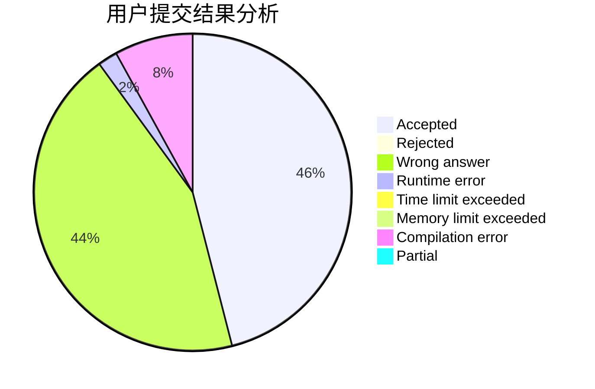
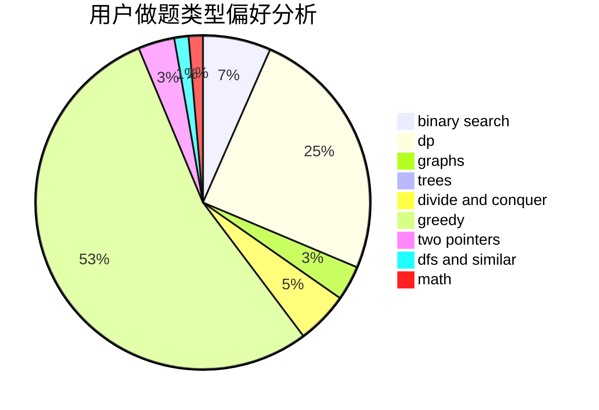

# HY_VFenux

<!-- tabs:start -->

#### **用户提交结果分析**

#### **用户做题类型偏好分析**

<!-- tabs:end -->
# 推荐题目
[768B](https://codeforces.com/contest/768/problem/B)
[613C](https://codeforces.com/contest/613/problem/C)
[61E](https://codeforces.com/contest/61/problem/E)
[472A](https://codeforces.com/contest/472/problem/A)
[1197B](https://codeforces.com/contest/1197/problem/B)
[916B](https://codeforces.com/contest/916/problem/B)
[512B](https://codeforces.com/contest/512/problem/B)
[1223A](https://codeforces.com/contest/1223/problem/A)
[842C](https://codeforces.com/contest/842/problem/C)
[1254A](https://codeforces.com/contest/1254/problem/A)
