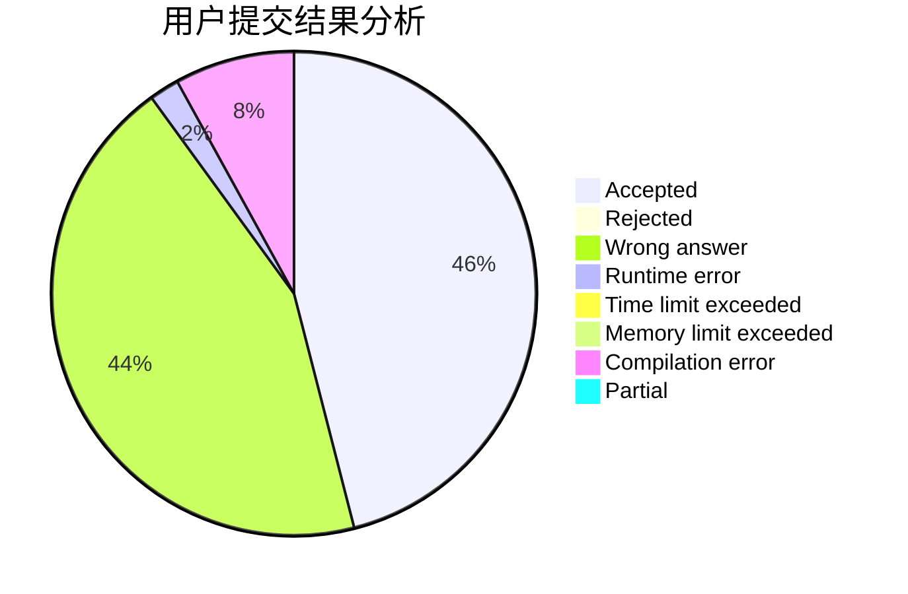
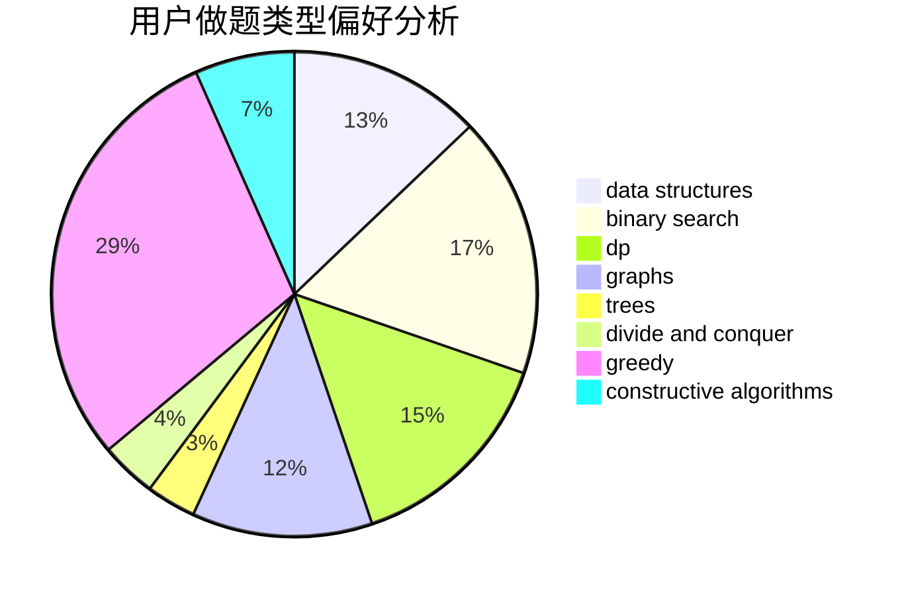
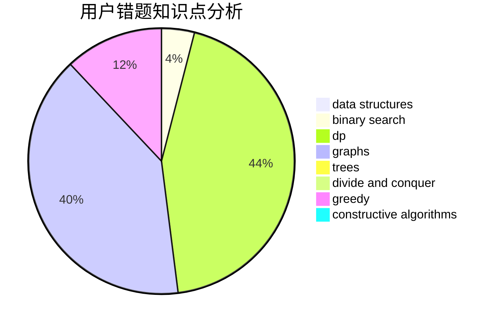

# HY_VFenux

<!-- tabs:start -->

#### **用户提交结果分析**

#### **用户做题类型偏好分析**

#### **用户错题知识点分析**

<!-- tabs:end -->
# 推荐题目
[768B](https://codeforces.com/contest/768/problem/B)		constructive algorithms,
                        dfs and similar,
                        divide and conquer		  
[613C](https://codeforces.com/contest/613/problem/C)		constructive algorithms,
                        math		  
[61E](https://codeforces.com/contest/61/problem/E)		data structures,
                        trees		  
[472A](https://codeforces.com/contest/472/problem/A)		math,
                        number theory		  
[1197B](https://codeforces.com/contest/1197/problem/B)		greedy,
                        implementation		  
[916B](https://codeforces.com/contest/916/problem/B)		bitmasks,
                        greedy,
                        math		  
[512B](https://codeforces.com/contest/512/problem/B)		dsu,graphs,sortings,trees		  
[1223A](https://codeforces.com/contest/1223/problem/A)		math		  
[842C](https://codeforces.com/contest/842/problem/C)		dfs and similar,
                        graphs,
                        math,
                        number theory,
                        trees		  
[1254A](https://codeforces.com/contest/1254/problem/A)		constructive algorithms,
                        greedy,
                        implementation		  
