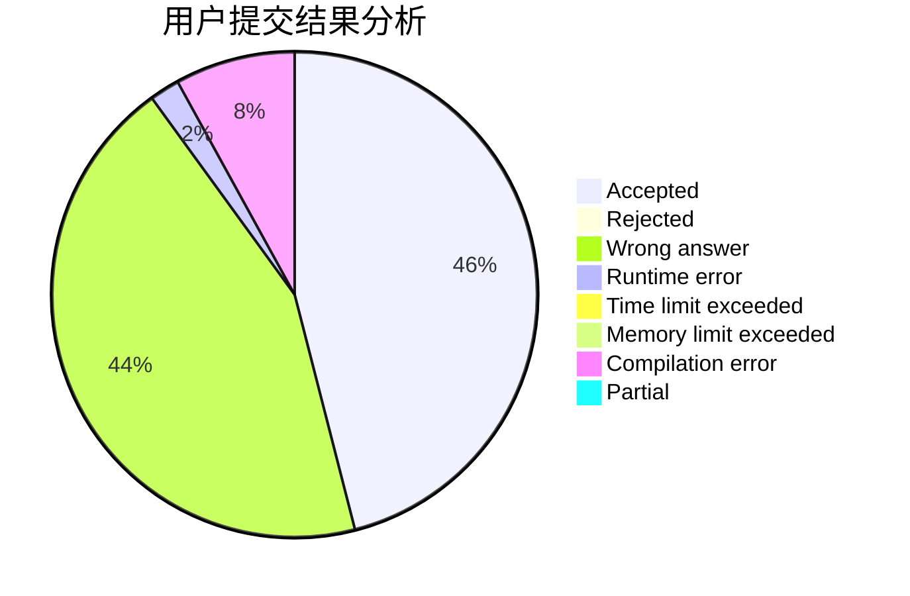
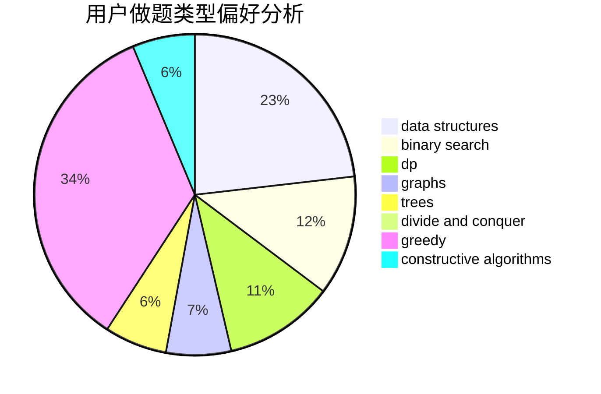
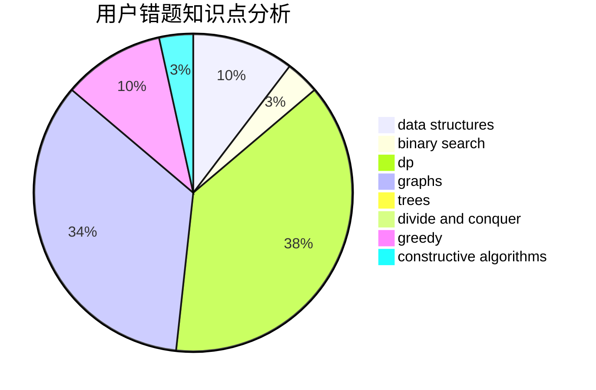

# HY_VFenux

<!-- tabs:start -->

#### **用户提交结果分析**

#### **用户做题类型偏好分析**

#### **用户错题知识点分析**

<!-- tabs:end -->
# 推荐题目
[749B](https://codeforces.com/contest/749/problem/B)		brute force,
                        constructive algorithms,
                        geometry		  
[596B](https://codeforces.com/contest/596/problem/B)		greedy,
                        implementation		  
[600D](https://codeforces.com/contest/600/problem/D)		geometry		  
[44G](https://codeforces.com/contest/44/problem/G)		data structures,
                        implementation		  
[1191C](https://codeforces.com/contest/1191/problem/C)		dsu,graphs,sortings,trees		  
[8D](https://codeforces.com/contest/8/problem/D)		binary search,
                        geometry		  
[491C](https://codeforces.com/contest/491/problem/C)		flows,
                        graph matchings		  
[1216D](https://codeforces.com/contest/1216/problem/D)		math		  
[822D](https://codeforces.com/contest/822/problem/D)		brute force,
                        dp,
                        greedy,
                        math,
                        number theory		  
[1250C](https://codeforces.com/contest/1250/problem/C)		data structures		  
