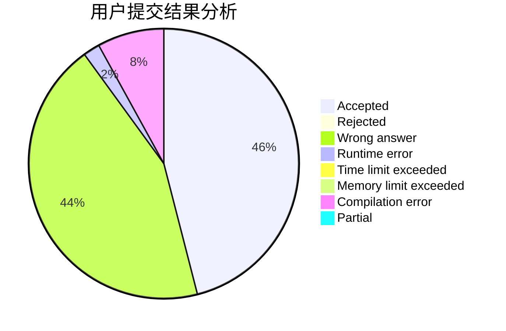
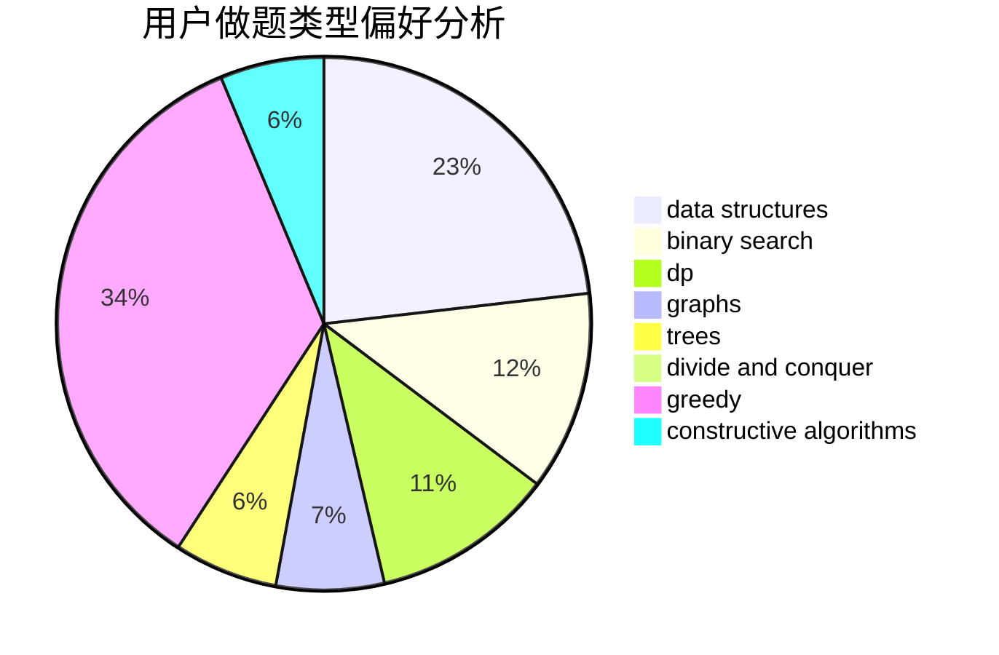
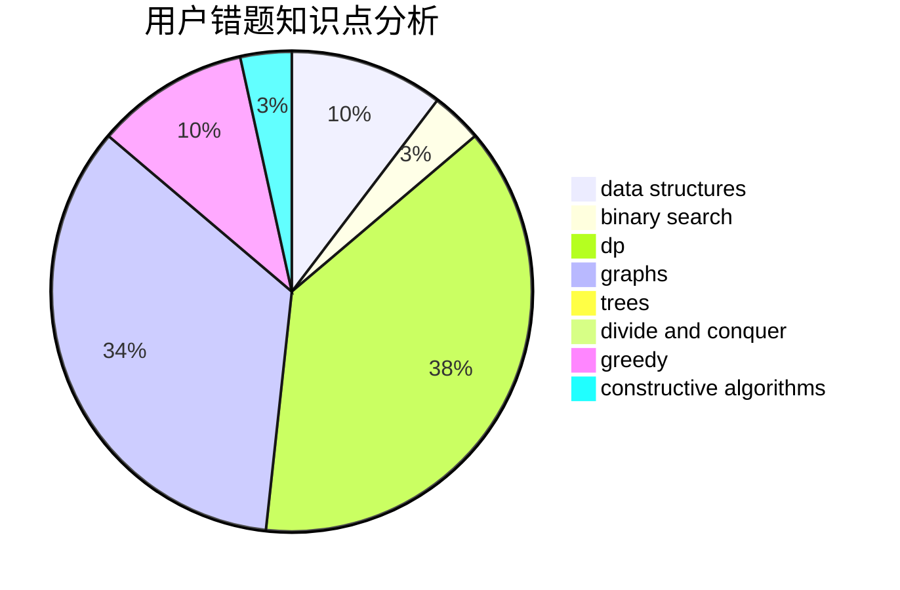

# HY_VFenux
<!-- tabs:start -->
#### **用户提交结果分析**

#### **用户做题类型偏好分析**

#### **用户错题知识点分析**

<!-- tabs:end -->
# 推荐题目
[Find String in a Grid](http://codeforces.com/problemset/problem/1252/D)		data structures,
                        dp,
                        strings,
                        trees		  
[Deciphering](http://codeforces.com/problemset/problem/491/C)		flows,
                        graph matchings		  
[ZS Shuffles Cards](http://codeforces.com/problemset/problem/1392/H)		combinatorics,
                        dp,
                        math,
                        probabilities		  
[Distinct Characters Queries](http://codeforces.com/problemset/problem/1234/D)		data structures		  
[Three Blocks Palindrome (hard version)](http://codeforces.com/problemset/problem/1335/E2)		brute force,
                        data structures,
                        dp,
                        two pointers		  
[Tokitsukaze and Discard Items](https://codeforces.com/contest/1191/problem/C)		implementation,
                        two pointers		  
[Sonya and Bitwise OR](http://codeforces.com/problemset/problem/1004/F)		bitmasks,
                        data structures,
                        divide and conquer		  
[Opening Portals](http://codeforces.com/problemset/problem/196/E)		dsu,
                        graphs,
                        shortest paths		  
[Road to Cinema](https://codeforces.com/contest/737/problem/A)		binary search,
                        greedy,
                        sortings		  
[Area of Two Circles' Intersection](http://codeforces.com/problemset/problem/600/D)		geometry		  
<!-- tabs:start -->
#### **data structures**
[Find String in a Grid](http://codeforces.com/problemset/problem/1252/D)		data structures,
                        dp,
                        strings,
                        trees		  
[Deciphering](http://codeforces.com/problemset/problem/1234/D)		data structures		  
[ZS Shuffles Cards](http://codeforces.com/problemset/problem/1335/E2)		brute force,
                        data structures,
                        dp,
                        two pointers		  
[Distinct Characters Queries](http://codeforces.com/problemset/problem/1004/F)		bitmasks,
                        data structures,
                        divide and conquer		  
[Three Blocks Palindrome (hard version)](http://codeforces.com/problemset/problem/1250/C)		data structures		  
[Tokitsukaze and Discard Items](http://codeforces.com/problemset/problem/44/G)		data structures,
                        implementation		  
[Sonya and Bitwise OR](http://codeforces.com/problemset/problem/817/F)		binary search,
                        data structures,
                        trees		  
[Opening Portals](http://codeforces.com/problemset/problem/1458/D)		data structures,
                        graphs,
                        greedy		  
[Road to Cinema](http://codeforces.com/problemset/problem/1408/D)		binary search,
                        brute force,
                        data structures,
                        dp,
                        implementation,
                        sortings,
                        two pointers		  
[Area of Two Circles' Intersection](http://codeforces.com/problemset/problem/1498/C)		brute force,
                        data structures,
                        dp		  
#### **binary search**
[Find String in a Grid](https://codeforces.com/contest/737/problem/A)		binary search,
                        greedy,
                        sortings		  
[Deciphering](http://codeforces.com/problemset/problem/1039/B)		binary search,
                        interactive,
                        probabilities		  
[ZS Shuffles Cards](http://codeforces.com/problemset/problem/8/D)		binary search,
                        geometry		  
[Distinct Characters Queries](http://codeforces.com/problemset/problem/817/F)		binary search,
                        data structures,
                        trees		  
[Three Blocks Palindrome (hard version)](http://codeforces.com/problemset/problem/1108/F)		binary search,
                        dsu,
                        graphs,
                        greedy		  
[Tokitsukaze and Discard Items](http://codeforces.com/problemset/problem/1408/D)		binary search,
                        brute force,
                        data structures,
                        dp,
                        implementation,
                        sortings,
                        two pointers		  
[Sonya and Bitwise OR](http://codeforces.com/problemset/problem/1492/C)		binary search,
                        data structures,
                        dp,
                        greedy,
                        two pointers		  
[Opening Portals](http://codeforces.com/problemset/problem/1463/D)		binary search,
                        constructive algorithms,
                        greedy,
                        two pointers		  
[Road to Cinema](http://codeforces.com/problemset/problem/1490/G)		binary search,
                        data structures,
                        math		  
[Area of Two Circles' Intersection](http://codeforces.com/problemset/problem/1479/D)		binary search,
                        bitmasks,
                        brute force,
                        data structures,
                        probabilities,
                        trees		  
#### **dp**
[Find String in a Grid](http://codeforces.com/problemset/problem/1252/D)		data structures,
                        dp,
                        strings,
                        trees		  
[Deciphering](http://codeforces.com/problemset/problem/1392/H)		combinatorics,
                        dp,
                        math,
                        probabilities		  
[ZS Shuffles Cards](http://codeforces.com/problemset/problem/1335/E2)		brute force,
                        data structures,
                        dp,
                        two pointers		  
[Distinct Characters Queries](http://codeforces.com/problemset/problem/822/D)		brute force,
                        dp,
                        greedy,
                        math,
                        number theory		  
[Three Blocks Palindrome (hard version)](http://codeforces.com/problemset/problem/8/E)		dp,
                        graphs		  
[Tokitsukaze and Discard Items](http://codeforces.com/problemset/problem/8/C)		bitmasks,
                        dp		  
[Sonya and Bitwise OR](http://codeforces.com/problemset/problem/1408/D)		binary search,
                        brute force,
                        data structures,
                        dp,
                        implementation,
                        sortings,
                        two pointers		  
[Opening Portals](http://codeforces.com/problemset/problem/1458/B)		dp		  
[Road to Cinema](http://codeforces.com/problemset/problem/1498/C)		brute force,
                        data structures,
                        dp		  
[Area of Two Circles' Intersection](http://codeforces.com/problemset/problem/1389/B)		brute force,
                        dp,
                        greedy		  
#### **graph**
[Find String in a Grid](http://codeforces.com/problemset/problem/491/C)		flows,
                        graph matchings		  
[Deciphering](http://codeforces.com/problemset/problem/196/E)		dsu,
                        graphs,
                        shortest paths		  
[ZS Shuffles Cards](http://codeforces.com/problemset/problem/8/E)		dp,
                        graphs		  
[Distinct Characters Queries](http://codeforces.com/problemset/problem/103/E)		flows,
                        graph matchings		  
[Three Blocks Palindrome (hard version)](http://codeforces.com/problemset/problem/1458/D)		data structures,
                        graphs,
                        greedy		  
[Tokitsukaze and Discard Items](http://codeforces.com/problemset/problem/1108/F)		binary search,
                        dsu,
                        graphs,
                        greedy		  
[Sonya and Bitwise OR](https://codeforces.com/contest/1341/problem/D)		bitmasks,
                        dp,
                        graphs,
                        greedy		  
[Opening Portals](http://codeforces.com/problemset/problem/1487/C)		brute force,
                        constructive algorithms,
                        dfs and similar,
                        graphs,
                        greedy,
                        implementation,
                        math		  
[Road to Cinema](http://codeforces.com/problemset/problem/1437/C)		dp,
                        flows,
                        graph matchings,
                        greedy,
                        math,
                        sortings		  
[Area of Two Circles' Intersection](http://codeforces.com/problemset/problem/1470/D)		constructive algorithms,
                        dfs and similar,
                        graph matchings,
                        graphs,
                        greedy		  
#### **trees**
[Find String in a Grid](http://codeforces.com/problemset/problem/1252/D)		data structures,
                        dp,
                        strings,
                        trees		  
[Deciphering](http://codeforces.com/problemset/problem/817/F)		binary search,
                        data structures,
                        trees		  
[ZS Shuffles Cards](http://codeforces.com/problemset/problem/1479/D)		binary search,
                        bitmasks,
                        brute force,
                        data structures,
                        probabilities,
                        trees		  
[Distinct Characters Queries](http://codeforces.com/problemset/problem/1511/C)		brute force,
                        data structures,
                        implementation,
                        trees		  
[Three Blocks Palindrome (hard version)](http://codeforces.com/problemset/problem/1499/F)		combinatorics,
                        dfs and similar,
                        dp,
                        trees		  
[Tokitsukaze and Discard Items](http://codeforces.com/problemset/problem/1491/E)		brute force,
                        dfs and similar,
                        divide and conquer,
                        number theory,
                        trees		  
[Sonya and Bitwise OR](http://codeforces.com/problemset/problem/1466/D)		data structures,
                        greedy,
                        sortings,
                        trees		  
[Opening Portals](http://codeforces.com/problemset/problem/1495/D)		combinatorics,
                        dfs and similar,
                        graphs,
                        math,
                        shortest paths,
                        trees		  
[Road to Cinema](http://codeforces.com/problemset/problem/1303/G)		data structures,
                        divide and conquer,
                        geometry,
                        trees		  
[Area of Two Circles' Intersection](http://codeforces.com/problemset/problem/1454/E)		combinatorics,
                        dfs and similar,
                        graphs,
                        trees		  
#### **divide and conquer**
[Find String in a Grid](http://codeforces.com/problemset/problem/1004/F)		bitmasks,
                        data structures,
                        divide and conquer		  
[Deciphering](http://codeforces.com/problemset/problem/1461/D)		binary search,
                        brute force,
                        data structures,
                        divide and conquer,
                        implementation,
                        sortings		  
[ZS Shuffles Cards](http://codeforces.com/problemset/problem/1466/G)		combinatorics,
                        divide and conquer,
                        hashing,
                        math,
                        string suffix structures,
                        strings		  
[Distinct Characters Queries](http://codeforces.com/problemset/problem/1490/D)		dfs and similar,
                        divide and conquer,
                        implementation		  
[Three Blocks Palindrome (hard version)](https://codeforces.com/contest/1483/problem/C)		data structures,
                        divide and conquer,
                        dp		  
[Tokitsukaze and Discard Items](http://codeforces.com/problemset/problem/1491/E)		brute force,
                        dfs and similar,
                        divide and conquer,
                        number theory,
                        trees		  
[Sonya and Bitwise OR](http://codeforces.com/problemset/problem/1303/G)		data structures,
                        divide and conquer,
                        geometry,
                        trees		  
[Opening Portals](http://codeforces.com/problemset/problem/1494/D)		constructive algorithms,
                        data structures,
                        dfs and similar,
                        divide and conquer,
                        dsu,
                        greedy,
                        sortings,
                        trees		  
[Road to Cinema](http://codeforces.com/problemset/problem/1482/E)		data structures,
                        divide and conquer,
                        dp		  
[Area of Two Circles' Intersection](http://codeforces.com/problemset/problem/566/C)		dfs and similar,
                        divide and conquer,
                        trees		  
#### **greedy**
[Find String in a Grid](https://codeforces.com/contest/737/problem/A)		binary search,
                        greedy,
                        sortings		  
[Deciphering](http://codeforces.com/problemset/problem/822/D)		brute force,
                        dp,
                        greedy,
                        math,
                        number theory		  
[ZS Shuffles Cards](http://codeforces.com/problemset/problem/1148/E)		constructive algorithms,
                        greedy,
                        math,
                        sortings,
                        two pointers		  
[Distinct Characters Queries](https://codeforces.com/contest/516/problem/B)		constructive algorithms,
                        greedy		  
[Three Blocks Palindrome (hard version)](http://codeforces.com/problemset/problem/1458/D)		data structures,
                        graphs,
                        greedy		  
[Tokitsukaze and Discard Items](http://codeforces.com/problemset/problem/1108/F)		binary search,
                        dsu,
                        graphs,
                        greedy		  
[Sonya and Bitwise OR](http://codeforces.com/problemset/problem/596/B)		greedy,
                        implementation		  
[Opening Portals](http://codeforces.com/problemset/problem/1392/A)		greedy,
                        math		  
[Road to Cinema](http://codeforces.com/problemset/problem/1114/A)		brute force,
                        greedy,
                        implementation		  
[Area of Two Circles' Intersection](http://codeforces.com/problemset/problem/1389/B)		brute force,
                        dp,
                        greedy		  
#### **constructive algorithms**
[Find String in a Grid](http://codeforces.com/problemset/problem/749/B)		brute force,
                        constructive algorithms,
                        geometry		  
[Deciphering](http://codeforces.com/problemset/problem/734/F)		bitmasks,
                        constructive algorithms,
                        implementation,
                        math		  
[ZS Shuffles Cards](http://codeforces.com/problemset/problem/1148/E)		constructive algorithms,
                        greedy,
                        math,
                        sortings,
                        two pointers		  
[Distinct Characters Queries](https://codeforces.com/contest/516/problem/B)		constructive algorithms,
                        greedy		  
[Three Blocks Palindrome (hard version)](http://codeforces.com/problemset/problem/1436/B)		constructive algorithms,
                        math		  
[Tokitsukaze and Discard Items](http://codeforces.com/problemset/problem/1493/A)		constructive algorithms,
                        greedy		  
[Sonya and Bitwise OR](http://codeforces.com/problemset/problem/1463/D)		binary search,
                        constructive algorithms,
                        greedy,
                        two pointers		  
[Opening Portals](https://codeforces.com/contest/1456/problem/B)		bitmasks,
                        brute force,
                        constructive algorithms		  
[Road to Cinema](http://codeforces.com/problemset/problem/1492/D)		bitmasks,
                        constructive algorithms,
                        greedy,
                        math		  
[Area of Two Circles' Intersection](https://codeforces.com/contest/1504/problem/D)		constructive algorithms,
                        games,
                        interactive		  
#### **sortings**
[Find String in a Grid](https://codeforces.com/contest/737/problem/A)		binary search,
                        greedy,
                        sortings		  
[Deciphering](http://codeforces.com/problemset/problem/1148/E)		constructive algorithms,
                        greedy,
                        math,
                        sortings,
                        two pointers		  
[ZS Shuffles Cards](http://codeforces.com/problemset/problem/632/C)		sortings,
                        strings		  
[Distinct Characters Queries](http://codeforces.com/problemset/problem/1408/D)		binary search,
                        brute force,
                        data structures,
                        dp,
                        implementation,
                        sortings,
                        two pointers		  
[Three Blocks Palindrome (hard version)](https://codeforces.com/contest/1496/problem/C)		geometry,
                        greedy,
                        math,
                        sortings		  
[Tokitsukaze and Discard Items](http://codeforces.com/problemset/problem/1495/A)		geometry,
                        greedy,
                        math,
                        sortings		  
[Sonya and Bitwise OR](http://codeforces.com/problemset/problem/1497/A)		brute force,
                        data structures,
                        greedy,
                        sortings		  
[Opening Portals](http://codeforces.com/problemset/problem/1427/A)		math,
                        sortings		  
[Road to Cinema](http://codeforces.com/problemset/problem/1461/D)		binary search,
                        brute force,
                        data structures,
                        divide and conquer,
                        implementation,
                        sortings		  
[Area of Two Circles' Intersection](http://codeforces.com/problemset/problem/1437/C)		dp,
                        flows,
                        graph matchings,
                        greedy,
                        math,
                        sortings		  
<!-- tabs:end -->
