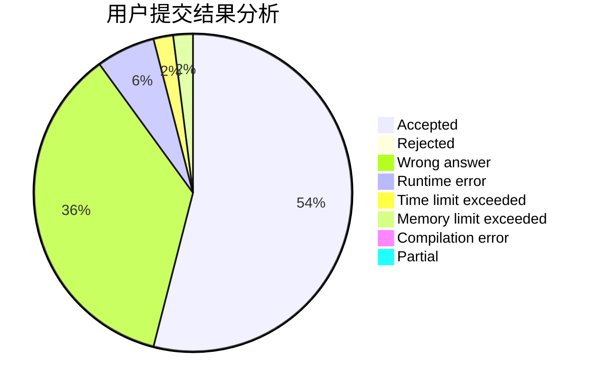
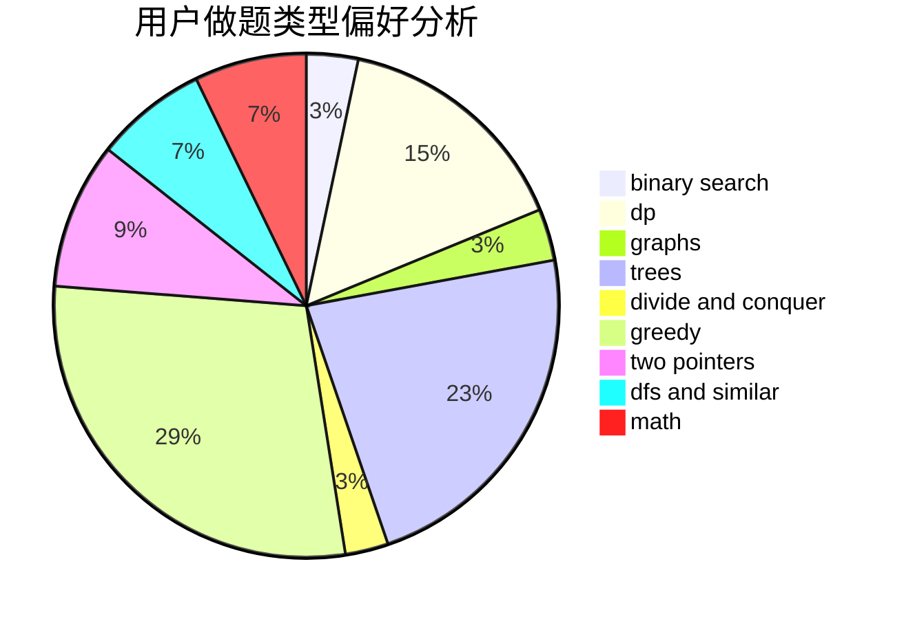

# HackerMonk

<!-- tabs:start -->

#### **用户提交结果分析**

#### **用户做题类型偏好分析**

<!-- tabs:end -->
# 推荐题目
[916D](https://codeforces.com/contest/916/problem/D)
[1215D](https://codeforces.com/contest/1215/problem/D)
[590C](https://codeforces.com/contest/590/problem/C)
[821C](https://codeforces.com/contest/821/problem/C)
[1061B](https://codeforces.com/contest/1061/problem/B)
[721E](https://codeforces.com/contest/721/problem/E)
[1345F](https://codeforces.com/contest/1345/problem/F)
[292E](https://codeforces.com/contest/292/problem/E)
[839A](https://codeforces.com/contest/839/problem/A)
[526G](https://codeforces.com/contest/526/problem/G)
