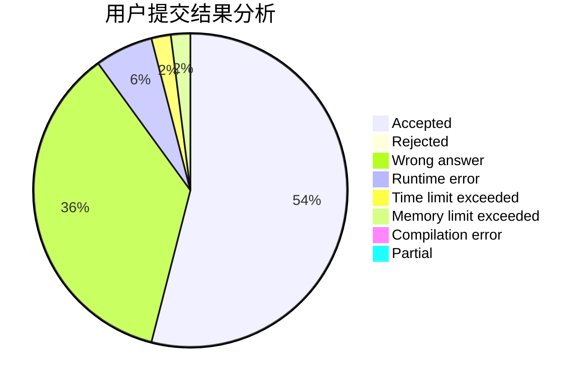
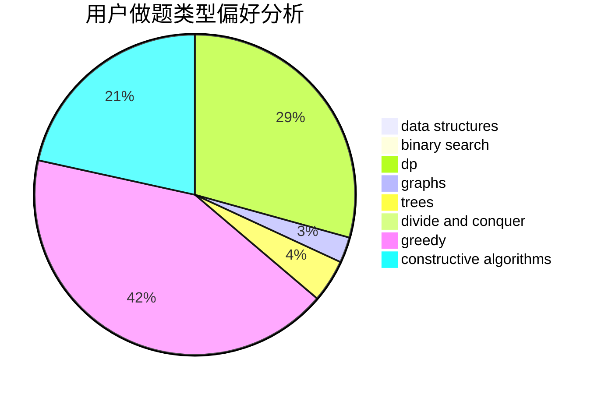
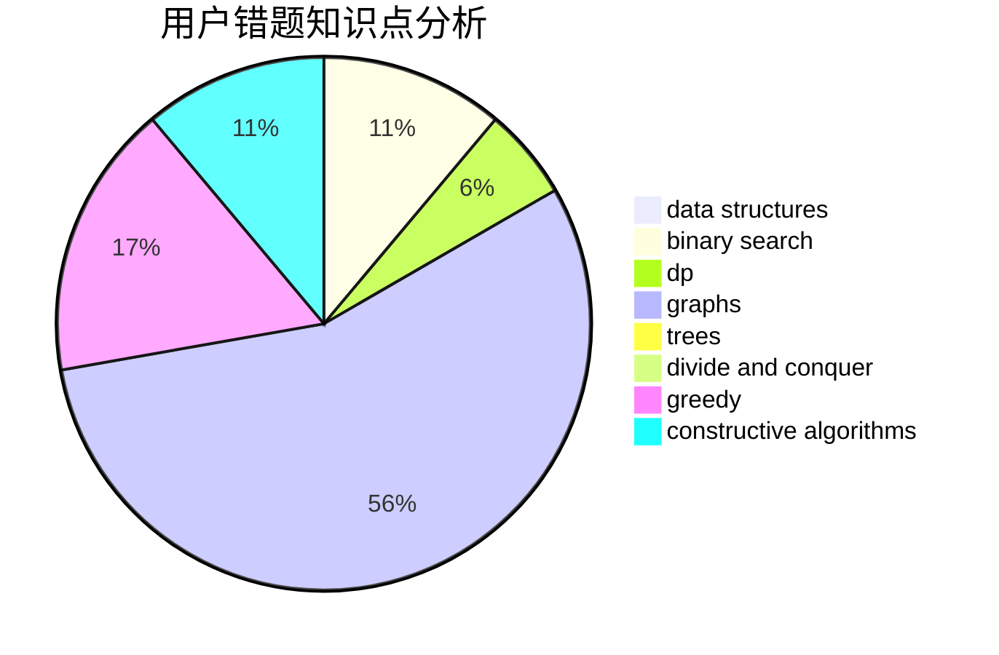

# HackerMonk

<!-- tabs:start -->

#### **用户提交结果分析**

#### **用户做题类型偏好分析**

#### **用户错题知识点分析**

<!-- tabs:end -->
# 推荐题目
[900A](https://codeforces.com/contest/900/problem/A)		geometry,
                        implementation		  
[1209G1](https://codeforces.com/contest/1209G/problem/1)		data structures,
                        dsu,
                        greedy,
                        implementation,
                        two pointers		  
[570A](https://codeforces.com/contest/570/problem/A)		implementation		  
[805B](https://codeforces.com/contest/805/problem/B)		constructive algorithms		  
[1060F](https://codeforces.com/contest/1060/problem/F)		combinatorics,
                        dp		  
[703A](https://codeforces.com/contest/703/problem/A)		implementation		  
[1338E](https://codeforces.com/contest/1338/problem/E)		graphs		  
[277D](https://codeforces.com/contest/277/problem/D)		dp,
                        probabilities		  
[819A](https://codeforces.com/contest/819/problem/A)		games,
                        greedy		  
[506D](https://codeforces.com/contest/506/problem/D)		brute force,
                        dfs and similar,
                        dsu,
                        graphs		  
