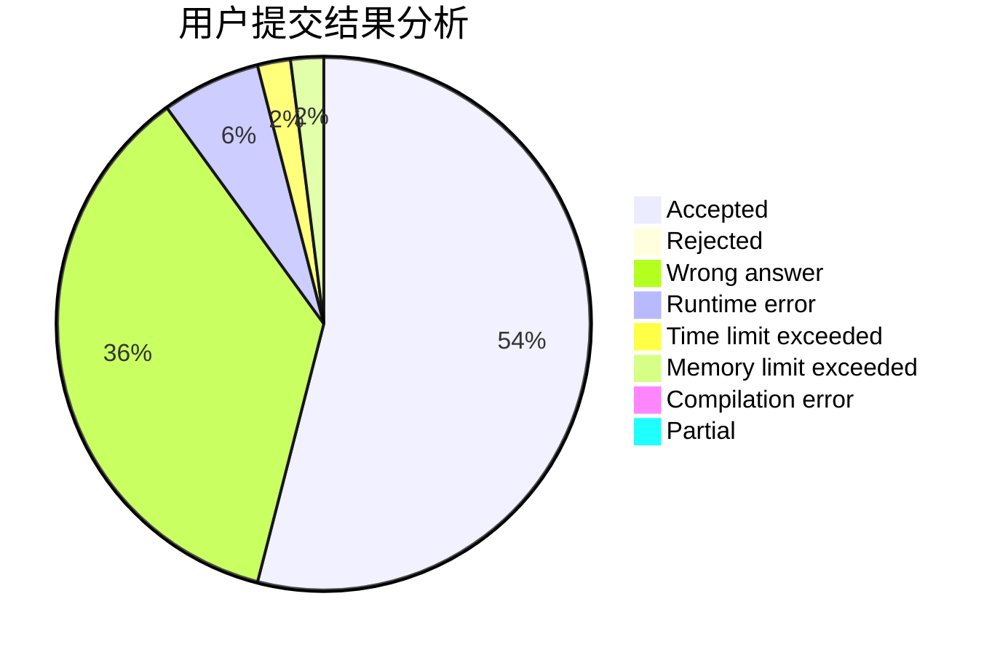
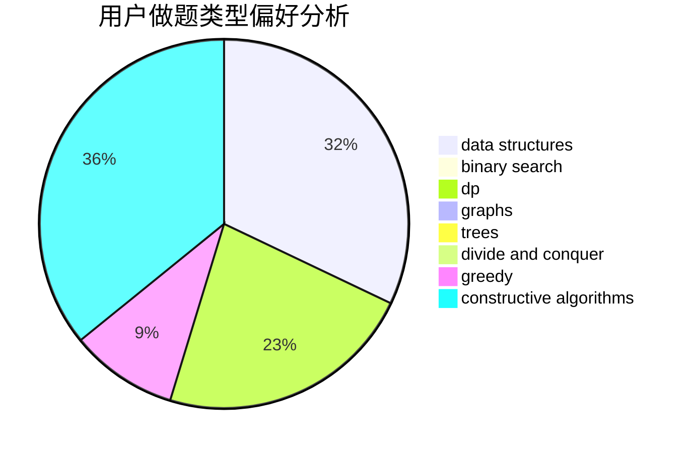
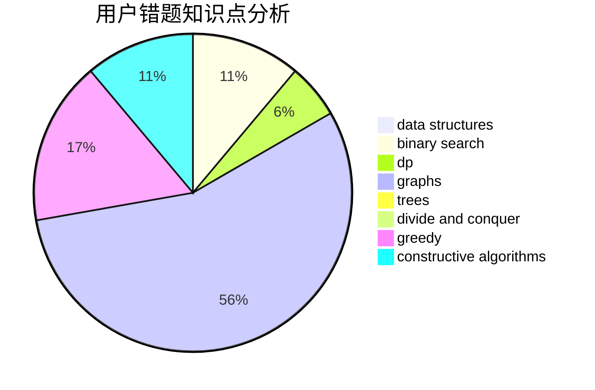

# HackerMonk

<!-- tabs:start -->

#### **用户提交结果分析**

#### **用户做题类型偏好分析**

#### **用户错题知识点分析**

<!-- tabs:end -->
# 推荐题目
[916D](https://codeforces.com/contest/916/problem/D)		data structures,
                        interactive,
                        trees		  
[1215D](https://codeforces.com/contest/1215/problem/D)		games,
                        greedy,
                        math		  
[590C](https://codeforces.com/contest/590/problem/C)		dfs and similar,
                        graphs,
                        shortest paths		  
[821C](https://codeforces.com/contest/821/problem/C)		data structures,
                        greedy,
                        trees		  
[1061B](https://codeforces.com/contest/1061/problem/B)		greedy,
                        implementation,
                        sortings		  
[721E](https://codeforces.com/contest/721/problem/E)		binary search,
                        dp		  
[1345F](https://codeforces.com/contest/1345/problem/F)		dsu,graphs,sortings,trees		  
[292E](https://codeforces.com/contest/292/problem/E)		data structures		  
[839A](https://codeforces.com/contest/839/problem/A)		implementation		  
[526G](https://codeforces.com/contest/526/problem/G)		greedy,
                        trees		  
