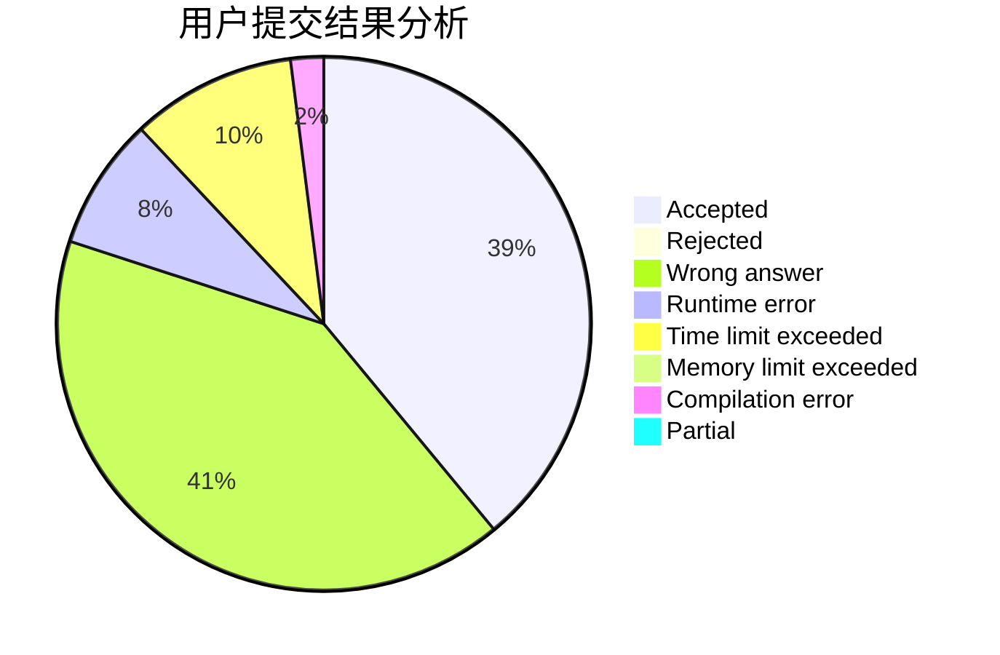
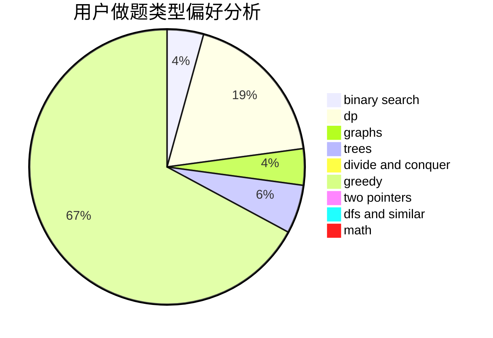

# HanZhongBalls

<!-- tabs:start -->

#### **用户提交结果分析**

#### **用户做题类型偏好分析**

<!-- tabs:end -->
# 推荐题目
[48A](https://codeforces.com/contest/48/problem/A)
[1106A](https://codeforces.com/contest/1106/problem/A)
[1161D](https://codeforces.com/contest/1161/problem/D)
[1288C](https://codeforces.com/contest/1288/problem/C)
[1468E](https://codeforces.com/contest/1468/problem/E)
[1490C](https://codeforces.com/contest/1490/problem/C)
[1497B](https://codeforces.com/contest/1497/problem/B)
[1491C](https://codeforces.com/contest/1491/problem/C)
[1484C](https://codeforces.com/contest/1484/problem/C)
[1480A](https://codeforces.com/contest/1480/problem/A)
