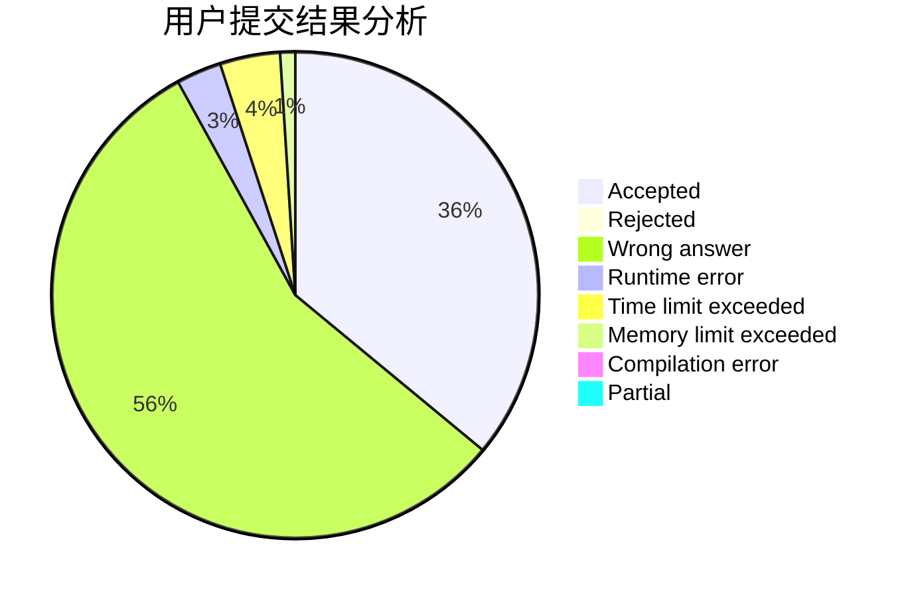
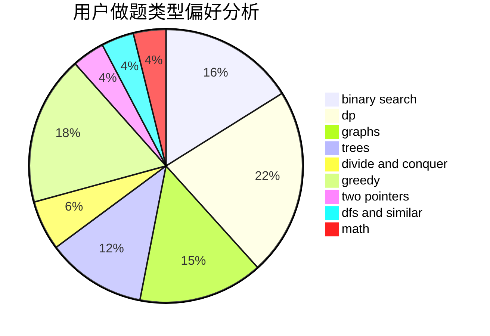

# Hank2019

<!-- tabs:start -->

#### **用户提交结果分析**

#### **用户做题类型偏好分析**

<!-- tabs:end -->
# 推荐题目
[1506C](https://codeforces.com/contest/1506/problem/C)
[76A](https://codeforces.com/contest/76/problem/A)
[804F](https://codeforces.com/contest/804/problem/F)
[527C](https://codeforces.com/contest/527/problem/C)
[80A](https://codeforces.com/contest/80/problem/A)
[126B](https://codeforces.com/contest/126/problem/B)
[1240E](https://codeforces.com/contest/1240/problem/E)
[1037B](https://codeforces.com/contest/1037/problem/B)
[742D](https://codeforces.com/contest/742/problem/D)
[377C](https://codeforces.com/contest/377/problem/C)
