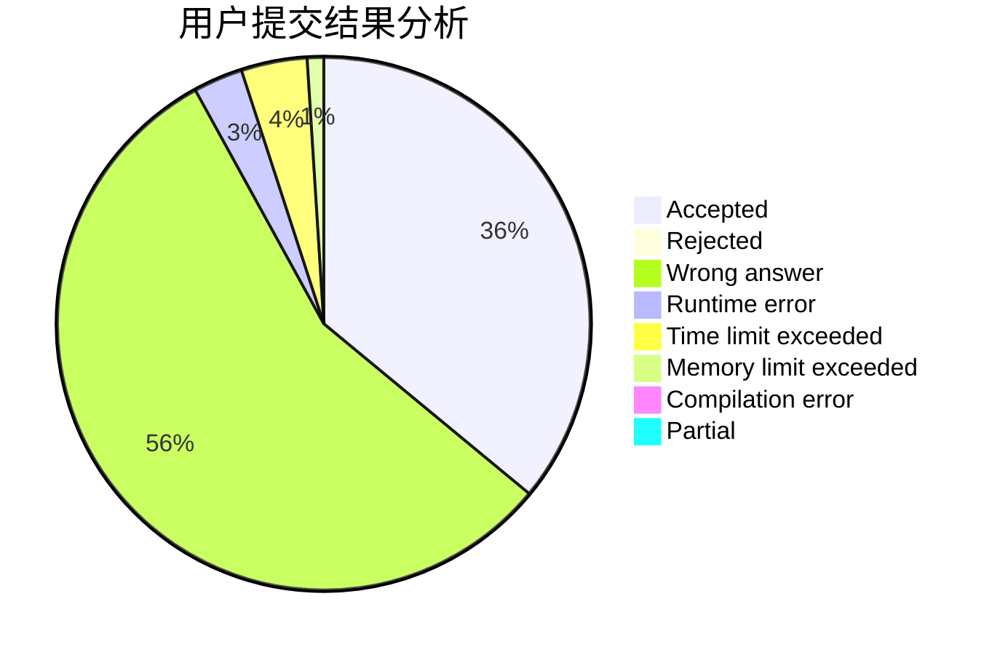
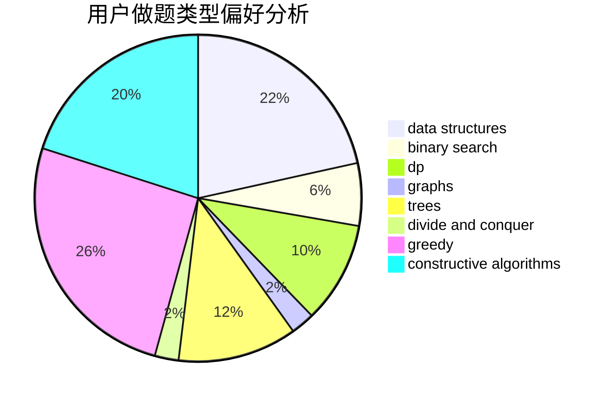
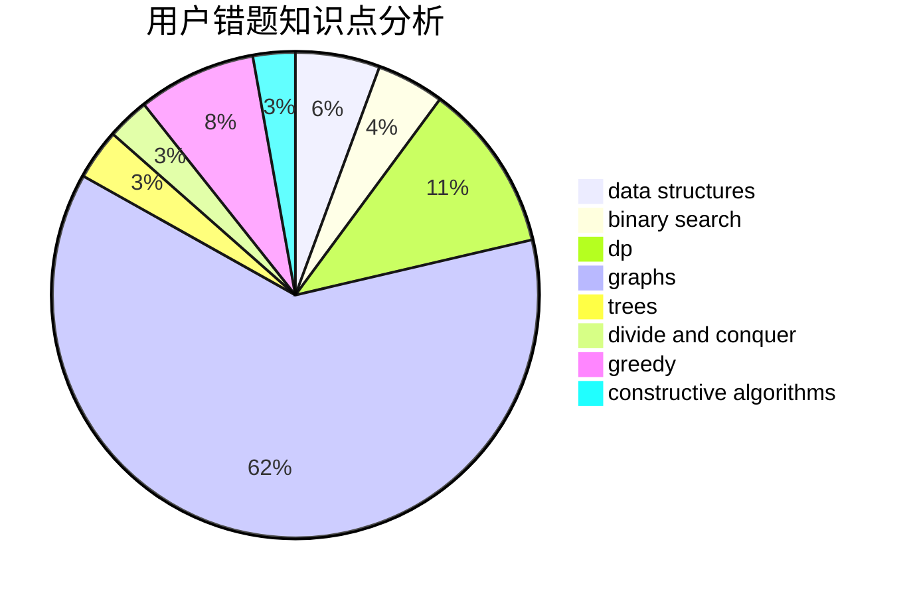

# Hank2019
<!-- tabs:start -->
#### **用户提交结果分析**

#### **用户做题类型偏好分析**

#### **用户错题知识点分析**

<!-- tabs:end -->
# 推荐题目
[Square-free division (easy version)](http://codeforces.com/problemset/problem/1497/E1)		data structures,
                        dp,
                        greedy,
                        math,
                        number theory,
                        two pointers		  
[Weird journey](https://codeforces.com/contest/789/problem/D)		combinatorics,
                        constructive algorithms,
                        dfs and similar,
                        dsu,
                        graphs		  
[Amr and Pins](http://codeforces.com/problemset/problem/507/B)		geometry,
                        math		  
[Almost Regular Bracket Sequence](http://codeforces.com/problemset/problem/1095/E)		implementation		  
[Anfisa the Monkey](http://codeforces.com/problemset/problem/44/E)		dp		  
[Oleg and shares](http://codeforces.com/problemset/problem/793/A)		implementation,
                        math		  
[Replace All](http://codeforces.com/problemset/problem/794/G)		combinatorics,
                        dp,
                        math		  
[Xor Permutations](http://codeforces.com/problemset/problem/1168/E)		constructive algorithms,
                        math		  
[Adding Digits](http://codeforces.com/problemset/problem/260/A)		implementation,
                        math		  
[Wet Shark and Bishops](http://codeforces.com/problemset/problem/621/B)		combinatorics,
                        implementation		  
<!-- tabs:start -->
#### **data structures**
[Square-free division (easy version)](http://codeforces.com/problemset/problem/1497/E1)		data structures,
                        dp,
                        greedy,
                        math,
                        number theory,
                        two pointers		  
[Weird journey](http://codeforces.com/problemset/problem/1492/C)		binary search,
                        data structures,
                        dp,
                        greedy,
                        two pointers		  
[Amr and Pins](http://codeforces.com/problemset/problem/1490/G)		binary search,
                        data structures,
                        math		  
[Almost Regular Bracket Sequence](http://codeforces.com/problemset/problem/1479/D)		binary search,
                        bitmasks,
                        brute force,
                        data structures,
                        probabilities,
                        trees		  
[Anfisa the Monkey](http://codeforces.com/problemset/problem/1497/A)		brute force,
                        data structures,
                        greedy,
                        sortings		  
[Oleg and shares](http://codeforces.com/problemset/problem/1491/C)		brute force,
                        data structures,
                        dp,
                        greedy,
                        implementation		  
[Replace All](http://codeforces.com/problemset/problem/1492/B)		data structures,
                        greedy,
                        math		  
[Xor Permutations](http://codeforces.com/problemset/problem/1436/E)		binary search,
                        data structures,
                        two pointers		  
[Adding Digits](http://codeforces.com/problemset/problem/1461/D)		binary search,
                        brute force,
                        data structures,
                        divide and conquer,
                        implementation,
                        sortings		  
[Wet Shark and Bishops](http://codeforces.com/problemset/problem/1511/C)		brute force,
                        data structures,
                        implementation,
                        trees		  
#### **binary search**
[Square-free division (easy version)](http://codeforces.com/problemset/problem/750/A)		binary search,
                        brute force,
                        implementation,
                        math		  
[Weird journey](http://codeforces.com/problemset/problem/1492/C)		binary search,
                        data structures,
                        dp,
                        greedy,
                        two pointers		  
[Amr and Pins](http://codeforces.com/problemset/problem/1463/D)		binary search,
                        constructive algorithms,
                        greedy,
                        two pointers		  
[Almost Regular Bracket Sequence](http://codeforces.com/problemset/problem/1490/G)		binary search,
                        data structures,
                        math		  
[Anfisa the Monkey](http://codeforces.com/problemset/problem/1479/D)		binary search,
                        bitmasks,
                        brute force,
                        data structures,
                        probabilities,
                        trees		  
[Oleg and shares](http://codeforces.com/problemset/problem/1436/E)		binary search,
                        data structures,
                        two pointers		  
[Replace All](http://codeforces.com/problemset/problem/1461/D)		binary search,
                        brute force,
                        data structures,
                        divide and conquer,
                        implementation,
                        sortings		  
[Xor Permutations](http://codeforces.com/problemset/problem/1493/C)		binary search,
                        brute force,
                        constructive algorithms,
                        greedy,
                        strings		  
[Adding Digits](http://codeforces.com/problemset/problem/1487/D)		binary search,
                        brute force,
                        math,
                        number theory		  
[Wet Shark and Bishops](http://codeforces.com/problemset/problem/1486/B)		binary search,
                        geometry,
                        shortest paths,
                        sortings		  
#### **dp**
[Square-free division (easy version)](http://codeforces.com/problemset/problem/1497/E1)		data structures,
                        dp,
                        greedy,
                        math,
                        number theory,
                        two pointers		  
[Weird journey](http://codeforces.com/problemset/problem/44/E)		dp		  
[Amr and Pins](http://codeforces.com/problemset/problem/794/G)		combinatorics,
                        dp,
                        math		  
[Almost Regular Bracket Sequence](http://codeforces.com/problemset/problem/830/E)		constructive algorithms,
                        dp,
                        graphs,
                        implementation,
                        math,
                        trees		  
[Anfisa the Monkey](http://codeforces.com/problemset/problem/508/E)		dp,
                        greedy		  
[Oleg and shares](http://codeforces.com/problemset/problem/1492/C)		binary search,
                        data structures,
                        dp,
                        greedy,
                        two pointers		  
[Replace All](https://codeforces.com/contest/1457/problem/C)		brute force,
                        dp,
                        implementation		  
[Xor Permutations](http://codeforces.com/problemset/problem/1491/C)		brute force,
                        data structures,
                        dp,
                        greedy,
                        implementation		  
[Adding Digits](http://codeforces.com/problemset/problem/1437/C)		dp,
                        flows,
                        graph matchings,
                        greedy,
                        math,
                        sortings		  
[Wet Shark and Bishops](http://codeforces.com/problemset/problem/1499/B)		brute force,
                        dp,
                        greedy,
                        implementation		  
#### **graph**
[Square-free division (easy version)](https://codeforces.com/contest/789/problem/D)		combinatorics,
                        constructive algorithms,
                        dfs and similar,
                        dsu,
                        graphs		  
[Weird journey](http://codeforces.com/problemset/problem/350/B)		graphs		  
[Amr and Pins](http://codeforces.com/problemset/problem/770/C)		*special problem,
                        dfs and similar,
                        graphs,
                        implementation		  
[Almost Regular Bracket Sequence](http://codeforces.com/problemset/problem/724/G)		bitmasks,
                        graphs,
                        math,
                        number theory,
                        trees		  
[Anfisa the Monkey](http://codeforces.com/problemset/problem/830/E)		constructive algorithms,
                        dp,
                        graphs,
                        implementation,
                        math,
                        trees		  
[Oleg and shares](http://codeforces.com/problemset/problem/1487/C)		brute force,
                        constructive algorithms,
                        dfs and similar,
                        graphs,
                        greedy,
                        implementation,
                        math		  
[Replace All](http://codeforces.com/problemset/problem/1437/C)		dp,
                        flows,
                        graph matchings,
                        greedy,
                        math,
                        sortings		  
[Xor Permutations](http://codeforces.com/problemset/problem/1470/D)		constructive algorithms,
                        dfs and similar,
                        graph matchings,
                        graphs,
                        greedy		  
[Adding Digits](http://codeforces.com/problemset/problem/1476/C)		dp,
                        graphs,
                        greedy		  
[Wet Shark and Bishops](http://codeforces.com/problemset/problem/1304/D)		constructive algorithms,
                        graphs,
                        greedy,
                        two pointers		  
#### **trees**
[Square-free division (easy version)](http://codeforces.com/problemset/problem/724/G)		bitmasks,
                        graphs,
                        math,
                        number theory,
                        trees		  
[Weird journey](http://codeforces.com/problemset/problem/830/E)		constructive algorithms,
                        dp,
                        graphs,
                        implementation,
                        math,
                        trees		  
[Amr and Pins](http://codeforces.com/problemset/problem/1479/D)		binary search,
                        bitmasks,
                        brute force,
                        data structures,
                        probabilities,
                        trees		  
[Almost Regular Bracket Sequence](http://codeforces.com/problemset/problem/1511/C)		brute force,
                        data structures,
                        implementation,
                        trees		  
[Anfisa the Monkey](http://codeforces.com/problemset/problem/1499/F)		combinatorics,
                        dfs and similar,
                        dp,
                        trees		  
[Oleg and shares](http://codeforces.com/problemset/problem/1491/E)		brute force,
                        dfs and similar,
                        divide and conquer,
                        number theory,
                        trees		  
[Replace All](http://codeforces.com/problemset/problem/1466/D)		data structures,
                        greedy,
                        sortings,
                        trees		  
[Xor Permutations](http://codeforces.com/problemset/problem/1495/D)		combinatorics,
                        dfs and similar,
                        graphs,
                        math,
                        shortest paths,
                        trees		  
[Adding Digits](http://codeforces.com/problemset/problem/1303/G)		data structures,
                        divide and conquer,
                        geometry,
                        trees		  
[Wet Shark and Bishops](http://codeforces.com/problemset/problem/1454/E)		combinatorics,
                        dfs and similar,
                        graphs,
                        trees		  
#### **divide and conquer**
[Square-free division (easy version)](http://codeforces.com/problemset/problem/1461/D)		binary search,
                        brute force,
                        data structures,
                        divide and conquer,
                        implementation,
                        sortings		  
[Weird journey](http://codeforces.com/problemset/problem/1466/G)		combinatorics,
                        divide and conquer,
                        hashing,
                        math,
                        string suffix structures,
                        strings		  
[Amr and Pins](http://codeforces.com/problemset/problem/1490/D)		dfs and similar,
                        divide and conquer,
                        implementation		  
[Almost Regular Bracket Sequence](https://codeforces.com/contest/1483/problem/C)		data structures,
                        divide and conquer,
                        dp		  
[Anfisa the Monkey](http://codeforces.com/problemset/problem/1491/E)		brute force,
                        dfs and similar,
                        divide and conquer,
                        number theory,
                        trees		  
[Oleg and shares](http://codeforces.com/problemset/problem/1303/G)		data structures,
                        divide and conquer,
                        geometry,
                        trees		  
[Replace All](http://codeforces.com/problemset/problem/1494/D)		constructive algorithms,
                        data structures,
                        dfs and similar,
                        divide and conquer,
                        dsu,
                        greedy,
                        sortings,
                        trees		  
[Xor Permutations](http://codeforces.com/problemset/problem/1482/E)		data structures,
                        divide and conquer,
                        dp		  
[Adding Digits](http://codeforces.com/problemset/problem/566/C)		dfs and similar,
                        divide and conquer,
                        trees		  
[Wet Shark and Bishops](http://codeforces.com/problemset/problem/1428/F)		binary search,
                        data structures,
                        divide and conquer,
                        dp,
                        two pointers		  
#### **greedy**
[Square-free division (easy version)](http://codeforces.com/problemset/problem/1497/E1)		data structures,
                        dp,
                        greedy,
                        math,
                        number theory,
                        two pointers		  
[Weird journey](http://codeforces.com/problemset/problem/1264/B)		brute force,
                        constructive algorithms,
                        greedy		  
[Amr and Pins](https://codeforces.com/contest/1265/problem/D)		brute force,
                        constructive algorithms,
                        greedy		  
[Almost Regular Bracket Sequence](http://codeforces.com/problemset/problem/1265/A)		constructive algorithms,
                        greedy		  
[Anfisa the Monkey](http://codeforces.com/problemset/problem/508/E)		dp,
                        greedy		  
[Oleg and shares](http://codeforces.com/problemset/problem/1371/D)		constructive algorithms,
                        greedy,
                        implementation		  
[Replace All](http://codeforces.com/problemset/problem/1413/E)		greedy,
                        math,
                        ternary search		  
[Xor Permutations](http://codeforces.com/problemset/problem/1492/C)		binary search,
                        data structures,
                        dp,
                        greedy,
                        two pointers		  
[Adding Digits](https://codeforces.com/contest/1496/problem/C)		geometry,
                        greedy,
                        math,
                        sortings		  
[Wet Shark and Bishops](http://codeforces.com/problemset/problem/1493/A)		constructive algorithms,
                        greedy		  
#### **constructive algorithms**
[Square-free division (easy version)](https://codeforces.com/contest/789/problem/D)		combinatorics,
                        constructive algorithms,
                        dfs and similar,
                        dsu,
                        graphs		  
[Weird journey](http://codeforces.com/problemset/problem/1168/E)		constructive algorithms,
                        math		  
[Amr and Pins](http://codeforces.com/problemset/problem/551/B)		brute force,
                        constructive algorithms,
                        implementation,
                        strings		  
[Almost Regular Bracket Sequence](http://codeforces.com/problemset/problem/1335/D)		constructive algorithms,
                        implementation		  
[Anfisa the Monkey](http://codeforces.com/problemset/problem/1264/B)		brute force,
                        constructive algorithms,
                        greedy		  
[Oleg and shares](https://codeforces.com/contest/1265/problem/D)		brute force,
                        constructive algorithms,
                        greedy		  
[Replace All](http://codeforces.com/problemset/problem/830/E)		constructive algorithms,
                        dp,
                        graphs,
                        implementation,
                        math,
                        trees		  
[Xor Permutations](http://codeforces.com/problemset/problem/1265/A)		constructive algorithms,
                        greedy		  
[Adding Digits](http://codeforces.com/problemset/problem/1371/D)		constructive algorithms,
                        greedy,
                        implementation		  
[Wet Shark and Bishops](http://codeforces.com/problemset/problem/1493/A)		constructive algorithms,
                        greedy		  
#### **sortings**
[Square-free division (easy version)](https://codeforces.com/contest/1496/problem/C)		geometry,
                        greedy,
                        math,
                        sortings		  
[Weird journey](http://codeforces.com/problemset/problem/1495/A)		geometry,
                        greedy,
                        math,
                        sortings		  
[Amr and Pins](http://codeforces.com/problemset/problem/1497/A)		brute force,
                        data structures,
                        greedy,
                        sortings		  
[Almost Regular Bracket Sequence](http://codeforces.com/problemset/problem/1427/A)		math,
                        sortings		  
[Anfisa the Monkey](http://codeforces.com/problemset/problem/1461/D)		binary search,
                        brute force,
                        data structures,
                        divide and conquer,
                        implementation,
                        sortings		  
[Oleg and shares](http://codeforces.com/problemset/problem/1437/C)		dp,
                        flows,
                        graph matchings,
                        greedy,
                        math,
                        sortings		  
[Replace All](http://codeforces.com/problemset/problem/1473/A)		greedy,
                        implementation,
                        math,
                        sortings		  
[Xor Permutations](http://codeforces.com/problemset/problem/1486/B)		binary search,
                        geometry,
                        shortest paths,
                        sortings		  
[Adding Digits](http://codeforces.com/problemset/problem/1480/B)		greedy,
                        implementation,
                        sortings		  
[Wet Shark and Bishops](http://codeforces.com/problemset/problem/1420/D)		combinatorics,
                        data structures,
                        sortings		  
<!-- tabs:end -->
