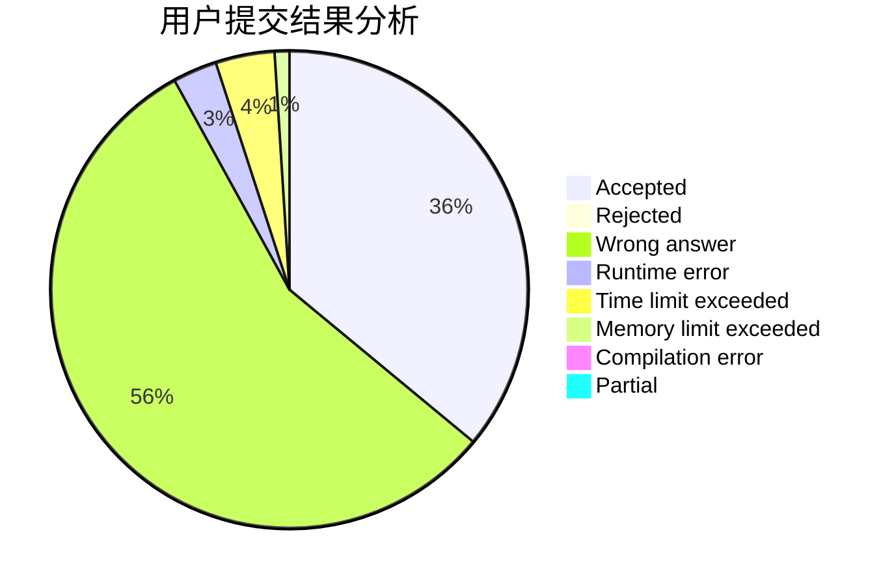
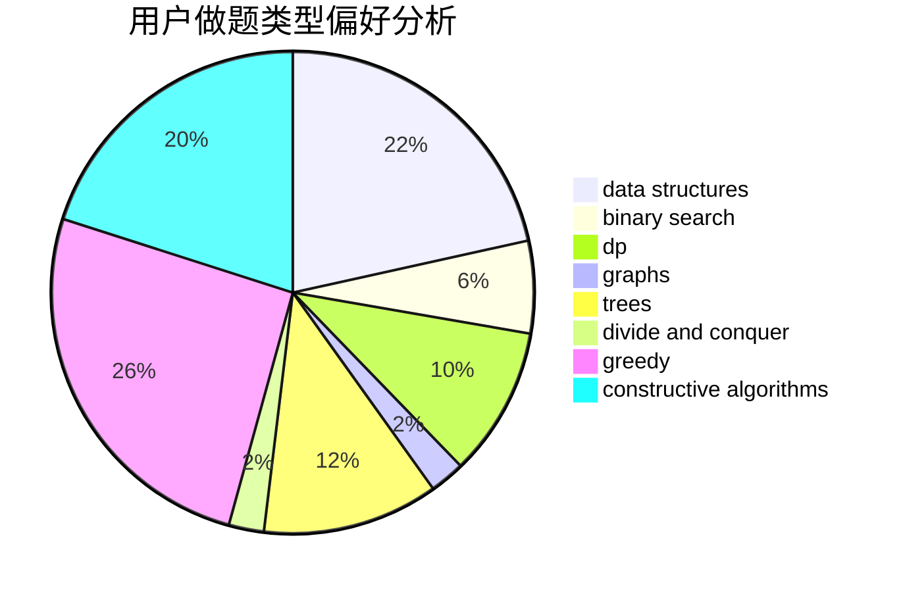
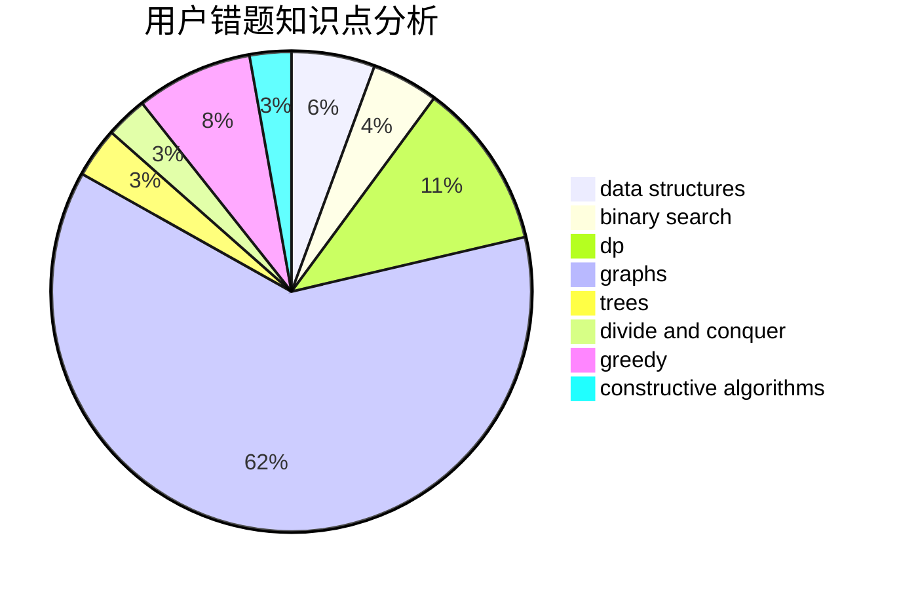

# Hank2019

<!-- tabs:start -->

#### **用户提交结果分析**

#### **用户做题类型偏好分析**

#### **用户错题知识点分析**

<!-- tabs:end -->
# 推荐题目
[1497E1](https://codeforces.com/contest/1497E/problem/1)		data structures,
                        dp,
                        greedy,
                        math,
                        number theory,
                        two pointers		  
[750A](https://codeforces.com/contest/750/problem/A)		binary search,
                        brute force,
                        implementation,
                        math		  
[789D](https://codeforces.com/contest/789/problem/D)		dsu,graphs,sortings,trees		  
[507B](https://codeforces.com/contest/507/problem/B)		geometry,
                        math		  
[794G](https://codeforces.com/contest/794/problem/G)		combinatorics,
                        dp,
                        math		  
[1264B](https://codeforces.com/contest/1264/problem/B)		brute force,
                        constructive algorithms,
                        greedy		  
[1236B](https://codeforces.com/contest/1236/problem/B)		combinatorics,
                        math		  
[1036E](https://codeforces.com/contest/1036/problem/E)		fft,
                        geometry,
                        number theory		  
[724G](https://codeforces.com/contest/724/problem/G)		bitmasks,
                        graphs,
                        math,
                        number theory,
                        trees		  
[350B](https://codeforces.com/contest/350/problem/B)		graphs		  
