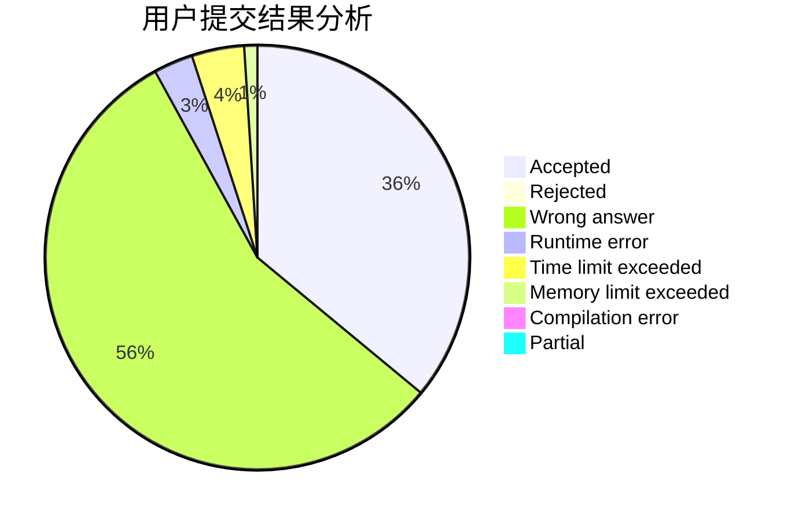
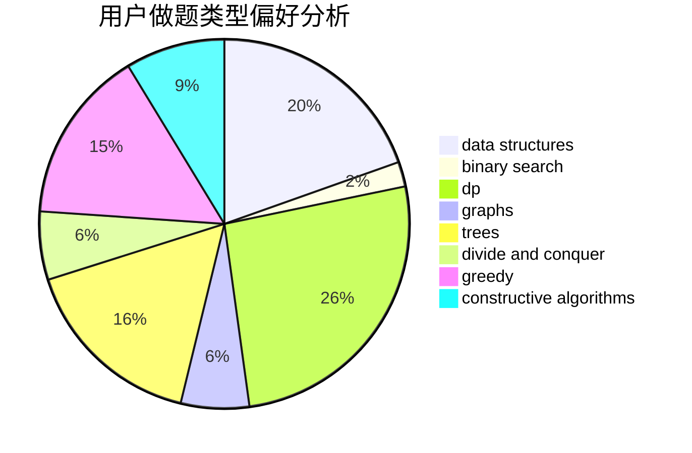
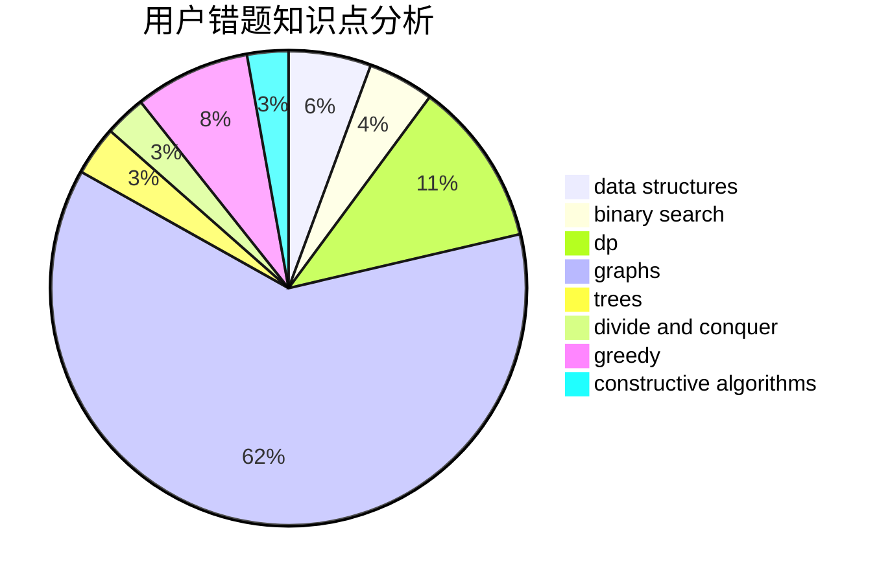

# Hank2019

<!-- tabs:start -->

#### **用户提交结果分析**

#### **用户做题类型偏好分析**

#### **用户错题知识点分析**

<!-- tabs:end -->
# 推荐题目
[1506C](https://codeforces.com/contest/1506/problem/C)		brute force,
                        implementation,
                        strings		  
[76A](https://codeforces.com/contest/76/problem/A)		dsu,
                        graphs,
                        sortings,
                        trees		  
[804F](https://codeforces.com/contest/804/problem/F)		combinatorics,
                        dfs and similar,
                        dp,
                        graphs,
                        number theory		  
[527C](https://codeforces.com/contest/527/problem/C)		binary search,
                        data structures,
                        implementation		  
[80A](https://codeforces.com/contest/80/problem/A)		brute force		  
[126B](https://codeforces.com/contest/126/problem/B)		binary search,
                        dp,
                        hashing,
                        string suffix structures,
                        strings		  
[1240E](https://codeforces.com/contest/1240/problem/E)		dsu,graphs,sortings,trees		  
[1037B](https://codeforces.com/contest/1037/problem/B)		greedy		  
[742D](https://codeforces.com/contest/742/problem/D)		dsu,graphs,sortings,trees		  
[377C](https://codeforces.com/contest/377/problem/C)		bitmasks,
                        dp,
                        games		  
