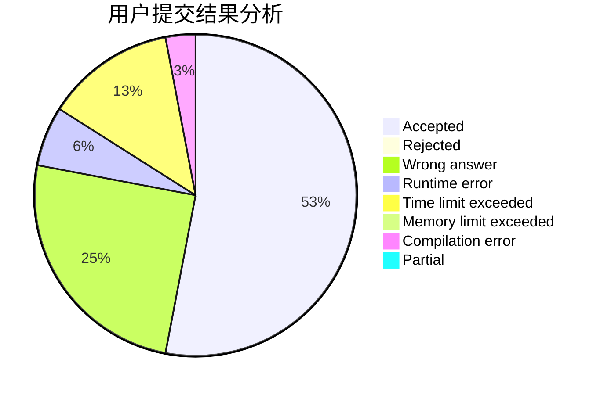
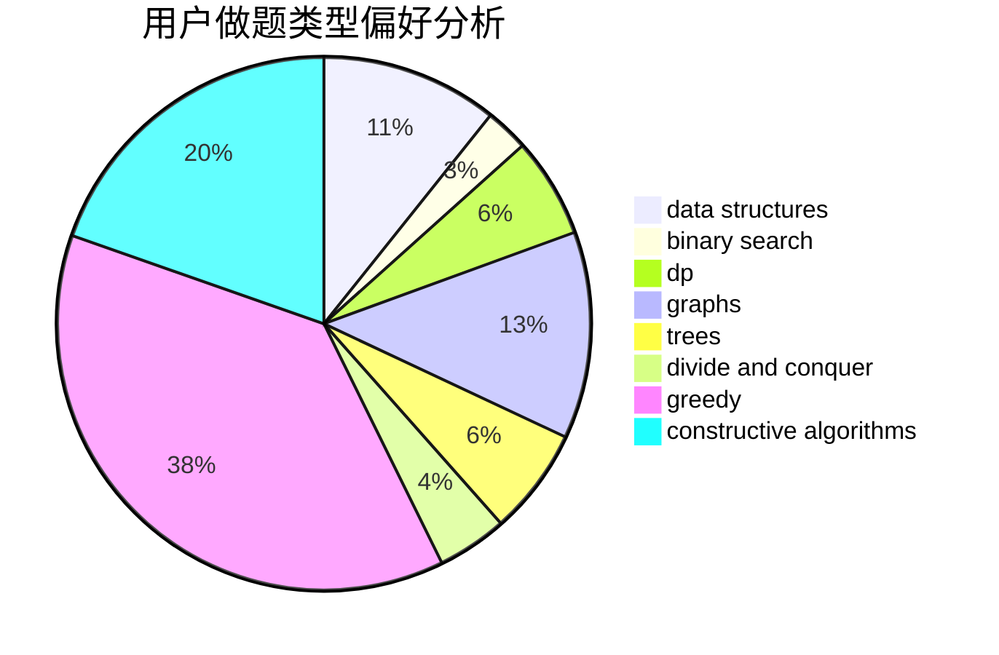
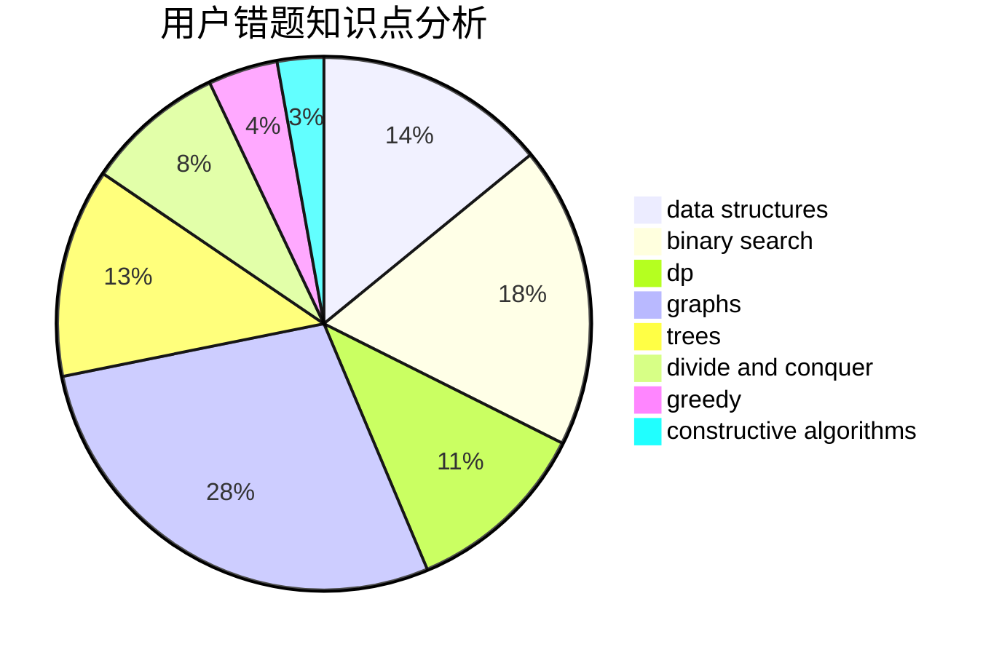

# Hany01

<!-- tabs:start -->

#### **用户提交结果分析**

#### **用户做题类型偏好分析**

#### **用户错题知识点分析**

<!-- tabs:end -->
# 推荐题目
[917C](https://codeforces.com/contest/917/problem/C)		combinatorics,
                        dp,
                        matrices		  
[917A](https://codeforces.com/contest/917/problem/A)		dp,
                        greedy,
                        implementation,
                        math		  
[585B](https://codeforces.com/contest/585/problem/B)		dfs and similar,
                        graphs,
                        shortest paths		  
[1288B](https://codeforces.com/contest/1288/problem/B)		math		  
[10151](https://codeforces.com/contest/1015/problem/1)		dsu,graphs,sortings,trees		  
[527C](https://codeforces.com/contest/527/problem/C)		binary search,
                        data structures,
                        implementation		  
[1065G](https://codeforces.com/contest/1065/problem/G)		strings		  
[290C](https://codeforces.com/contest/290/problem/C)		*special problem,
                        graph matchings,
                        implementation,
                        trees		  
[424A](https://codeforces.com/contest/424/problem/A)		implementation		  
[1178B](https://codeforces.com/contest/1178/problem/B)		dp,
                        strings		  
