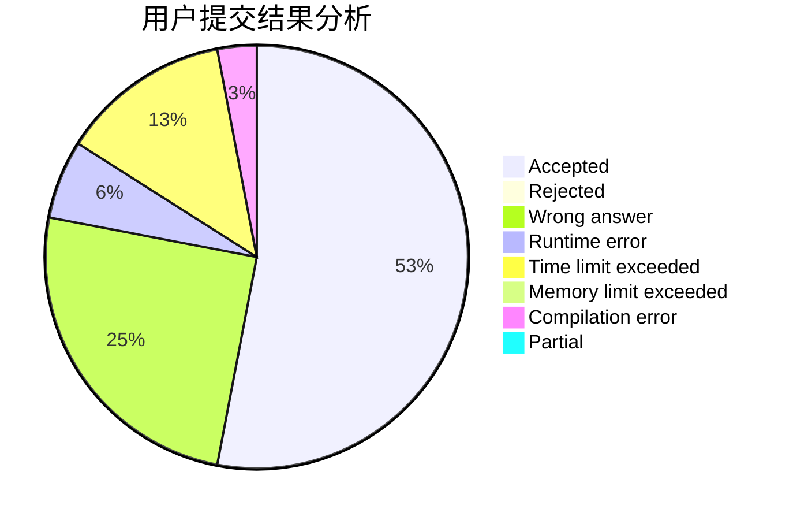
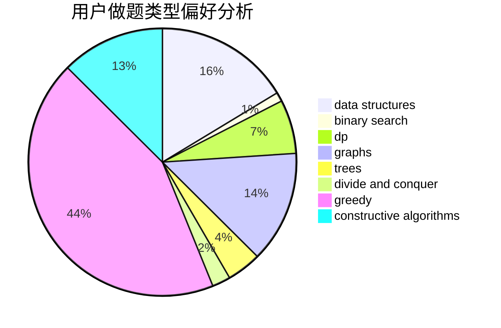

# Hany01

<!-- tabs:start -->

#### **用户提交结果分析**

#### **用户做题类型偏好分析**

#### **用户错题知识点分析**

<!-- tabs:end -->
# 推荐题目
[900E](https://codeforces.com/contest/900/problem/E)		data structures,
                        dp,
                        strings		  
[900C](https://codeforces.com/contest/900/problem/C)		brute force,
                        data structures,
                        math		  
[566C](https://codeforces.com/contest/566/problem/C)		dfs and similar,
                        divide and conquer,
                        trees		  
[1281F](https://codeforces.com/contest/1281/problem/F)		dsu,graphs,sortings,trees		  
[1013C](https://codeforces.com/contest/1013/problem/C)		dsu,graphs,sortings,trees		  
[507B](https://codeforces.com/contest/507/problem/B)		geometry,
                        math		  
[1065C](https://codeforces.com/contest/1065/problem/C)		greedy		  
[276C](https://codeforces.com/contest/276/problem/C)		data structures,
                        greedy,
                        implementation,
                        sortings		  
[394C](https://codeforces.com/contest/394/problem/C)		constructive algorithms,
                        greedy		  
[1175B](https://codeforces.com/contest/1175/problem/B)		data structures,
                        expression parsing,
                        implementation		  
