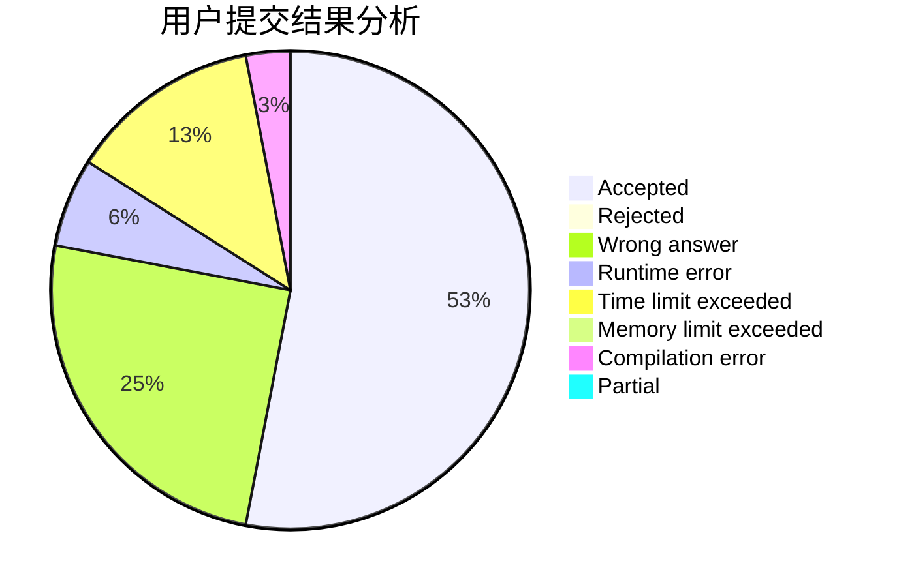
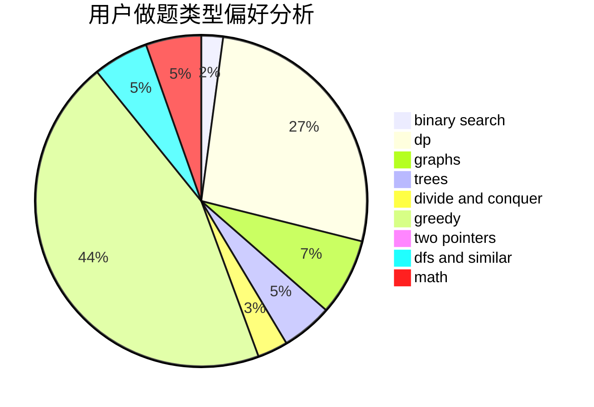

# Hany01

<!-- tabs:start -->

#### **用户提交结果分析**

#### **用户做题类型偏好分析**

<!-- tabs:end -->
# 推荐题目
[917C](https://codeforces.com/contest/917/problem/C)
[917A](https://codeforces.com/contest/917/problem/A)
[585B](https://codeforces.com/contest/585/problem/B)
[1288B](https://codeforces.com/contest/1288/problem/B)
[10151](https://codeforces.com/contest/1015/problem/1)
[527C](https://codeforces.com/contest/527/problem/C)
[1065G](https://codeforces.com/contest/1065/problem/G)
[290C](https://codeforces.com/contest/290/problem/C)
[424A](https://codeforces.com/contest/424/problem/A)
[1178B](https://codeforces.com/contest/1178/problem/B)
