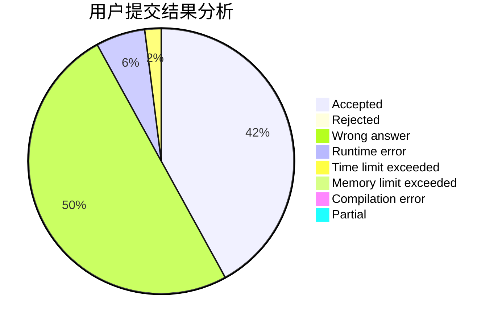
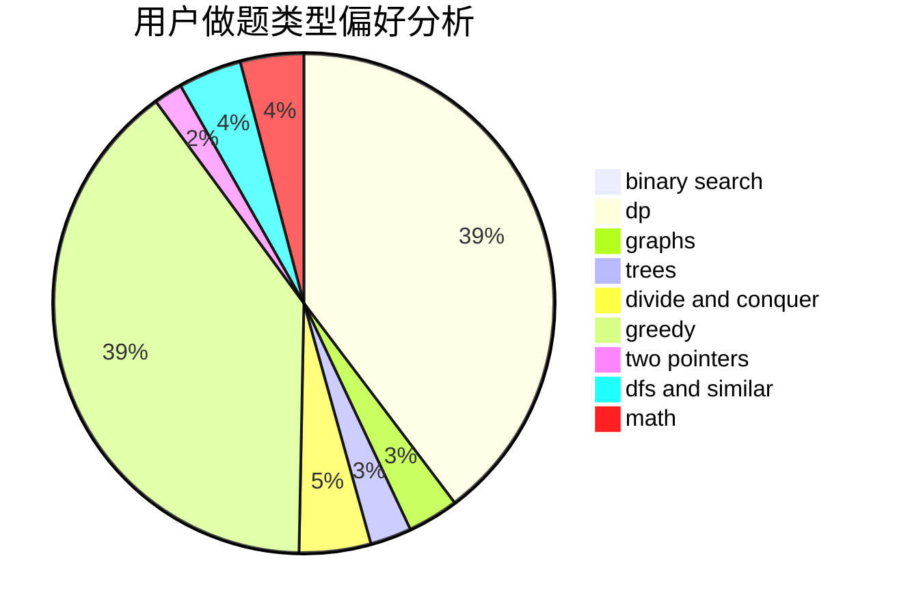

# Harborfan

<!-- tabs:start -->

#### **用户提交结果分析**

#### **用户做题类型偏好分析**

<!-- tabs:end -->
# 推荐题目
[1471E](https://codeforces.com/contest/1471/problem/E)
[861A](https://codeforces.com/contest/861/problem/A)
[1140E](https://codeforces.com/contest/1140/problem/E)
[1261A](https://codeforces.com/contest/1261/problem/A)
[626F](https://codeforces.com/contest/626/problem/F)
[678D](https://codeforces.com/contest/678/problem/D)
[656E](https://codeforces.com/contest/656/problem/E)
[1341F](https://codeforces.com/contest/1341/problem/F)
[77E](https://codeforces.com/contest/77/problem/E)
[917E](https://codeforces.com/contest/917/problem/E)
