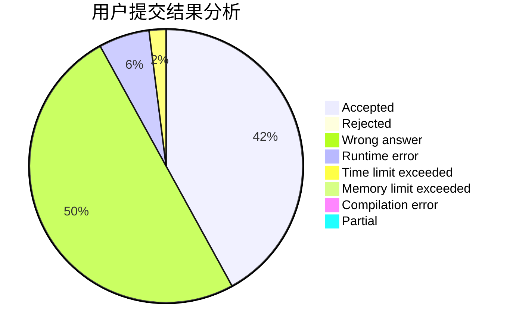
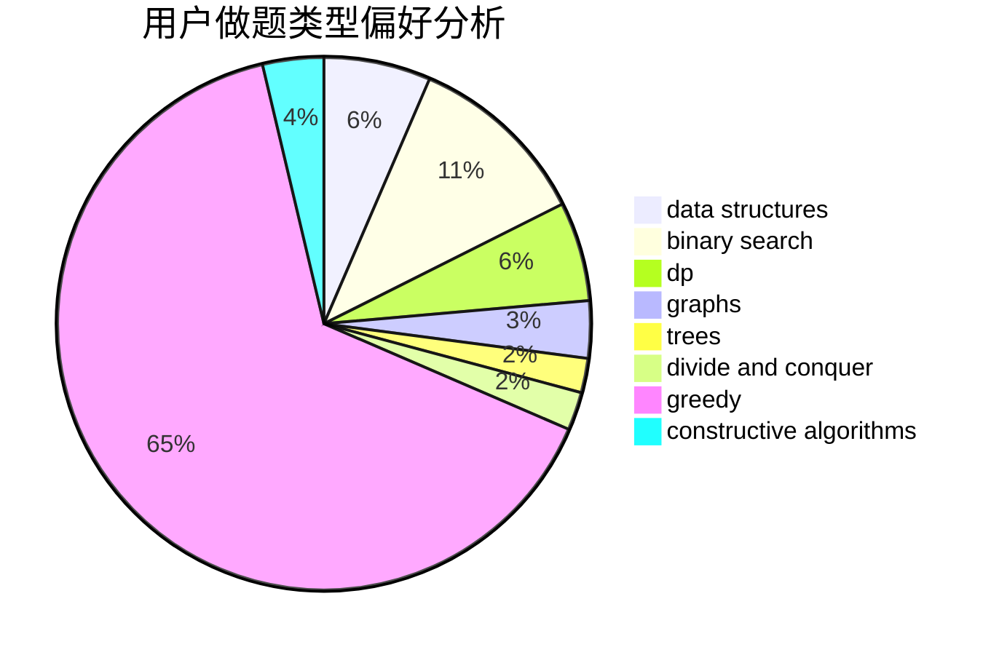
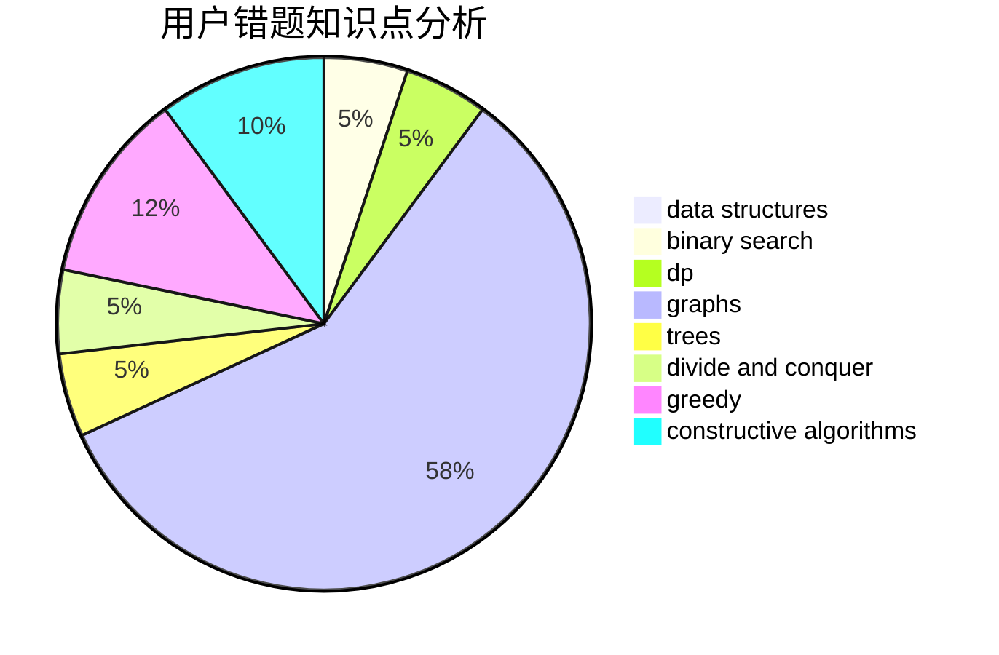

# Harborfan

<!-- tabs:start -->

#### **用户提交结果分析**

#### **用户做题类型偏好分析**

#### **用户错题知识点分析**

<!-- tabs:end -->
# 推荐题目
[1464D](https://codeforces.com/contest/1464/problem/D)		dsu,graphs,sortings,trees		  
[842B](https://codeforces.com/contest/842/problem/B)		geometry		  
[1139A](https://codeforces.com/contest/1139/problem/A)		implementation,
                        strings		  
[1254A](https://codeforces.com/contest/1254/problem/A)		constructive algorithms,
                        greedy,
                        implementation		  
[607E](https://codeforces.com/contest/607/problem/E)		binary search,
                        geometry		  
[656D](https://codeforces.com/contest/656/problem/D)		*special problem		  
[628D](https://codeforces.com/contest/628/problem/D)		dp		  
[1334G](https://codeforces.com/contest/1334/problem/G)		bitmasks,
                        brute force,
                        fft		  
[760A](https://codeforces.com/contest/760/problem/A)		implementation,
                        math		  
[901B](https://codeforces.com/contest/901/problem/B)		constructive algorithms,
                        math		  
