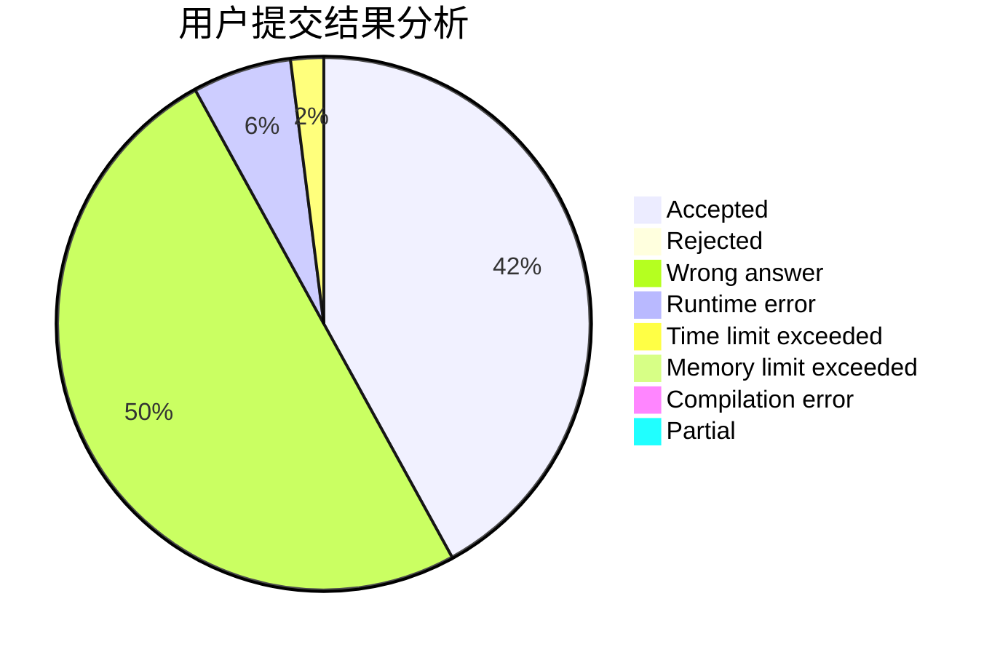
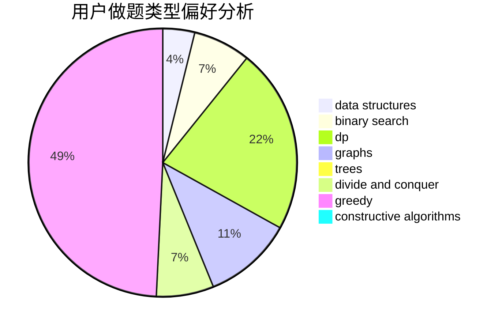
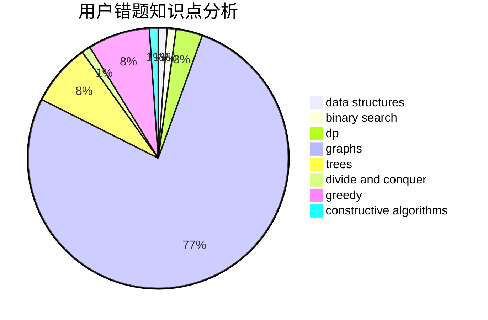

# Harborfan

<!-- tabs:start -->

#### **用户提交结果分析**

#### **用户做题类型偏好分析**

#### **用户错题知识点分析**

<!-- tabs:end -->
# 推荐题目
[1471E](https://codeforces.com/contest/1471/problem/E)		dsu,graphs,sortings,trees		  
[861A](https://codeforces.com/contest/861/problem/A)		dsu,graphs,sortings,trees		  
[1140E](https://codeforces.com/contest/1140/problem/E)		combinatorics,
                        divide and conquer,
                        dp		  
[1261A](https://codeforces.com/contest/1261/problem/A)		dsu,graphs,sortings,trees		  
[626F](https://codeforces.com/contest/626/problem/F)		dp		  
[678D](https://codeforces.com/contest/678/problem/D)		math,
                        number theory		  
[656E](https://codeforces.com/contest/656/problem/E)		*special problem		  
[1341F](https://codeforces.com/contest/1341/problem/F)		dsu,graphs,sortings,trees		  
[77E](https://codeforces.com/contest/77/problem/E)		geometry		  
[917E](https://codeforces.com/contest/917/problem/E)		data structures,
                        string suffix structures,
                        strings,
                        trees		  
