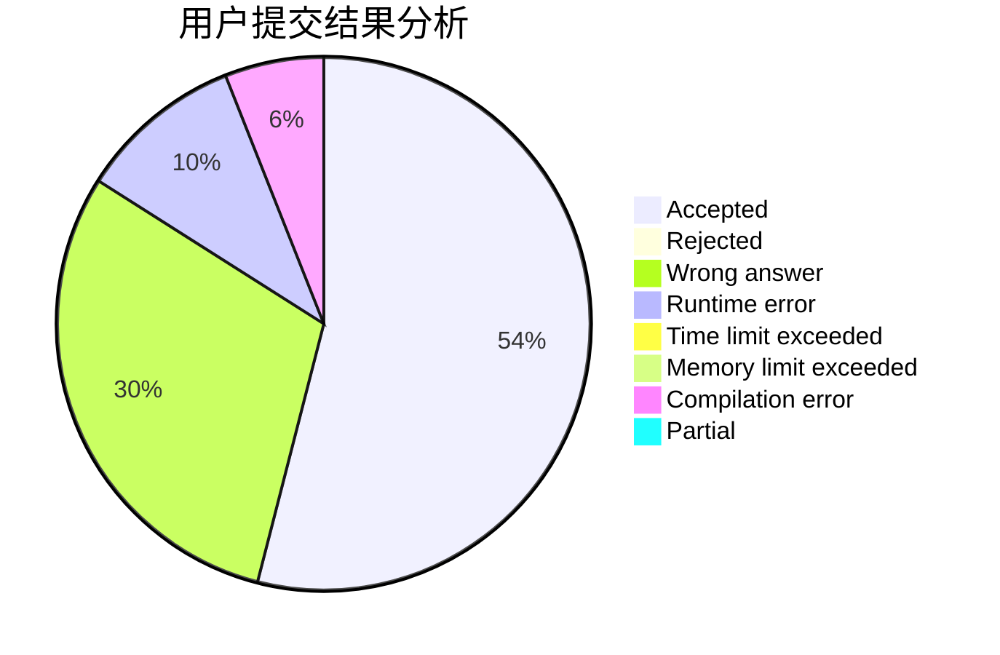
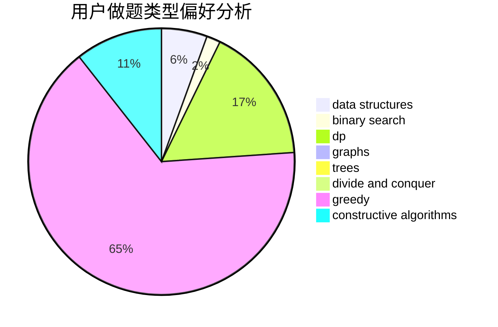

# HareXX

<!-- tabs:start -->

#### **用户提交结果分析**

#### **用户做题类型偏好分析**

#### **用户错题知识点分析**

<!-- tabs:end -->
# 推荐题目
[1382B](https://codeforces.com/contest/1382/problem/B)		dp,
                        games		  
[634B](https://codeforces.com/contest/634/problem/B)		dsu,graphs,sortings,trees		  
[62A](https://codeforces.com/contest/62/problem/A)		greedy,
                        math		  
[180D](https://codeforces.com/contest/180/problem/D)		greedy,
                        strings		  
[313E](https://codeforces.com/contest/313/problem/E)		constructive algorithms,
                        data structures,
                        dsu,
                        greedy		  
[1039C](https://codeforces.com/contest/1039/problem/C)		dfs and similar,
                        dsu,
                        graphs,
                        math,
                        sortings		  
[1217D](https://codeforces.com/contest/1217/problem/D)		constructive algorithms,
                        dfs and similar,
                        graphs		  
[1036E](https://codeforces.com/contest/1036/problem/E)		fft,
                        geometry,
                        number theory		  
[877D](https://codeforces.com/contest/877/problem/D)		data structures,
                        dfs and similar,
                        graphs,
                        shortest paths		  
[901C](https://codeforces.com/contest/901/problem/C)		binary search,
                        data structures,
                        dfs and similar,
                        dsu,
                        graphs,
                        two pointers		  
