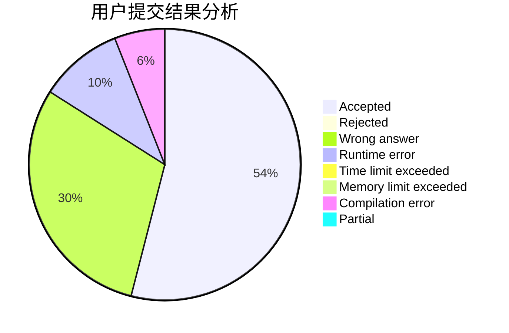
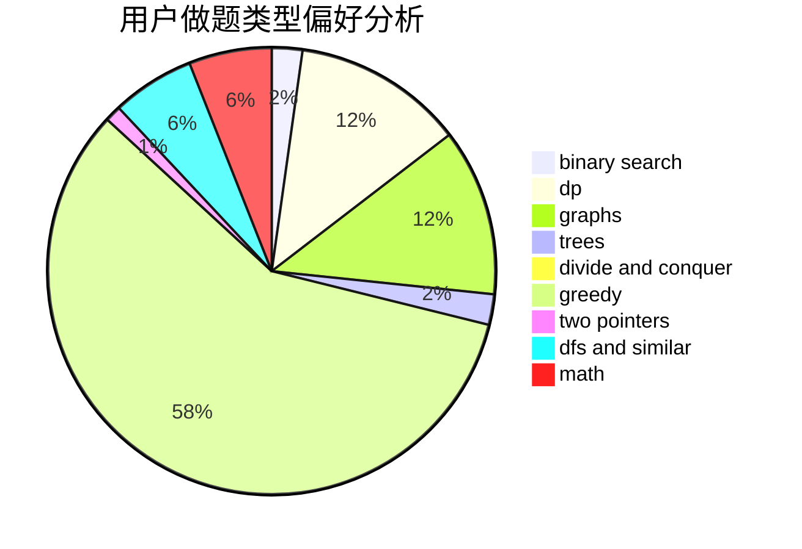

# HareXX

<!-- tabs:start -->

#### **用户提交结果分析**

#### **用户做题类型偏好分析**

<!-- tabs:end -->
# 推荐题目
[1392D](https://codeforces.com/contest/1392/problem/D)
[666E](https://codeforces.com/contest/666/problem/E)
[659F](https://codeforces.com/contest/659/problem/F)
[208A](https://codeforces.com/contest/208/problem/A)
[338D](https://codeforces.com/contest/338/problem/D)
[103A](https://codeforces.com/contest/103/problem/A)
[1225A](https://codeforces.com/contest/1225/problem/A)
[1037B](https://codeforces.com/contest/1037/problem/B)
[898C](https://codeforces.com/contest/898/problem/C)
[918A](https://codeforces.com/contest/918/problem/A)
