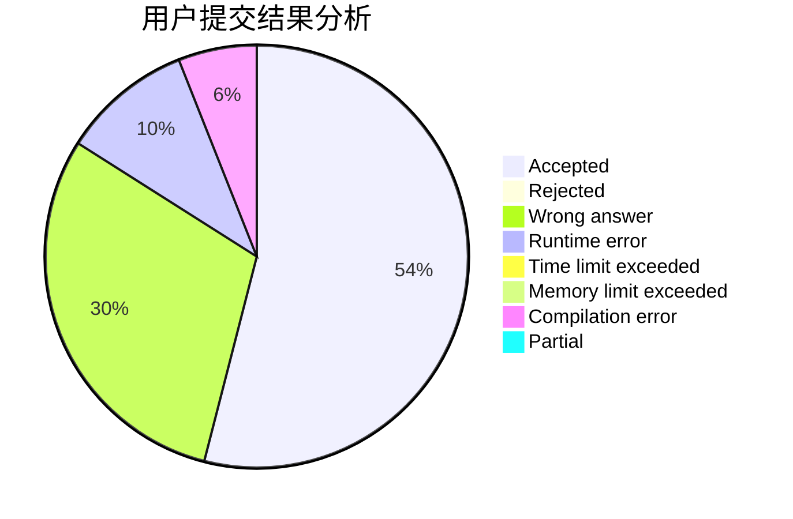
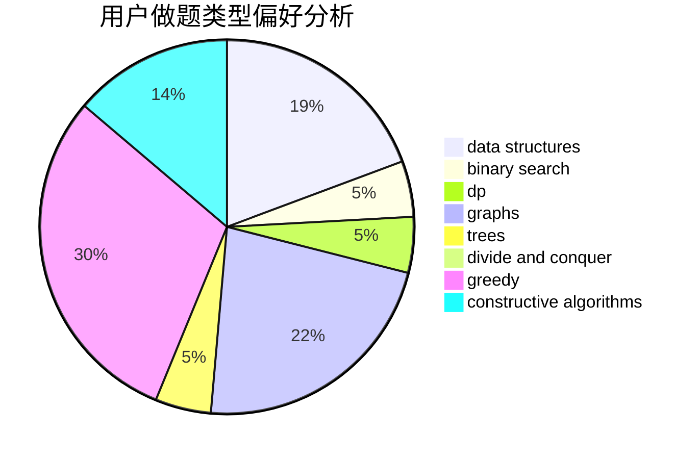

# HareXX

<!-- tabs:start -->

#### **用户提交结果分析**

#### **用户做题类型偏好分析**

#### **用户错题知识点分析**

<!-- tabs:end -->
# 推荐题目
[1392D](https://codeforces.com/contest/1392/problem/D)		dp,
                        greedy		  
[666E](https://codeforces.com/contest/666/problem/E)		data structures,
                        string suffix structures		  
[659F](https://codeforces.com/contest/659/problem/F)		dfs and similar,
                        dsu,
                        graphs,
                        greedy,
                        sortings		  
[208A](https://codeforces.com/contest/208/problem/A)		strings		  
[338D](https://codeforces.com/contest/338/problem/D)		chinese remainder theorem,
                        math,
                        number theory		  
[103A](https://codeforces.com/contest/103/problem/A)		greedy,
                        implementation,
                        math		  
[1225A](https://codeforces.com/contest/1225/problem/A)		math		  
[1037B](https://codeforces.com/contest/1037/problem/B)		greedy		  
[898C](https://codeforces.com/contest/898/problem/C)		implementation,
                        strings		  
[918A](https://codeforces.com/contest/918/problem/A)		brute force,
                        implementation		  
