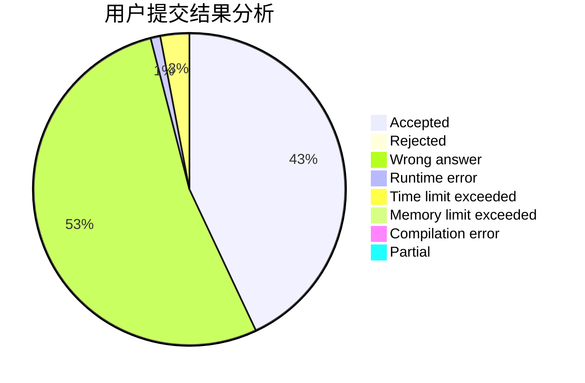
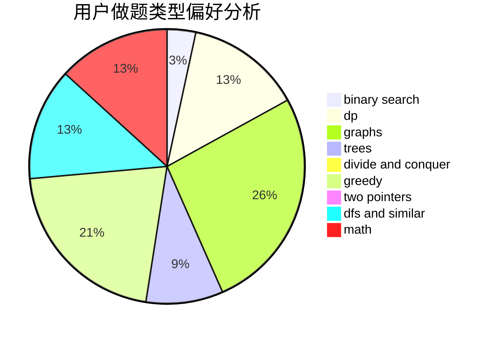

# 213ddi

<!-- tabs:start -->

#### **用户提交结果分析**

#### **用户做题类型偏好分析**

<!-- tabs:end -->
# 推荐题目
[1321B](https://codeforces.com/contest/1321/problem/B)
[1322C](https://codeforces.com/contest/1322/problem/C)
[1321A](https://codeforces.com/contest/1321/problem/A)
[1321F](https://codeforces.com/contest/1321/problem/F)
[1322A](https://codeforces.com/contest/1322/problem/A)
[1063F](https://codeforces.com/contest/1063/problem/F)
[102A](https://codeforces.com/contest/102/problem/A)
[1320E](https://codeforces.com/contest/1320/problem/E)
[1220A](https://codeforces.com/contest/1220/problem/A)
[131D](https://codeforces.com/contest/131/problem/D)
