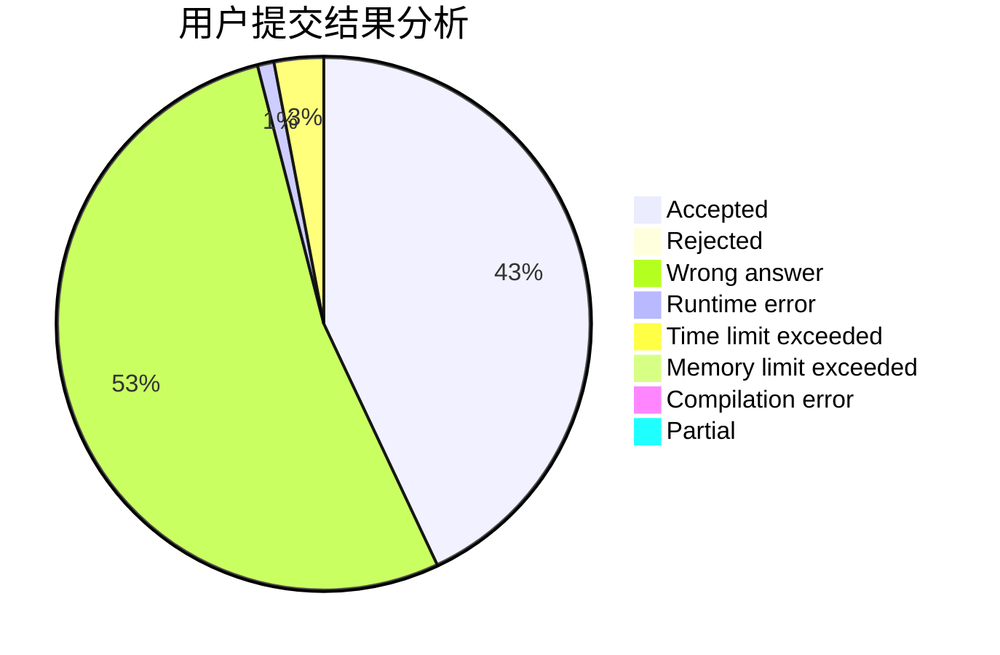
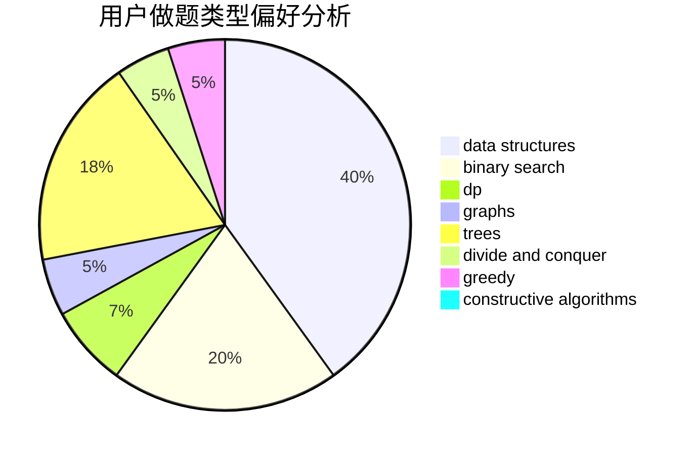

# 213ddi

<!-- tabs:start -->

#### **用户提交结果分析**

#### **用户做题类型偏好分析**

#### **用户错题知识点分析**

<!-- tabs:end -->
# 推荐题目
[1311F](https://codeforces.com/contest/1311/problem/F)		data structures,
                        divide and conquer,
                        implementation,
                        sortings		  
[1312G](https://codeforces.com/contest/1312/problem/G)		data structures,
                        dfs and similar,
                        dp		  
[1311E](https://codeforces.com/contest/1311/problem/E)		brute force,
                        constructive algorithms,
                        trees		  
[1312D](https://codeforces.com/contest/1312/problem/D)		combinatorics,
                        math		  
[1312E](https://codeforces.com/contest/1312/problem/E)		dp,
                        greedy		  
[1063C](https://codeforces.com/contest/1063/problem/C)		binary search,
                        constructive algorithms,
                        geometry,
                        interactive		  
[1029D](https://codeforces.com/contest/1029/problem/D)		implementation,
                        math		  
[1311D](https://codeforces.com/contest/1311/problem/D)		brute force,
                        math		  
[1214E](https://codeforces.com/contest/1214/problem/E)		constructive algorithms,
                        graphs,
                        math,
                        sortings,
                        trees		  
[1310E](https://codeforces.com/contest/1310/problem/E)		dp		  
