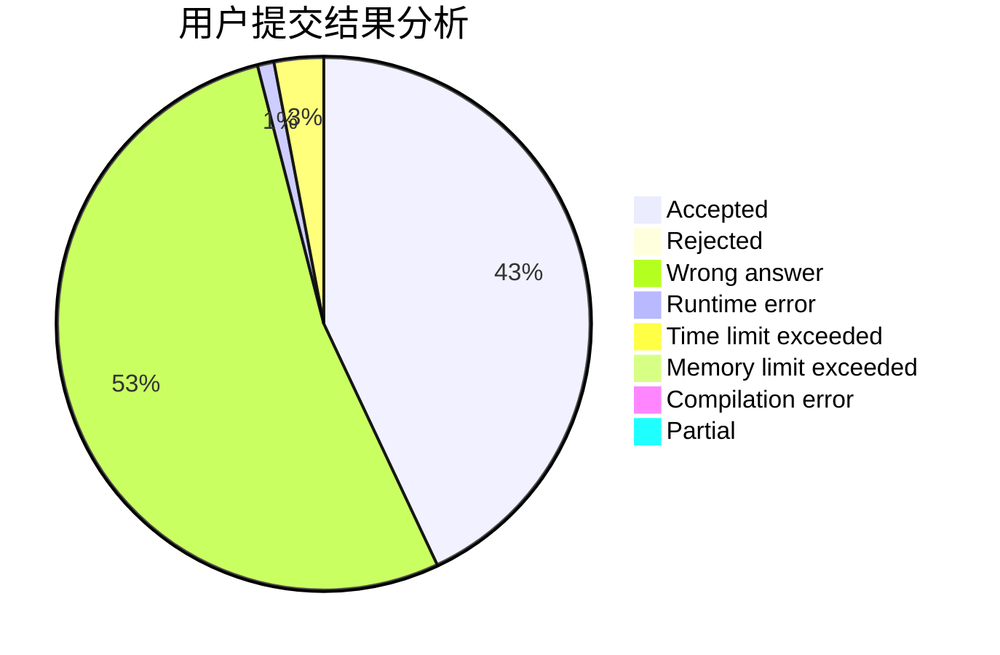
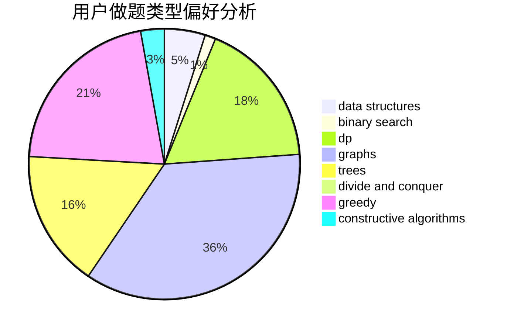

# 213ddi

<!-- tabs:start -->

#### **用户提交结果分析**

#### **用户做题类型偏好分析**

#### **用户错题知识点分析**

<!-- tabs:end -->
# 推荐题目
[1321B](https://codeforces.com/contest/1321/problem/B)		dsu,graphs,sortings,trees		  
[1322C](https://codeforces.com/contest/1322/problem/C)		graphs,
                        hashing,
                        math,
                        number theory		  
[1321A](https://codeforces.com/contest/1321/problem/A)		greedy		  
[1321F](https://codeforces.com/contest/1321/problem/F)		dsu,graphs,sortings,trees		  
[1322A](https://codeforces.com/contest/1322/problem/A)		greedy		  
[1063F](https://codeforces.com/contest/1063/problem/F)		data structures,
                        dp,
                        string suffix structures		  
[102A](https://codeforces.com/contest/102/problem/A)		brute force		  
[1320E](https://codeforces.com/contest/1320/problem/E)		data structures,
                        dfs and similar,
                        dp,
                        shortest paths,
                        trees		  
[1220A](https://codeforces.com/contest/1220/problem/A)		implementation,
                        sortings,
                        strings		  
[131D](https://codeforces.com/contest/131/problem/D)		dfs and similar,
                        graphs		  
