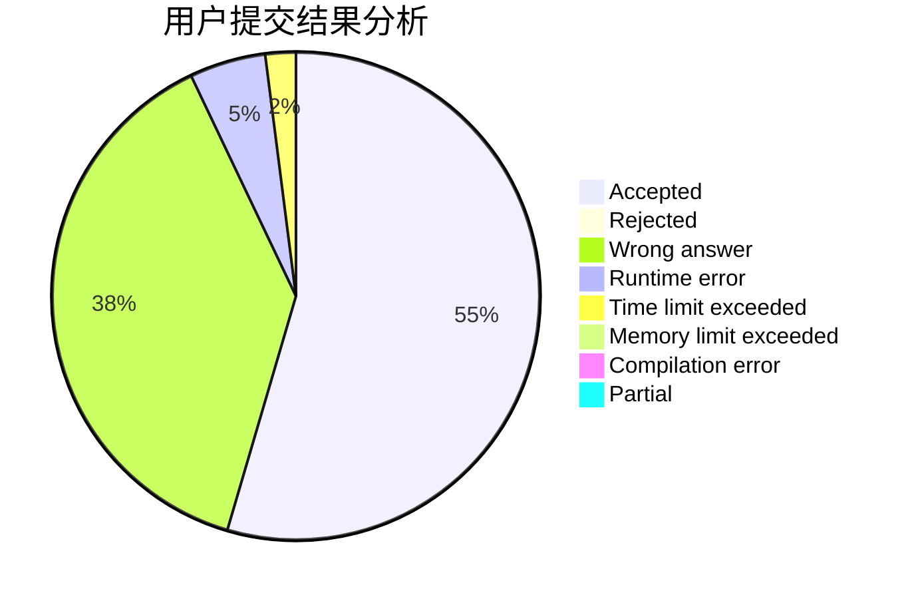
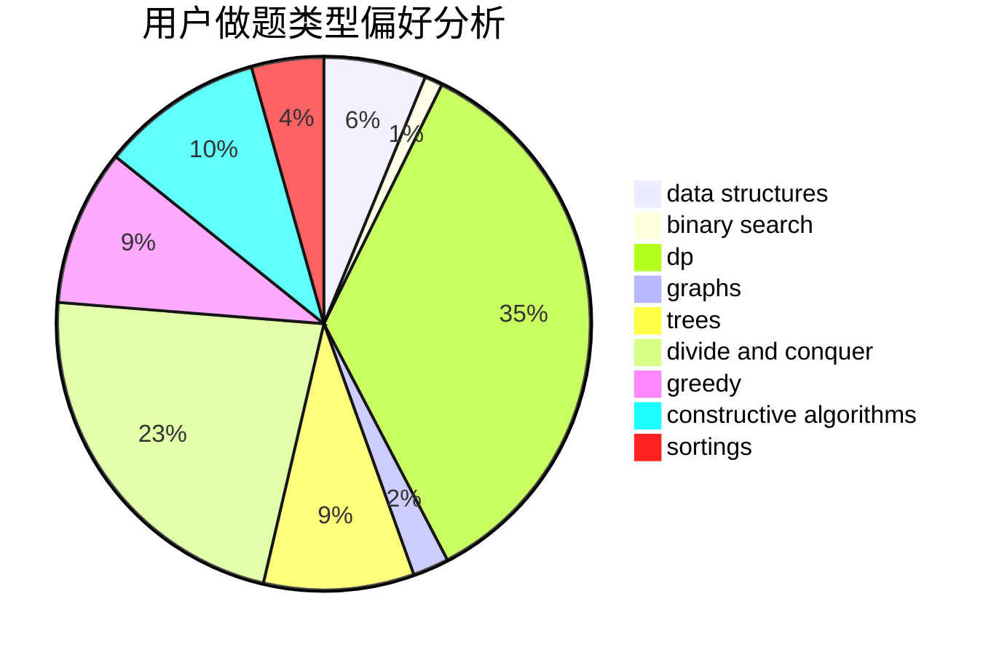
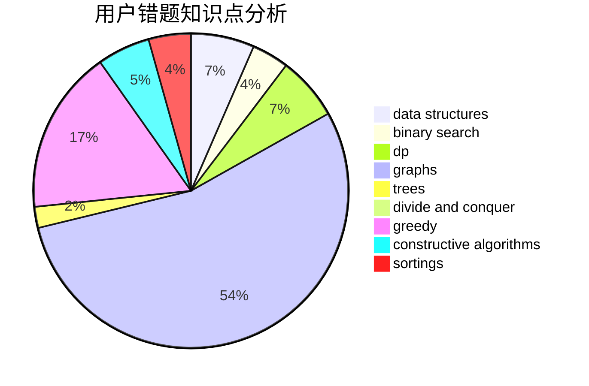

# Harmony_
<!-- tabs:start -->
#### **用户提交结果分析**

#### **用户做题类型偏好分析**

#### **用户错题知识点分析**

<!-- tabs:end -->
# 推荐题目
[828E](https://codeforces.com/contest/828/problem/E)		data structures,
                        strings		  
[725A](http://codeforces.com/problemset/problem/725/A)		implementation		  
[331C3](http://codeforces.com/problemset/problem/331/C3)		dp		  
[535C](http://codeforces.com/problemset/problem/535/C)		binary search,
                        greedy,
                        math		  
[306D](http://codeforces.com/problemset/problem/306/D)		constructive algorithms,
                        geometry		  
[1217D](http://codeforces.com/problemset/problem/1217/D)		constructive algorithms,
                        dfs and similar,
                        graphs		  
[1206D](https://codeforces.com/contest/1206/problem/D)		bitmasks,
                        brute force,
                        graphs,
                        shortest paths		  
[246B](http://codeforces.com/problemset/problem/246/B)		greedy,
                        math		  
[820D](https://codeforces.com/contest/820/problem/D)		data structures,
                        implementation,
                        math		  
[768C](http://codeforces.com/problemset/problem/768/C)		brute force,
                        dp,
                        implementation,
                        sortings		  
<!-- tabs:start -->
#### **data structures**
[828E](https://codeforces.com/contest/828/problem/E)		data structures,
                        strings		  
[820D](https://codeforces.com/contest/820/problem/D)		data structures,
                        implementation,
                        math		  
[754D](http://codeforces.com/problemset/problem/754/D)		binary search,
                        data structures,
                        greedy,
                        sortings		  
[750D](http://codeforces.com/problemset/problem/750/D)		brute force,
                        data structures,
                        dfs and similar,
                        dp,
                        implementation		  
[447E](https://codeforces.com/contest/447/problem/E)		data structures,
                        math,
                        number theory		  
[1334F](http://codeforces.com/problemset/problem/1334/F)		binary search,
                        data structures,
                        dp,
                        greedy		  
[1346F](http://codeforces.com/problemset/problem/1346/F)		*special problem,
                        data structures,
                        greedy,
                        math		  
[212D](http://codeforces.com/problemset/problem/212/D)		binary search,
                        data structures,
                        dsu		  
[686D](https://codeforces.com/contest/686/problem/D)		data structures,
                        dfs and similar,
                        dp,
                        trees		  
[38G](http://codeforces.com/problemset/problem/38/G)		data structures		  
#### **binary search**
[535C](http://codeforces.com/problemset/problem/535/C)		binary search,
                        greedy,
                        math		  
[754D](http://codeforces.com/problemset/problem/754/D)		binary search,
                        data structures,
                        greedy,
                        sortings		  
[1223G](http://codeforces.com/problemset/problem/1223/G)		binary search,
                        math,
                        number theory		  
[1334F](http://codeforces.com/problemset/problem/1334/F)		binary search,
                        data structures,
                        dp,
                        greedy		  
[212D](http://codeforces.com/problemset/problem/212/D)		binary search,
                        data structures,
                        dsu		  
[1492C](http://codeforces.com/problemset/problem/1492/C)		binary search,
                        data structures,
                        dp,
                        greedy,
                        two pointers		  
[1463D](http://codeforces.com/problemset/problem/1463/D)		binary search,
                        constructive algorithms,
                        greedy,
                        two pointers		  
[1490G](http://codeforces.com/problemset/problem/1490/G)		binary search,
                        data structures,
                        math		  
[1479D](http://codeforces.com/problemset/problem/1479/D)		binary search,
                        bitmasks,
                        brute force,
                        data structures,
                        probabilities,
                        trees		  
[1436E](http://codeforces.com/problemset/problem/1436/E)		binary search,
                        data structures,
                        two pointers		  
#### **dp**
[331C3](http://codeforces.com/problemset/problem/331/C3)		dp		  
[768C](http://codeforces.com/problemset/problem/768/C)		brute force,
                        dp,
                        implementation,
                        sortings		  
[750D](http://codeforces.com/problemset/problem/750/D)		brute force,
                        data structures,
                        dfs and similar,
                        dp,
                        implementation		  
[429B](http://codeforces.com/problemset/problem/429/B)		dp		  
[1334F](http://codeforces.com/problemset/problem/1334/F)		binary search,
                        data structures,
                        dp,
                        greedy		  
[686D](https://codeforces.com/contest/686/problem/D)		data structures,
                        dfs and similar,
                        dp,
                        trees		  
[544E](https://codeforces.com/contest/544/problem/E)		bitmasks,
                        dp		  
[1076F](http://codeforces.com/problemset/problem/1076/F)		dp,
                        greedy		  
[1433F](http://codeforces.com/problemset/problem/1433/F)		dp		  
[1475G](http://codeforces.com/problemset/problem/1475/G)		dp,
                        math,
                        number theory,
                        sortings		  
#### **graph**
[1217D](http://codeforces.com/problemset/problem/1217/D)		constructive algorithms,
                        dfs and similar,
                        graphs		  
[1206D](https://codeforces.com/contest/1206/problem/D)		bitmasks,
                        brute force,
                        graphs,
                        shortest paths		  
[1063B](http://codeforces.com/problemset/problem/1063/B)		graphs,
                        shortest paths		  
[1487C](http://codeforces.com/problemset/problem/1487/C)		brute force,
                        constructive algorithms,
                        dfs and similar,
                        graphs,
                        greedy,
                        implementation,
                        math		  
[1437C](http://codeforces.com/problemset/problem/1437/C)		dp,
                        flows,
                        graph matchings,
                        greedy,
                        math,
                        sortings		  
[1470D](http://codeforces.com/problemset/problem/1470/D)		constructive algorithms,
                        dfs and similar,
                        graph matchings,
                        graphs,
                        greedy		  
[1476C](http://codeforces.com/problemset/problem/1476/C)		dp,
                        graphs,
                        greedy		  
[1304D](http://codeforces.com/problemset/problem/1304/D)		constructive algorithms,
                        graphs,
                        greedy,
                        two pointers		  
[1475C](http://codeforces.com/problemset/problem/1475/C)		combinatorics,
                        graphs,
                        math		  
[553E](http://codeforces.com/problemset/problem/553/E)		dp,
                        fft,
                        graphs,
                        math,
                        probabilities		  
#### **trees**
[686D](https://codeforces.com/contest/686/problem/D)		data structures,
                        dfs and similar,
                        dp,
                        trees		  
[1479D](http://codeforces.com/problemset/problem/1479/D)		binary search,
                        bitmasks,
                        brute force,
                        data structures,
                        probabilities,
                        trees		  
[1511C](http://codeforces.com/problemset/problem/1511/C)		brute force,
                        data structures,
                        implementation,
                        trees		  
[1499F](http://codeforces.com/problemset/problem/1499/F)		combinatorics,
                        dfs and similar,
                        dp,
                        trees		  
[1491E](http://codeforces.com/problemset/problem/1491/E)		brute force,
                        dfs and similar,
                        divide and conquer,
                        number theory,
                        trees		  
[1466D](http://codeforces.com/problemset/problem/1466/D)		data structures,
                        greedy,
                        sortings,
                        trees		  
[1495D](http://codeforces.com/problemset/problem/1495/D)		combinatorics,
                        dfs and similar,
                        graphs,
                        math,
                        shortest paths,
                        trees		  
[1303G](http://codeforces.com/problemset/problem/1303/G)		data structures,
                        divide and conquer,
                        geometry,
                        trees		  
[1454E](http://codeforces.com/problemset/problem/1454/E)		combinatorics,
                        dfs and similar,
                        graphs,
                        trees		  
[1494D](http://codeforces.com/problemset/problem/1494/D)		constructive algorithms,
                        data structures,
                        dfs and similar,
                        divide and conquer,
                        dsu,
                        greedy,
                        sortings,
                        trees		  
#### **divide and conquer**
[1461D](http://codeforces.com/problemset/problem/1461/D)		binary search,
                        brute force,
                        data structures,
                        divide and conquer,
                        implementation,
                        sortings		  
[1466G](http://codeforces.com/problemset/problem/1466/G)		combinatorics,
                        divide and conquer,
                        hashing,
                        math,
                        string suffix structures,
                        strings		  
[1490D](http://codeforces.com/problemset/problem/1490/D)		dfs and similar,
                        divide and conquer,
                        implementation		  
[1483C](https://codeforces.com/contest/1483/problem/C)		data structures,
                        divide and conquer,
                        dp		  
[1491E](http://codeforces.com/problemset/problem/1491/E)		brute force,
                        dfs and similar,
                        divide and conquer,
                        number theory,
                        trees		  
[1303G](http://codeforces.com/problemset/problem/1303/G)		data structures,
                        divide and conquer,
                        geometry,
                        trees		  
[1494D](http://codeforces.com/problemset/problem/1494/D)		constructive algorithms,
                        data structures,
                        dfs and similar,
                        divide and conquer,
                        dsu,
                        greedy,
                        sortings,
                        trees		  
[1482E](http://codeforces.com/problemset/problem/1482/E)		data structures,
                        divide and conquer,
                        dp		  
[566C](http://codeforces.com/problemset/problem/566/C)		dfs and similar,
                        divide and conquer,
                        trees		  
[1428F](http://codeforces.com/problemset/problem/1428/F)		binary search,
                        data structures,
                        divide and conquer,
                        dp,
                        two pointers		  
#### **greedy**
[535C](http://codeforces.com/problemset/problem/535/C)		binary search,
                        greedy,
                        math		  
[246B](http://codeforces.com/problemset/problem/246/B)		greedy,
                        math		  
[754D](http://codeforces.com/problemset/problem/754/D)		binary search,
                        data structures,
                        greedy,
                        sortings		  
[389A](http://codeforces.com/problemset/problem/389/A)		greedy,
                        math		  
[1157C1](http://codeforces.com/problemset/problem/1157/C1)		greedy		  
[1334F](http://codeforces.com/problemset/problem/1334/F)		binary search,
                        data structures,
                        dp,
                        greedy		  
[1346F](http://codeforces.com/problemset/problem/1346/F)		*special problem,
                        data structures,
                        greedy,
                        math		  
[902B](http://codeforces.com/problemset/problem/902/B)		dfs and similar,
                        dsu,
                        greedy		  
[1076F](http://codeforces.com/problemset/problem/1076/F)		dp,
                        greedy		  
[1287A](http://codeforces.com/problemset/problem/1287/A)		greedy,
                        implementation		  
#### **constructive algorithms**
[306D](http://codeforces.com/problemset/problem/306/D)		constructive algorithms,
                        geometry		  
[1217D](http://codeforces.com/problemset/problem/1217/D)		constructive algorithms,
                        dfs and similar,
                        graphs		  
[1391A](http://codeforces.com/problemset/problem/1391/A)		constructive algorithms,
                        math		  
[1493A](http://codeforces.com/problemset/problem/1493/A)		constructive algorithms,
                        greedy		  
[1463D](http://codeforces.com/problemset/problem/1463/D)		binary search,
                        constructive algorithms,
                        greedy,
                        two pointers		  
[1456B](https://codeforces.com/contest/1456/problem/B)		bitmasks,
                        brute force,
                        constructive algorithms		  
[1492D](http://codeforces.com/problemset/problem/1492/D)		bitmasks,
                        constructive algorithms,
                        greedy,
                        math		  
[1504D](https://codeforces.com/contest/1504/problem/D)		constructive algorithms,
                        games,
                        interactive		  
[1483A](https://codeforces.com/contest/1483/problem/A)		brute force,
                        constructive algorithms,
                        greedy,
                        implementation		  
[1457D](https://codeforces.com/contest/1457/problem/D)		bitmasks,
                        brute force,
                        constructive algorithms		  
#### **sortings**
[768C](http://codeforces.com/problemset/problem/768/C)		brute force,
                        dp,
                        implementation,
                        sortings		  
[754D](http://codeforces.com/problemset/problem/754/D)		binary search,
                        data structures,
                        greedy,
                        sortings		  
[1475G](http://codeforces.com/problemset/problem/1475/G)		dp,
                        math,
                        number theory,
                        sortings		  
[1496C](https://codeforces.com/contest/1496/problem/C)		geometry,
                        greedy,
                        math,
                        sortings		  
[1495A](http://codeforces.com/problemset/problem/1495/A)		geometry,
                        greedy,
                        math,
                        sortings		  
[1497A](http://codeforces.com/problemset/problem/1497/A)		brute force,
                        data structures,
                        greedy,
                        sortings		  
[1427A](http://codeforces.com/problemset/problem/1427/A)		math,
                        sortings		  
[1461D](http://codeforces.com/problemset/problem/1461/D)		binary search,
                        brute force,
                        data structures,
                        divide and conquer,
                        implementation,
                        sortings		  
[1437C](http://codeforces.com/problemset/problem/1437/C)		dp,
                        flows,
                        graph matchings,
                        greedy,
                        math,
                        sortings		  
[1473A](http://codeforces.com/problemset/problem/1473/A)		greedy,
                        implementation,
                        math,
                        sortings		  
<!-- tabs:end -->
