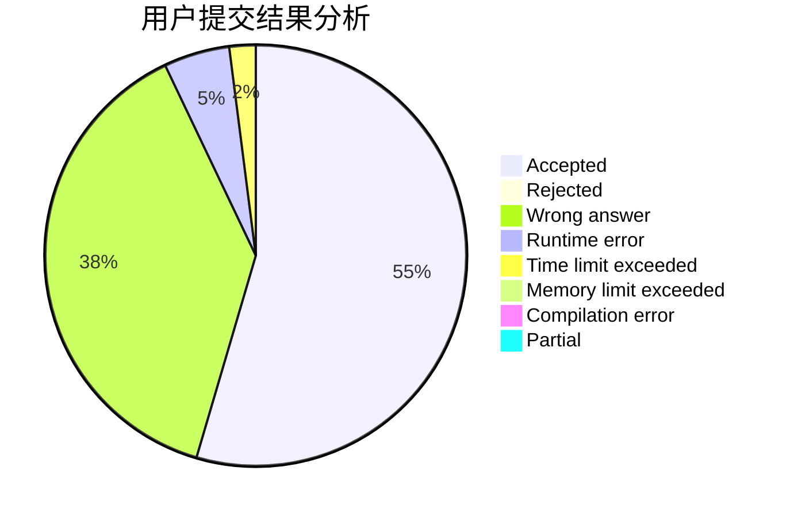
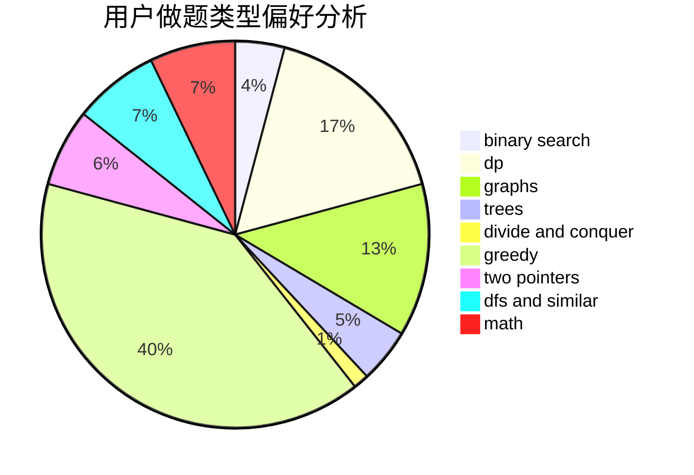

# Harmony_

<!-- tabs:start -->

#### **用户提交结果分析**

#### **用户做题类型偏好分析**

<!-- tabs:end -->
# 推荐题目
[359C](https://codeforces.com/contest/359/problem/C)
[329B](https://codeforces.com/contest/329/problem/B)
[840D](https://codeforces.com/contest/840/problem/D)
[1225A](https://codeforces.com/contest/1225/problem/A)
[847E](https://codeforces.com/contest/847/problem/E)
[788B](https://codeforces.com/contest/788/problem/B)
[1341E](https://codeforces.com/contest/1341/problem/E)
[742E](https://codeforces.com/contest/742/problem/E)
[918D](https://codeforces.com/contest/918/problem/D)
[1230F](https://codeforces.com/contest/1230/problem/F)
