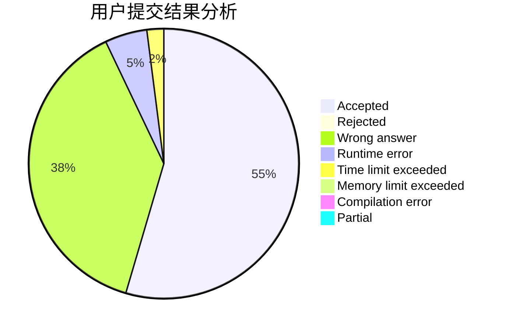
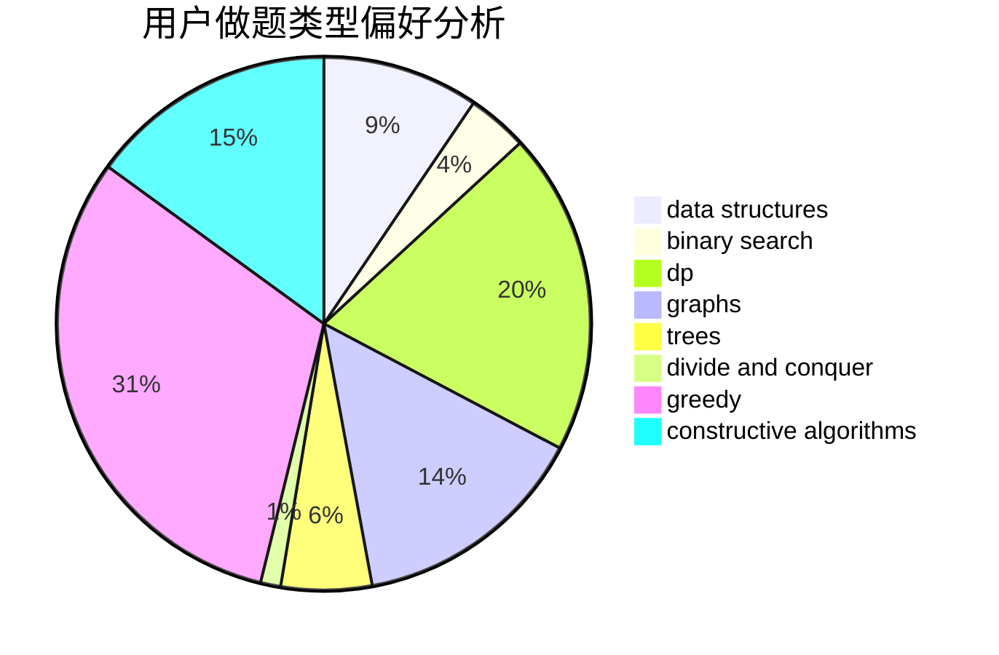
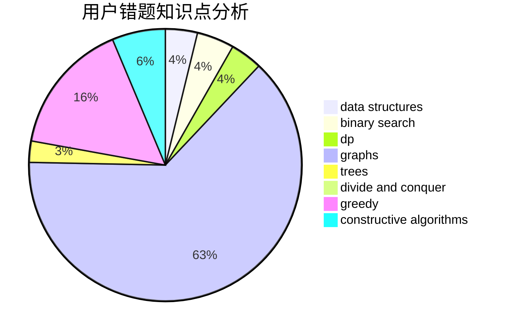

# Harmony_

<!-- tabs:start -->

#### **用户提交结果分析**

#### **用户做题类型偏好分析**

#### **用户错题知识点分析**

<!-- tabs:end -->
# 推荐题目
[359C](https://codeforces.com/contest/359/problem/C)		math,
                        number theory		  
[329B](https://codeforces.com/contest/329/problem/B)		dfs and similar,
                        shortest paths		  
[840D](https://codeforces.com/contest/840/problem/D)		data structures,
                        probabilities		  
[1225A](https://codeforces.com/contest/1225/problem/A)		math		  
[847E](https://codeforces.com/contest/847/problem/E)		binary search,
                        dp		  
[788B](https://codeforces.com/contest/788/problem/B)		combinatorics,
                        constructive algorithms,
                        dfs and similar,
                        dsu,
                        graphs		  
[1341E](https://codeforces.com/contest/1341/problem/E)		dsu,graphs,sortings,trees		  
[742E](https://codeforces.com/contest/742/problem/E)		dsu,graphs,sortings,trees		  
[918D](https://codeforces.com/contest/918/problem/D)		dsu,graphs,sortings,trees		  
[1230F](https://codeforces.com/contest/1230/problem/F)		dsu,graphs,sortings,trees		  
