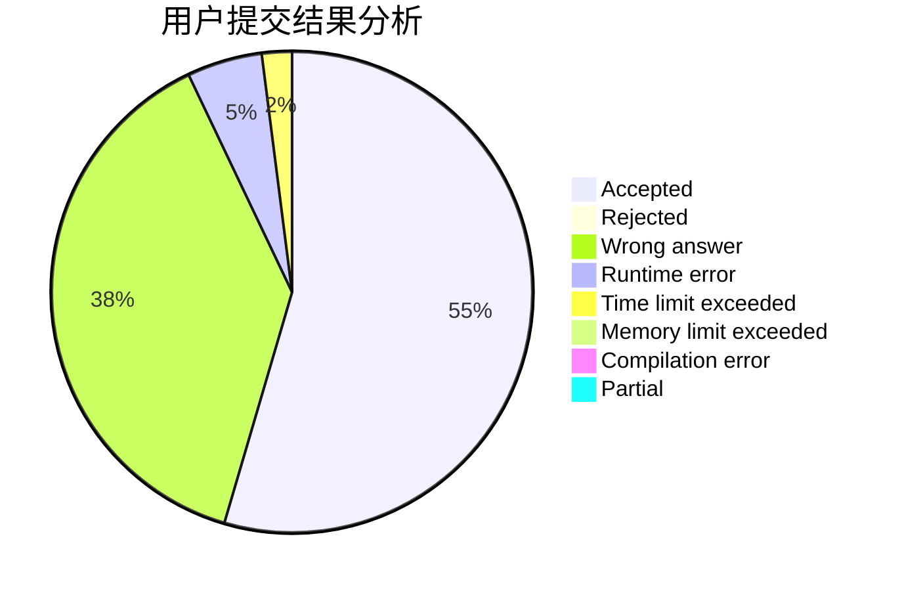
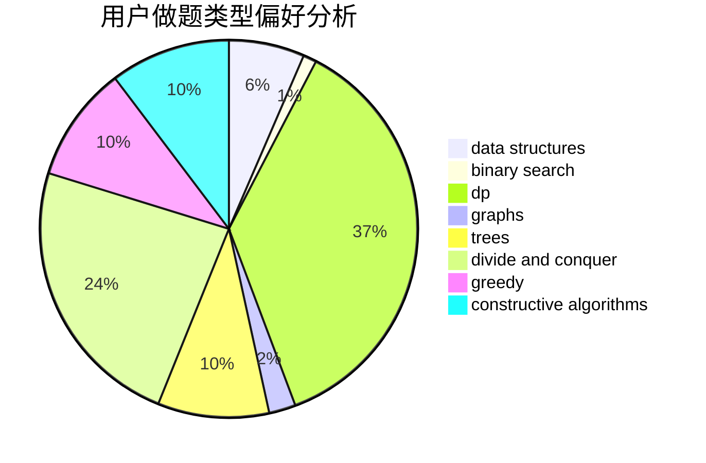
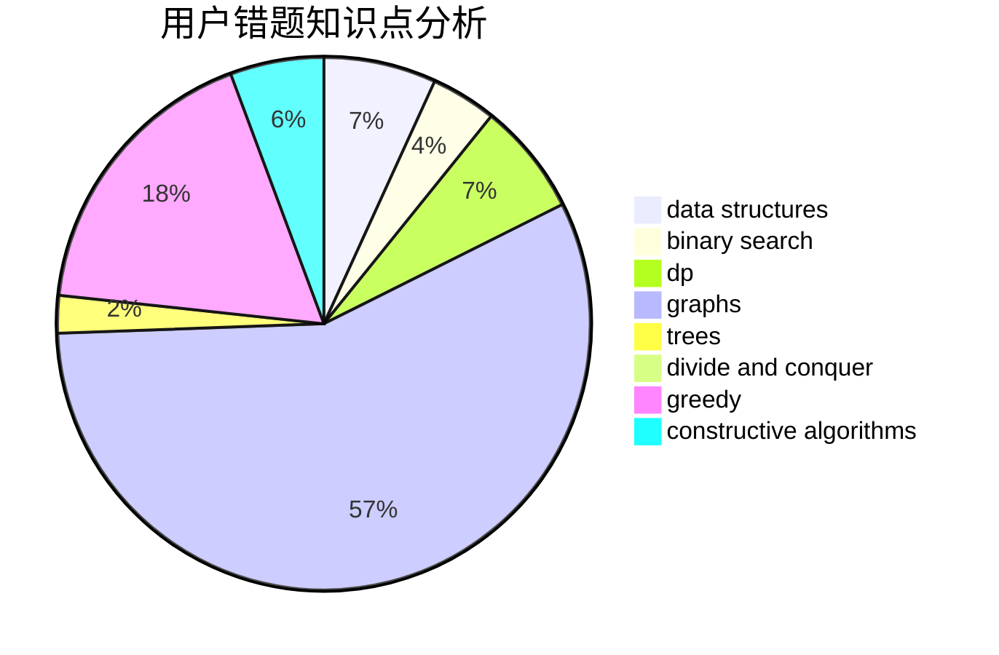

# Harmony_

<!-- tabs:start -->

#### **用户提交结果分析**

#### **用户做题类型偏好分析**

#### **用户错题知识点分析**

<!-- tabs:end -->
# 推荐题目
[331C3](https://codeforces.com/contest/331C/problem/3)		dp		  
[306D](https://codeforces.com/contest/306/problem/D)		constructive algorithms,
                        geometry		  
[820D](https://codeforces.com/contest/820/problem/D)		dsu,graphs,sortings,trees		  
[1217D](https://codeforces.com/contest/1217/problem/D)		constructive algorithms,
                        dfs and similar,
                        graphs		  
[828E](https://codeforces.com/contest/828/problem/E)		dsu,graphs,sortings,trees		  
[768C](https://codeforces.com/contest/768/problem/C)		brute force,
                        dp,
                        implementation,
                        sortings		  
[1334F](https://codeforces.com/contest/1334/problem/F)		binary search,
                        data structures,
                        dp,
                        greedy		  
[725A](https://codeforces.com/contest/725/problem/A)		implementation		  
[902B](https://codeforces.com/contest/902/problem/B)		dfs and similar,
                        dsu,
                        greedy		  
[1223G](https://codeforces.com/contest/1223/problem/G)		binary search,
                        math,
                        number theory		  
