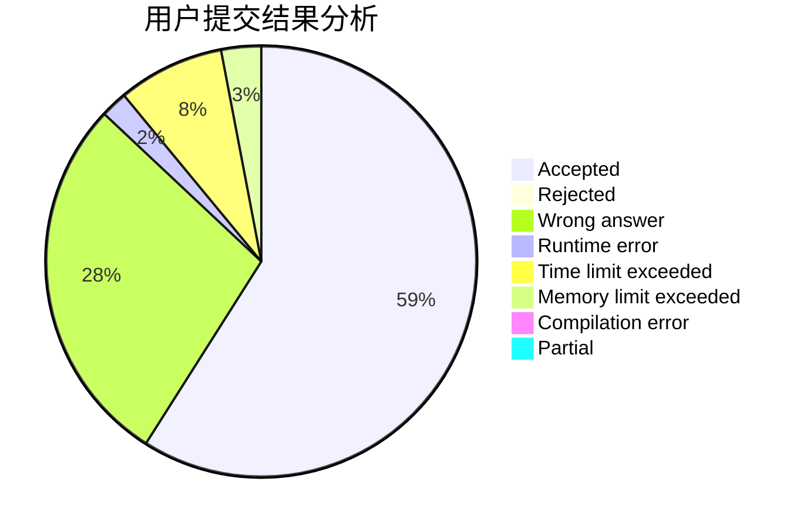
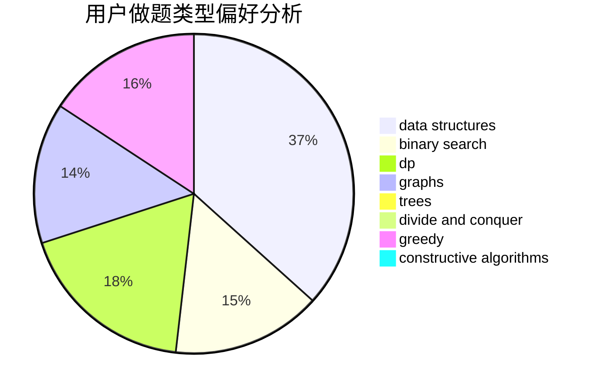
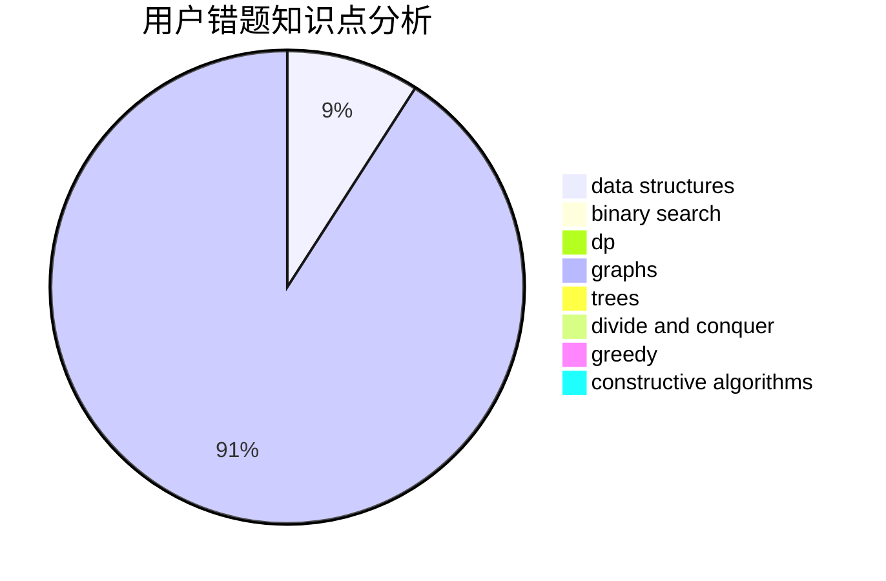

# Hartley

<!-- tabs:start -->

#### **用户提交结果分析**

#### **用户做题类型偏好分析**

#### **用户错题知识点分析**

<!-- tabs:end -->
# 推荐题目
[125A](https://codeforces.com/contest/125/problem/A)		math		  
[1375I](https://codeforces.com/contest/1375/problem/I)		geometry,
                        math,
                        matrices,
                        number theory		  
[1468B](https://codeforces.com/contest/1468/problem/B)		data structures,
                        dsu		  
[542D](https://codeforces.com/contest/542/problem/D)		dfs and similar,
                        dp,
                        hashing,
                        math,
                        number theory		  
[1288D](https://codeforces.com/contest/1288/problem/D)		binary search,
                        bitmasks,
                        dp		  
[1291C](https://codeforces.com/contest/1291/problem/C)		dsu,graphs,sortings,trees		  
[878C](https://codeforces.com/contest/878/problem/C)		data structures,
                        graphs		  
[445B](https://codeforces.com/contest/445/problem/B)		dfs and similar,
                        dsu,
                        greedy		  
[787B](https://codeforces.com/contest/787/problem/B)		greedy,
                        implementation,
                        math		  
[830A](https://codeforces.com/contest/830/problem/A)		binary search,
                        brute force,
                        dp,
                        greedy,
                        sortings		  
