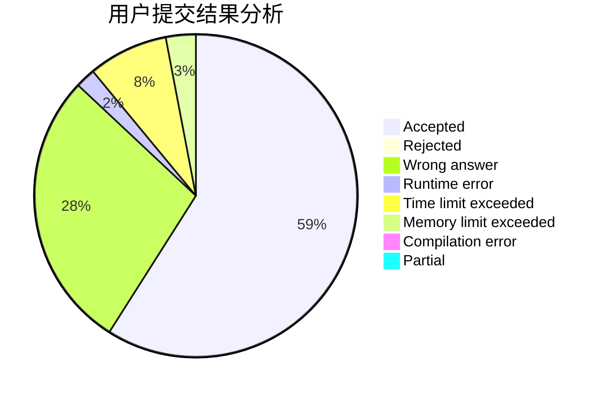
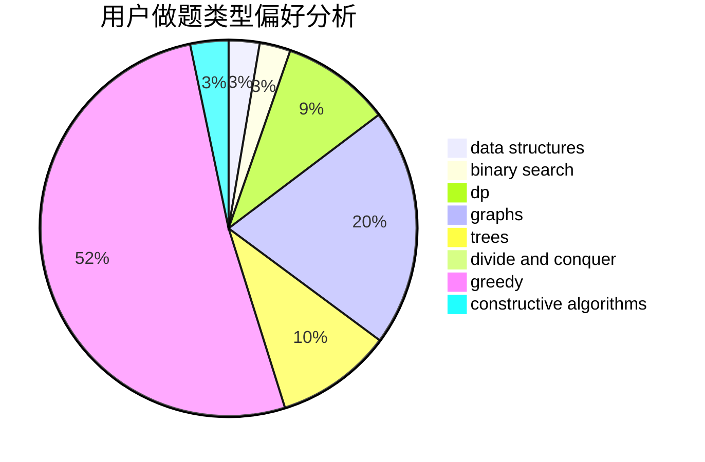
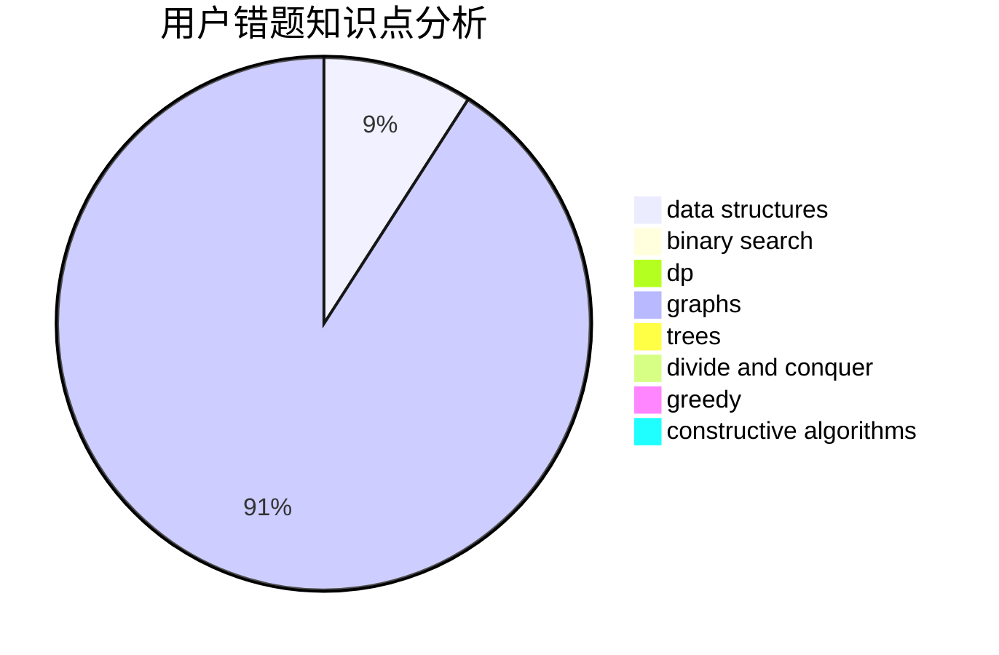

# Hartley

<!-- tabs:start -->

#### **用户提交结果分析**

#### **用户做题类型偏好分析**

#### **用户错题知识点分析**

<!-- tabs:end -->
# 推荐题目
[1265C](https://codeforces.com/contest/1265/problem/C)		dsu,graphs,sortings,trees		  
[1385C](https://codeforces.com/contest/1385/problem/C)		greedy		  
[1475C](https://codeforces.com/contest/1475/problem/C)		combinatorics,
                        graphs,
                        math		  
[566G](https://codeforces.com/contest/566/problem/G)		geometry		  
[1295F](https://codeforces.com/contest/1295/problem/F)		combinatorics,
                        dp,
                        probabilities		  
[1298B](https://codeforces.com/contest/1298/problem/B)		dsu,graphs,sortings,trees		  
[899B](https://codeforces.com/contest/899/problem/B)		implementation		  
[465D](https://codeforces.com/contest/465/problem/D)		dsu,graphs,sortings,trees		  
[803C](https://codeforces.com/contest/803/problem/C)		constructive algorithms,
                        greedy,
                        math		  
[848A](https://codeforces.com/contest/848/problem/A)		constructive algorithms		  
