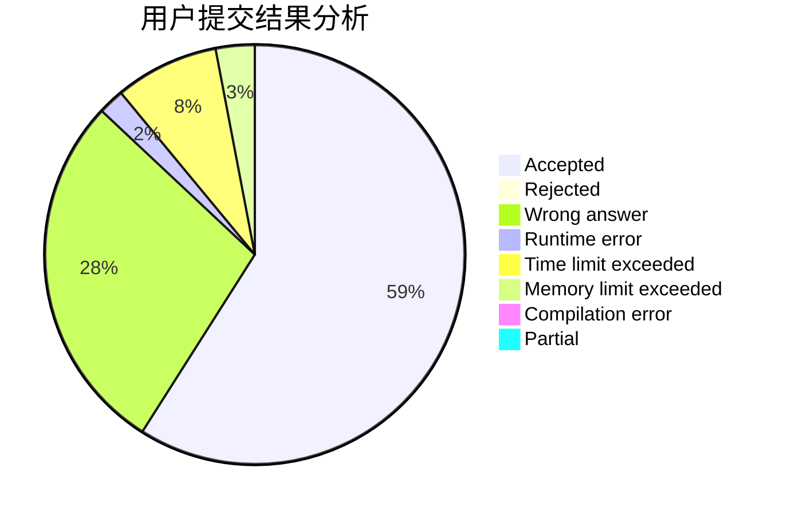
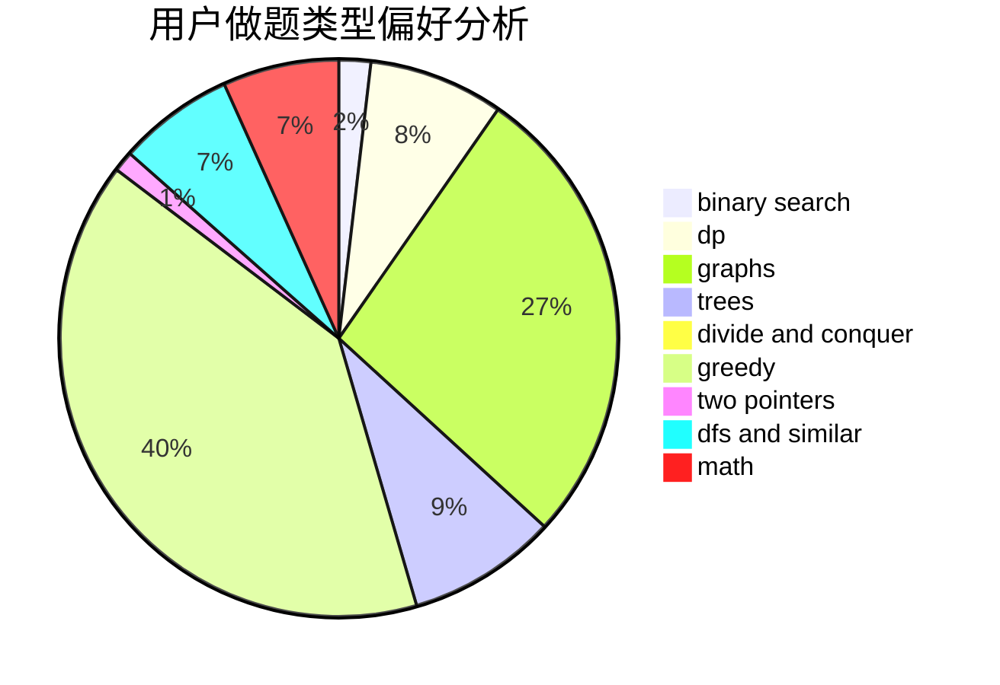

# Hartley

<!-- tabs:start -->

#### **用户提交结果分析**

#### **用户做题类型偏好分析**

<!-- tabs:end -->
# 推荐题目
[1265C](https://codeforces.com/contest/1265/problem/C)
[1385C](https://codeforces.com/contest/1385/problem/C)
[1475C](https://codeforces.com/contest/1475/problem/C)
[566G](https://codeforces.com/contest/566/problem/G)
[1295F](https://codeforces.com/contest/1295/problem/F)
[1298B](https://codeforces.com/contest/1298/problem/B)
[899B](https://codeforces.com/contest/899/problem/B)
[465D](https://codeforces.com/contest/465/problem/D)
[803C](https://codeforces.com/contest/803/problem/C)
[848A](https://codeforces.com/contest/848/problem/A)
