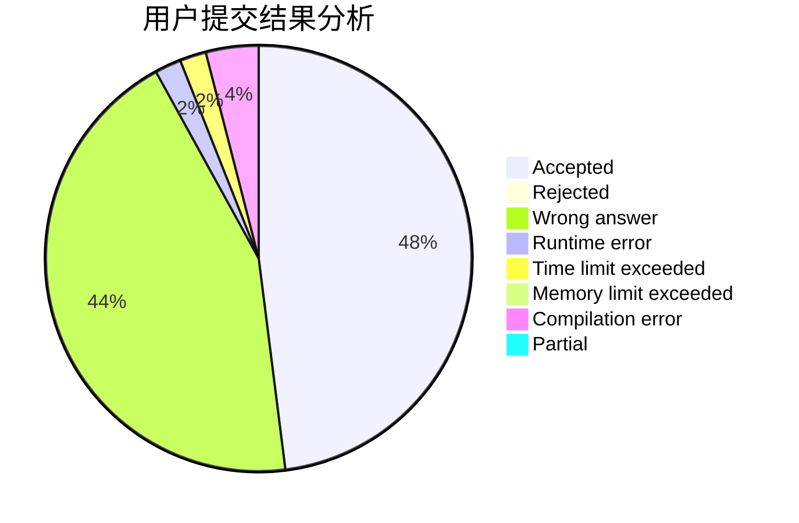
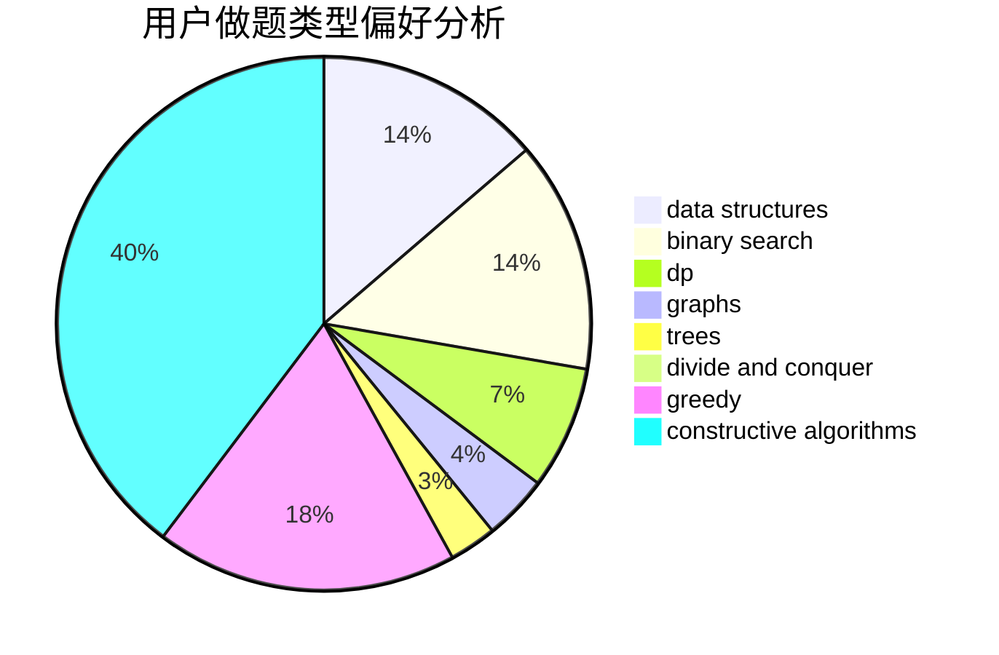

# HayasakaAi

<!-- tabs:start -->

#### **用户提交结果分析**

#### **用户做题类型偏好分析**

#### **用户错题知识点分析**

<!-- tabs:end -->
# 推荐题目
[1357A3](https://codeforces.com/contest/1357A/problem/3)		nan		  
[811D](https://codeforces.com/contest/811/problem/D)		constructive algorithms,
                        dfs and similar,
                        graphs,
                        interactive		  
[1402B](https://codeforces.com/contest/1402/problem/B)		*special problem,
                        geometry,
                        sortings		  
[1343E](https://codeforces.com/contest/1343/problem/E)		brute force,
                        graphs,
                        greedy,
                        shortest paths,
                        sortings		  
[1311E](https://codeforces.com/contest/1311/problem/E)		brute force,
                        constructive algorithms,
                        trees		  
[147B](https://codeforces.com/contest/147/problem/B)		binary search,
                        graphs,
                        matrices		  
[1492D](https://codeforces.com/contest/1492/problem/D)		bitmasks,
                        constructive algorithms,
                        greedy,
                        math		  
[547A](https://codeforces.com/contest/547/problem/A)		brute force,
                        greedy,
                        implementation,
                        math		  
[115A](https://codeforces.com/contest/115/problem/A)		dfs and similar,
                        graphs,
                        trees		  
[1195F](https://codeforces.com/contest/1195/problem/F)		data structures,
                        geometry,
                        math,
                        sortings		  
