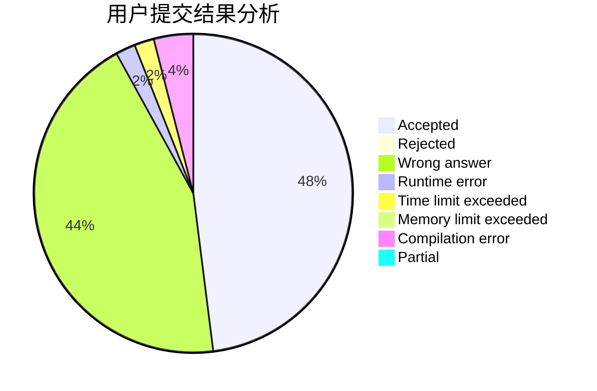
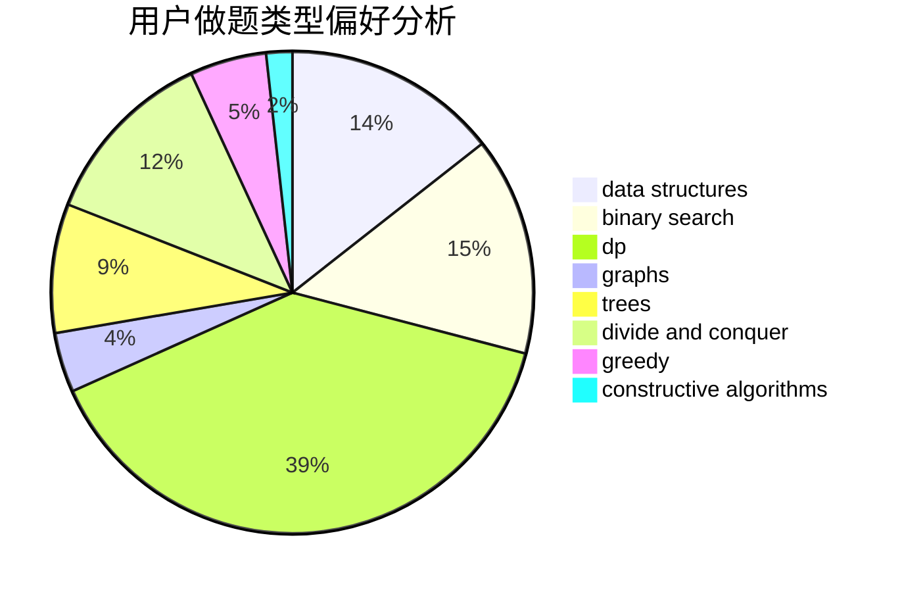

# HayasakaAi

<!-- tabs:start -->

#### **用户提交结果分析**

#### **用户做题类型偏好分析**

#### **用户错题知识点分析**

<!-- tabs:end -->
# 推荐题目
[1363E](https://codeforces.com/contest/1363/problem/E)		dfs and similar,
                        dp,
                        greedy,
                        trees		  
[830B](https://codeforces.com/contest/830/problem/B)		data structures,
                        implementation,
                        sortings		  
[1413D](https://codeforces.com/contest/1413/problem/D)		data structures,
                        greedy,
                        implementation		  
[1350C](https://codeforces.com/contest/1350/problem/C)		dsu,graphs,sortings,trees		  
[1321A](https://codeforces.com/contest/1321/problem/A)		greedy		  
[1488D](https://codeforces.com/contest/1488/problem/D)		*special problem,
                        binary search,
                        greedy		  
[1500E](https://codeforces.com/contest/1500/problem/E)		binary search,
                        data structures		  
[571C](https://codeforces.com/contest/571/problem/C)		constructive algorithms,
                        dfs and similar,
                        graphs,
                        greedy		  
[1162E](https://codeforces.com/contest/1162/problem/E)		dsu,graphs,sortings,trees		  
[11A](https://codeforces.com/contest/11/problem/A)		constructive algorithms,
                        implementation,
                        math		  
