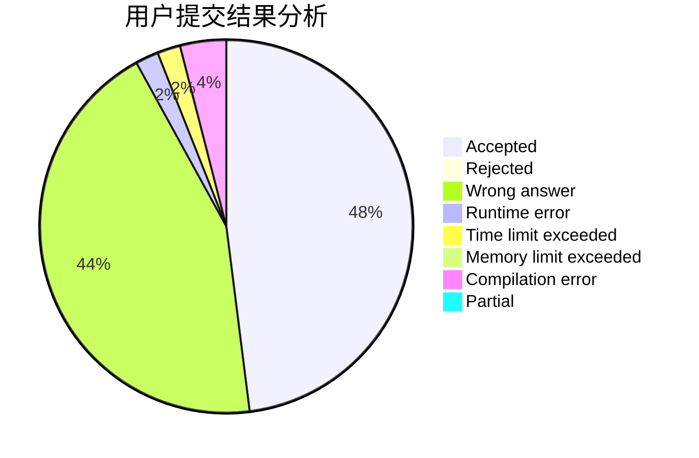
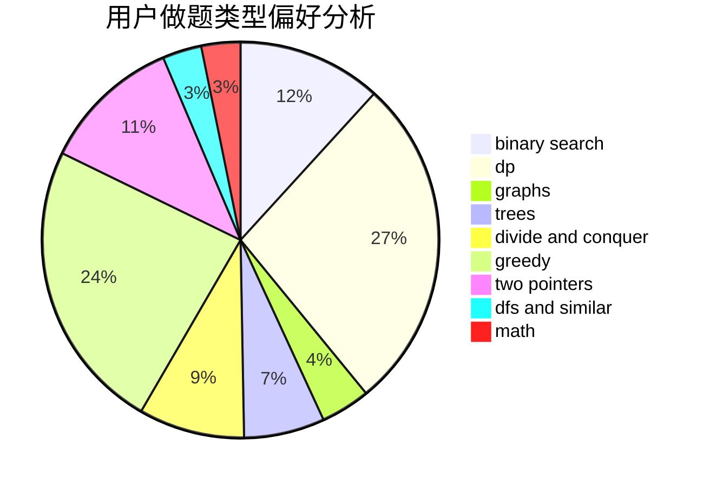

# HayasakaAi

<!-- tabs:start -->

#### **用户提交结果分析**

#### **用户做题类型偏好分析**

<!-- tabs:end -->
# 推荐题目
[1363E](https://codeforces.com/contest/1363/problem/E)
[830B](https://codeforces.com/contest/830/problem/B)
[1413D](https://codeforces.com/contest/1413/problem/D)
[1350C](https://codeforces.com/contest/1350/problem/C)
[1321A](https://codeforces.com/contest/1321/problem/A)
[1488D](https://codeforces.com/contest/1488/problem/D)
[1500E](https://codeforces.com/contest/1500/problem/E)
[571C](https://codeforces.com/contest/571/problem/C)
[1162E](https://codeforces.com/contest/1162/problem/E)
[11A](https://codeforces.com/contest/11/problem/A)
