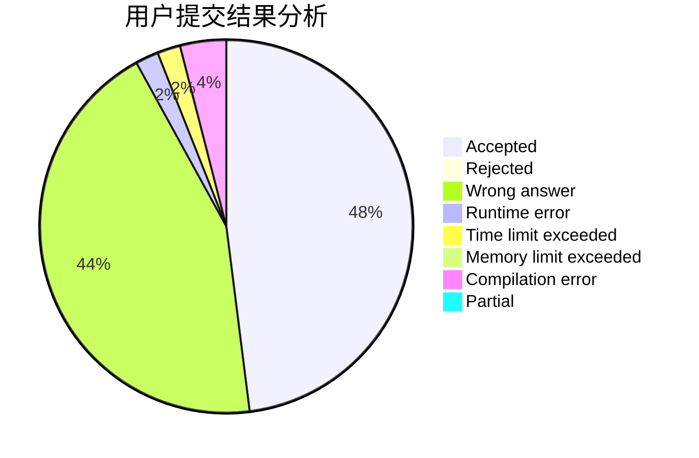
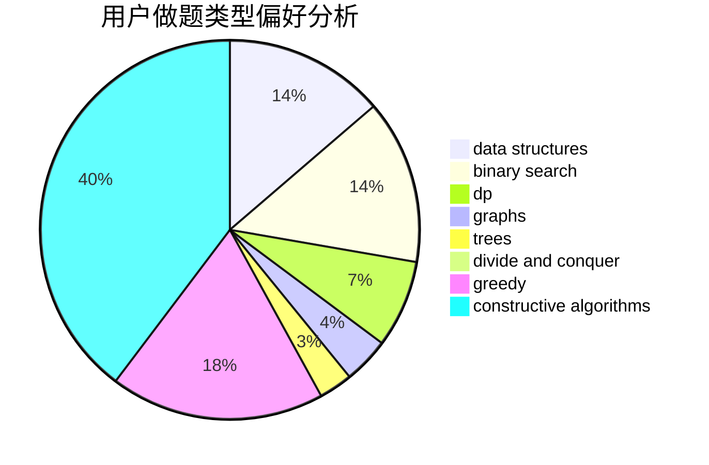

# HayasakaAi
<!-- tabs:start -->
#### **用户提交结果分析**

#### **用户做题类型偏好分析**

#### **用户错题知识点分析**

<!-- tabs:end -->
# 推荐题目
[Beautiful Regional Contest](http://codeforces.com/problemset/problem/1264/A)		greedy,
                        implementation		  
[Nastya and Scoreboard](http://codeforces.com/problemset/problem/1340/B)		bitmasks,
                        dp,
                        graphs,
                        greedy		  
[Geometers Anonymous Club](http://codeforces.com/problemset/problem/1195/F)		data structures,
                        geometry,
                        math,
                        sortings		  
[Weights Distributing](http://codeforces.com/problemset/problem/1343/E)		brute force,
                        graphs,
                        greedy,
                        shortest paths,
                        sortings		  
[Circling Round Treasures](http://codeforces.com/problemset/problem/375/C)		bitmasks,
                        shortest paths		  
[Roads](http://codeforces.com/problemset/problem/1402/B)		*special problem,
                        geometry,
                        sortings		  
[Choose Two Numbers](http://codeforces.com/problemset/problem/1206/A)		math,
                        sortings		  
[Two Rooted Trees](http://codeforces.com/problemset/problem/403/E)		data structures,
                        implementation,
                        trees		  
[Selection of Personnel](http://codeforces.com/problemset/problem/630/F)		combinatorics,
                        math		  
[Smile House](http://codeforces.com/problemset/problem/147/B)		binary search,
                        graphs,
                        matrices		  
<!-- tabs:start -->
#### **data structures**
[Beautiful Regional Contest](http://codeforces.com/problemset/problem/1195/F)		data structures,
                        geometry,
                        math,
                        sortings		  
[Nastya and Scoreboard](http://codeforces.com/problemset/problem/403/E)		data structures,
                        implementation,
                        trees		  
[Geometers Anonymous Club](http://codeforces.com/problemset/problem/899/E)		data structures,
                        dsu,
                        flows,
                        implementation,
                        two pointers		  
[Weights Distributing](http://codeforces.com/problemset/problem/1353/D)		constructive algorithms,
                        data structures,
                        sortings		  
[Circling Round Treasures](https://codeforces.com/contest/1314/problem/A)		data structures,
                        greedy,
                        sortings		  
[Roads](http://codeforces.com/problemset/problem/1284/B)		binary search,
                        combinatorics,
                        data structures,
                        dp,
                        implementation,
                        sortings		  
[Choose Two Numbers](http://codeforces.com/problemset/problem/786/B)		data structures,
                        graphs,
                        shortest paths		  
[Two Rooted Trees](http://codeforces.com/problemset/problem/1492/B)		data structures,
                        greedy,
                        math		  
[Selection of Personnel](http://codeforces.com/problemset/problem/86/D)		data structures,
                        implementation,
                        math,
                        two pointers		  
[Smile House](http://codeforces.com/problemset/problem/1492/C)		binary search,
                        data structures,
                        dp,
                        greedy,
                        two pointers		  
#### **binary search**
[Beautiful Regional Contest](http://codeforces.com/problemset/problem/147/B)		binary search,
                        graphs,
                        matrices		  
[Nastya and Scoreboard](http://codeforces.com/problemset/problem/865/B)		binary search,
                        sortings,
                        ternary search		  
[Geometers Anonymous Club](http://codeforces.com/problemset/problem/1310/C)		binary search,
                        dp,
                        strings		  
[Weights Distributing](http://codeforces.com/problemset/problem/1297/D)		*special problem,
                        binary search,
                        greedy,
                        sortings		  
[Circling Round Treasures](http://codeforces.com/problemset/problem/1284/B)		binary search,
                        combinatorics,
                        data structures,
                        dp,
                        implementation,
                        sortings		  
[Roads](http://codeforces.com/problemset/problem/1119/D)		binary search,
                        sortings		  
[Choose Two Numbers](http://codeforces.com/problemset/problem/1492/C)		binary search,
                        data structures,
                        dp,
                        greedy,
                        two pointers		  
[Two Rooted Trees](http://codeforces.com/problemset/problem/1463/D)		binary search,
                        constructive algorithms,
                        greedy,
                        two pointers		  
[Selection of Personnel](http://codeforces.com/problemset/problem/1490/G)		binary search,
                        data structures,
                        math		  
[Smile House](http://codeforces.com/problemset/problem/1479/D)		binary search,
                        bitmasks,
                        brute force,
                        data structures,
                        probabilities,
                        trees		  
#### **dp**
[Beautiful Regional Contest](http://codeforces.com/problemset/problem/1340/B)		bitmasks,
                        dp,
                        graphs,
                        greedy		  
[Nastya and Scoreboard](http://codeforces.com/problemset/problem/429/B)		dp		  
[Geometers Anonymous Club](http://codeforces.com/problemset/problem/321/D)		dp,
                        greedy,
                        math		  
[Weights Distributing](http://codeforces.com/problemset/problem/799/D)		brute force,
                        dp,
                        meet-in-the-middle		  
[Circling Round Treasures](http://codeforces.com/problemset/problem/417/D)		bitmasks,
                        dp,
                        greedy,
                        sortings		  
[Roads](http://codeforces.com/problemset/problem/1310/C)		binary search,
                        dp,
                        strings		  
[Choose Two Numbers](http://codeforces.com/problemset/problem/1185/G1)		bitmasks,
                        combinatorics,
                        dp		  
[Two Rooted Trees](http://codeforces.com/problemset/problem/1012/F)		dp,
                        implementation		  
[Selection of Personnel](http://codeforces.com/problemset/problem/1284/B)		binary search,
                        combinatorics,
                        data structures,
                        dp,
                        implementation,
                        sortings		  
[Smile House](http://codeforces.com/problemset/problem/41/D)		dp		  
#### **graph**
[Beautiful Regional Contest](http://codeforces.com/problemset/problem/1340/B)		bitmasks,
                        dp,
                        graphs,
                        greedy		  
[Nastya and Scoreboard](http://codeforces.com/problemset/problem/1343/E)		brute force,
                        graphs,
                        greedy,
                        shortest paths,
                        sortings		  
[Geometers Anonymous Club](http://codeforces.com/problemset/problem/147/B)		binary search,
                        graphs,
                        matrices		  
[Weights Distributing](http://codeforces.com/problemset/problem/115/A)		dfs and similar,
                        graphs,
                        trees		  
[Circling Round Treasures](http://codeforces.com/problemset/problem/1019/C)		constructive algorithms,
                        graphs		  
[Roads](http://codeforces.com/problemset/problem/1006/E)		dfs and similar,
                        graphs,
                        trees		  
[Choose Two Numbers](http://codeforces.com/problemset/problem/81/E)		dfs and similar,
                        dp,
                        dsu,
                        graphs,
                        implementation,
                        trees		  
[Two Rooted Trees](http://codeforces.com/problemset/problem/786/B)		data structures,
                        graphs,
                        shortest paths		  
[Selection of Personnel](http://codeforces.com/problemset/problem/811/D)		constructive algorithms,
                        dfs and similar,
                        graphs,
                        interactive		  
[Smile House](http://codeforces.com/problemset/problem/1487/C)		brute force,
                        constructive algorithms,
                        dfs and similar,
                        graphs,
                        greedy,
                        implementation,
                        math		  
#### **trees**
[Beautiful Regional Contest](http://codeforces.com/problemset/problem/403/E)		data structures,
                        implementation,
                        trees		  
[Nastya and Scoreboard](http://codeforces.com/problemset/problem/1283/F)		constructive algorithms,
                        greedy,
                        trees		  
[Geometers Anonymous Club](http://codeforces.com/problemset/problem/1311/E)		brute force,
                        constructive algorithms,
                        trees		  
[Weights Distributing](http://codeforces.com/problemset/problem/115/A)		dfs and similar,
                        graphs,
                        trees		  
[Circling Round Treasures](http://codeforces.com/problemset/problem/1006/E)		dfs and similar,
                        graphs,
                        trees		  
[Roads](http://codeforces.com/problemset/problem/81/E)		dfs and similar,
                        dp,
                        dsu,
                        graphs,
                        implementation,
                        trees		  
[Choose Two Numbers](http://codeforces.com/problemset/problem/1491/E)		brute force,
                        dfs and similar,
                        divide and conquer,
                        number theory,
                        trees		  
[Two Rooted Trees](http://codeforces.com/problemset/problem/1479/D)		binary search,
                        bitmasks,
                        brute force,
                        data structures,
                        probabilities,
                        trees		  
[Selection of Personnel](http://codeforces.com/problemset/problem/1511/C)		brute force,
                        data structures,
                        implementation,
                        trees		  
[Smile House](http://codeforces.com/problemset/problem/1499/F)		combinatorics,
                        dfs and similar,
                        dp,
                        trees		  
#### **divide and conquer**
[Beautiful Regional Contest](http://codeforces.com/problemset/problem/1491/E)		brute force,
                        dfs and similar,
                        divide and conquer,
                        number theory,
                        trees		  
[Nastya and Scoreboard](http://codeforces.com/problemset/problem/1461/D)		binary search,
                        brute force,
                        data structures,
                        divide and conquer,
                        implementation,
                        sortings		  
[Geometers Anonymous Club](http://codeforces.com/problemset/problem/1466/G)		combinatorics,
                        divide and conquer,
                        hashing,
                        math,
                        string suffix structures,
                        strings		  
[Weights Distributing](http://codeforces.com/problemset/problem/1490/D)		dfs and similar,
                        divide and conquer,
                        implementation		  
[Circling Round Treasures](https://codeforces.com/contest/1483/problem/C)		data structures,
                        divide and conquer,
                        dp		  
[Roads](http://codeforces.com/problemset/problem/1491/E)		brute force,
                        dfs and similar,
                        divide and conquer,
                        number theory,
                        trees		  
[Choose Two Numbers](http://codeforces.com/problemset/problem/1303/G)		data structures,
                        divide and conquer,
                        geometry,
                        trees		  
[Two Rooted Trees](http://codeforces.com/problemset/problem/1494/D)		constructive algorithms,
                        data structures,
                        dfs and similar,
                        divide and conquer,
                        dsu,
                        greedy,
                        sortings,
                        trees		  
[Selection of Personnel](http://codeforces.com/problemset/problem/1482/E)		data structures,
                        divide and conquer,
                        dp		  
[Smile House](http://codeforces.com/problemset/problem/566/C)		dfs and similar,
                        divide and conquer,
                        trees		  
#### **greedy**
[Beautiful Regional Contest](http://codeforces.com/problemset/problem/1264/A)		greedy,
                        implementation		  
[Nastya and Scoreboard](http://codeforces.com/problemset/problem/1340/B)		bitmasks,
                        dp,
                        graphs,
                        greedy		  
[Geometers Anonymous Club](http://codeforces.com/problemset/problem/1343/E)		brute force,
                        graphs,
                        greedy,
                        shortest paths,
                        sortings		  
[Weights Distributing](https://codeforces.com/contest/443/problem/D)		greedy,
                        math,
                        probabilities		  
[Circling Round Treasures](http://codeforces.com/problemset/problem/1283/F)		constructive algorithms,
                        greedy,
                        trees		  
[Roads](http://codeforces.com/problemset/problem/321/D)		dp,
                        greedy,
                        math		  
[Choose Two Numbers](http://codeforces.com/problemset/problem/417/D)		bitmasks,
                        dp,
                        greedy,
                        sortings		  
[Two Rooted Trees](http://codeforces.com/problemset/problem/547/A)		brute force,
                        greedy,
                        implementation,
                        math		  
[Selection of Personnel](http://codeforces.com/problemset/problem/1297/D)		*special problem,
                        binary search,
                        greedy,
                        sortings		  
[Smile House](http://codeforces.com/problemset/problem/1186/D)		constructive algorithms,
                        greedy,
                        math		  
#### **constructive algorithms**
[Beautiful Regional Contest](http://codeforces.com/problemset/problem/1283/F)		constructive algorithms,
                        greedy,
                        trees		  
[Nastya and Scoreboard](http://codeforces.com/problemset/problem/1311/E)		brute force,
                        constructive algorithms,
                        trees		  
[Geometers Anonymous Club](https://codeforces.com/contest/902/problem/D)		constructive algorithms,
                        math		  
[Weights Distributing](http://codeforces.com/problemset/problem/1019/C)		constructive algorithms,
                        graphs		  
[Circling Round Treasures](http://codeforces.com/problemset/problem/1186/D)		constructive algorithms,
                        greedy,
                        math		  
[Roads](http://codeforces.com/problemset/problem/1353/D)		constructive algorithms,
                        data structures,
                        sortings		  
[Choose Two Numbers](http://codeforces.com/problemset/problem/218/A)		brute force,
                        constructive algorithms,
                        implementation		  
[Two Rooted Trees](http://codeforces.com/problemset/problem/1367/C)		constructive algorithms,
                        greedy,
                        math		  
[Selection of Personnel](http://codeforces.com/problemset/problem/1492/D)		bitmasks,
                        constructive algorithms,
                        greedy,
                        math		  
[Smile House](http://codeforces.com/problemset/problem/811/D)		constructive algorithms,
                        dfs and similar,
                        graphs,
                        interactive		  
#### **sortings**
[Beautiful Regional Contest](http://codeforces.com/problemset/problem/1195/F)		data structures,
                        geometry,
                        math,
                        sortings		  
[Nastya and Scoreboard](http://codeforces.com/problemset/problem/1343/E)		brute force,
                        graphs,
                        greedy,
                        shortest paths,
                        sortings		  
[Geometers Anonymous Club](http://codeforces.com/problemset/problem/1402/B)		*special problem,
                        geometry,
                        sortings		  
[Weights Distributing](http://codeforces.com/problemset/problem/1206/A)		math,
                        sortings		  
[Circling Round Treasures](http://codeforces.com/problemset/problem/865/B)		binary search,
                        sortings,
                        ternary search		  
[Roads](http://codeforces.com/problemset/problem/417/D)		bitmasks,
                        dp,
                        greedy,
                        sortings		  
[Choose Two Numbers](http://codeforces.com/problemset/problem/1297/D)		*special problem,
                        binary search,
                        greedy,
                        sortings		  
[Two Rooted Trees](http://codeforces.com/problemset/problem/1353/D)		constructive algorithms,
                        data structures,
                        sortings		  
[Selection of Personnel](https://codeforces.com/contest/1314/problem/A)		data structures,
                        greedy,
                        sortings		  
[Smile House](http://codeforces.com/problemset/problem/1284/B)		binary search,
                        combinatorics,
                        data structures,
                        dp,
                        implementation,
                        sortings		  
<!-- tabs:end -->
