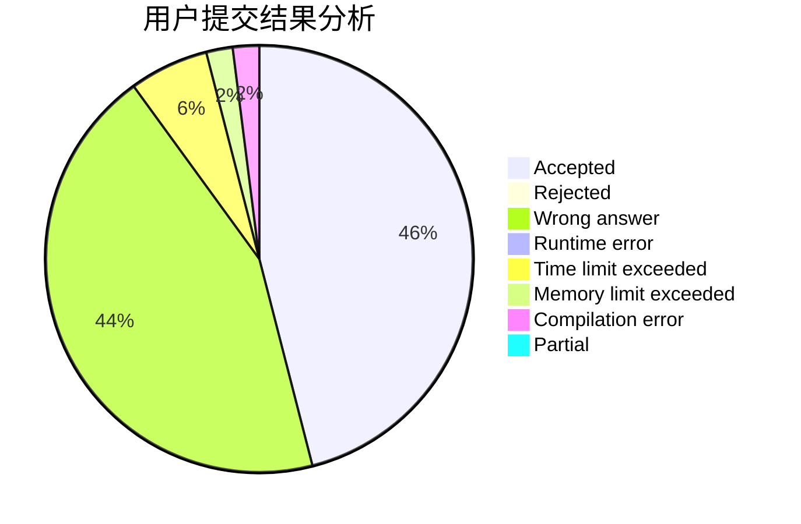
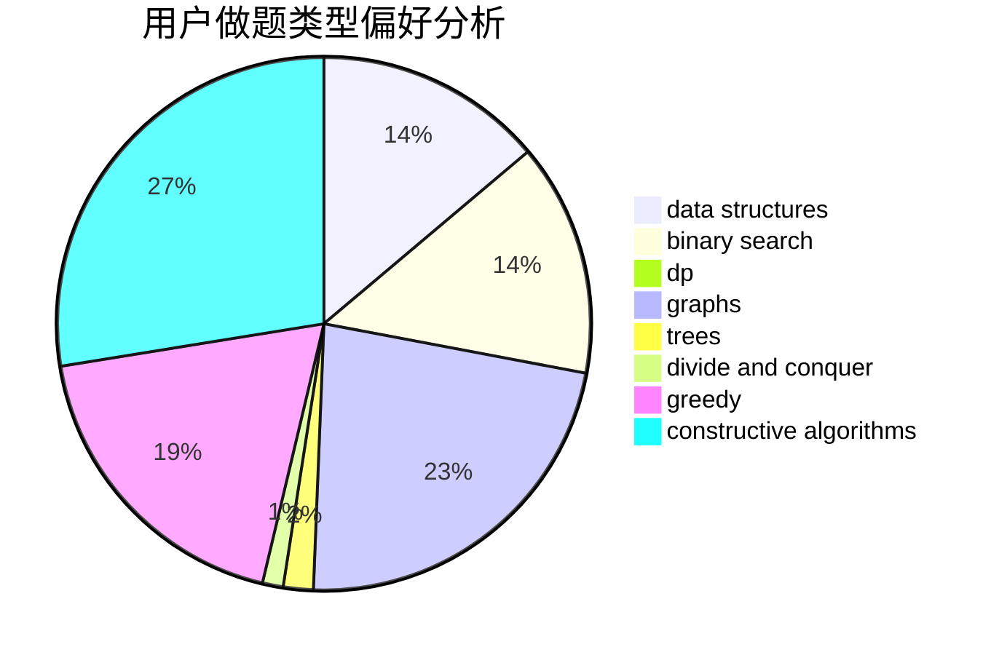
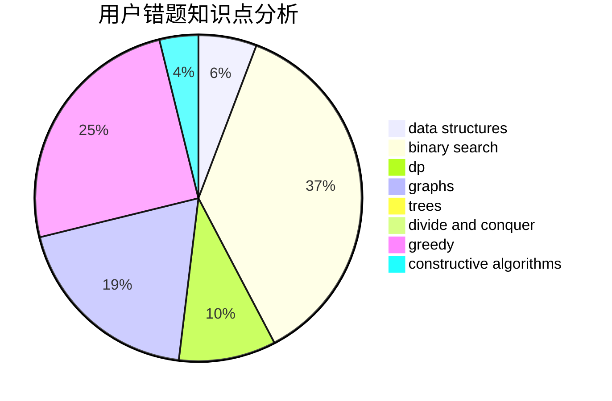

# Hayasaka_

<!-- tabs:start -->

#### **用户提交结果分析**

#### **用户做题类型偏好分析**

#### **用户错题知识点分析**

<!-- tabs:end -->
# 推荐题目
[1015E2](https://codeforces.com/contest/1015E/problem/2)		binary search,
                        dp,
                        greedy		  
[840C](https://codeforces.com/contest/840/problem/C)		combinatorics,
                        dp		  
[1349C](https://codeforces.com/contest/1349/problem/C)		dfs and similar,
                        graphs,
                        implementation,
                        shortest paths		  
[1070B](https://codeforces.com/contest/1070/problem/B)		data structures,
                        greedy		  
[802O](https://codeforces.com/contest/802/problem/O)		binary search,
                        data structures,
                        flows		  
[171G](https://codeforces.com/contest/171/problem/G)		*special problem		  
[299B](https://codeforces.com/contest/299/problem/B)		brute force,
                        implementation		  
[38G](https://codeforces.com/contest/38/problem/G)		data structures		  
[1133A](https://codeforces.com/contest/1133/problem/A)		implementation		  
[6D](https://codeforces.com/contest/6/problem/D)		brute force,
                        dp		  
