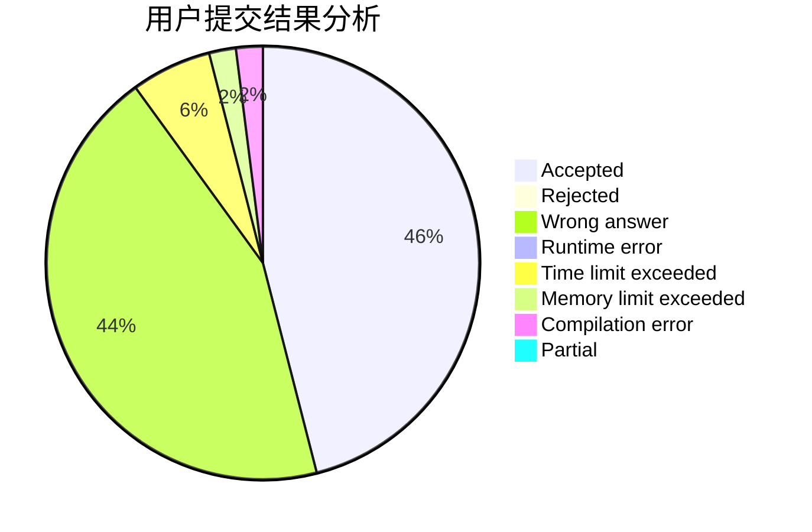
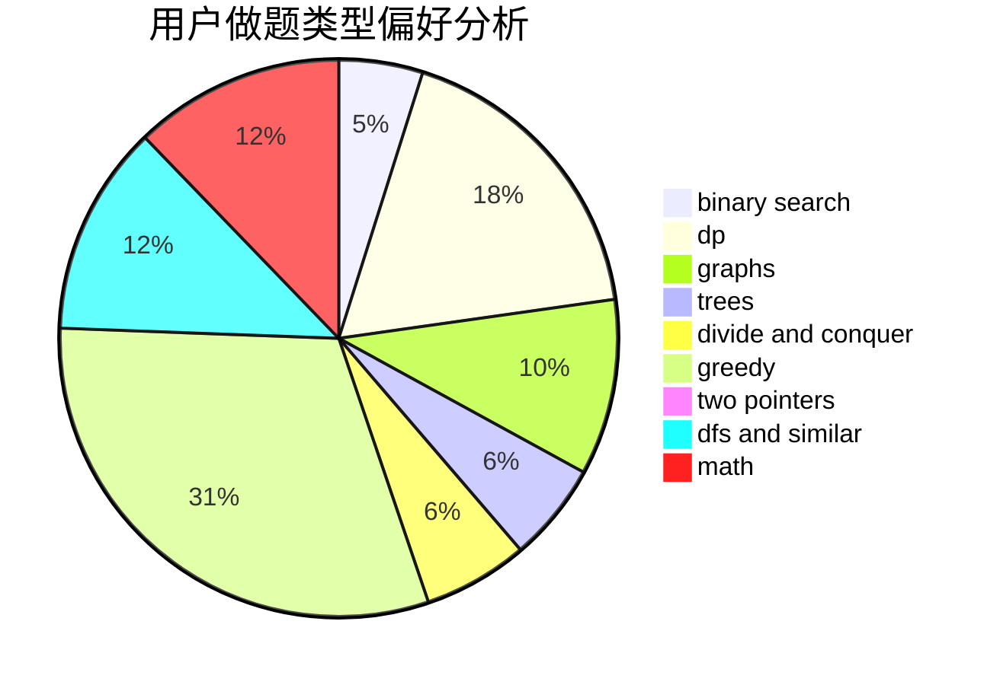

# Hayasaka_

<!-- tabs:start -->

#### **用户提交结果分析**

#### **用户做题类型偏好分析**

<!-- tabs:end -->
# 推荐题目
[1016B](https://codeforces.com/contest/1016/problem/B)
[85A](https://codeforces.com/contest/85/problem/A)
[13561](https://codeforces.com/contest/1356/problem/1)
[1070E](https://codeforces.com/contest/1070/problem/E)
[818E](https://codeforces.com/contest/818/problem/E)
[199E](https://codeforces.com/contest/199/problem/E)
[3161](https://codeforces.com/contest/316/problem/1)
[41E](https://codeforces.com/contest/41/problem/E)
[1137B](https://codeforces.com/contest/1137/problem/B)
[717H](https://codeforces.com/contest/717/problem/H)
