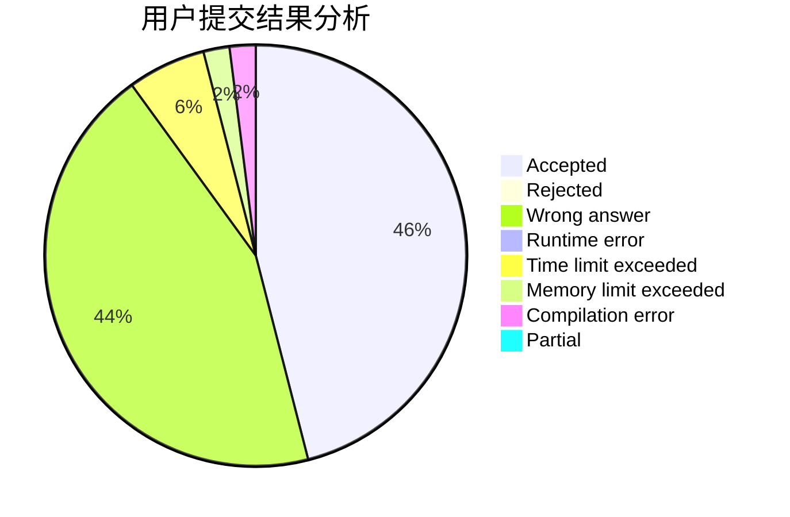
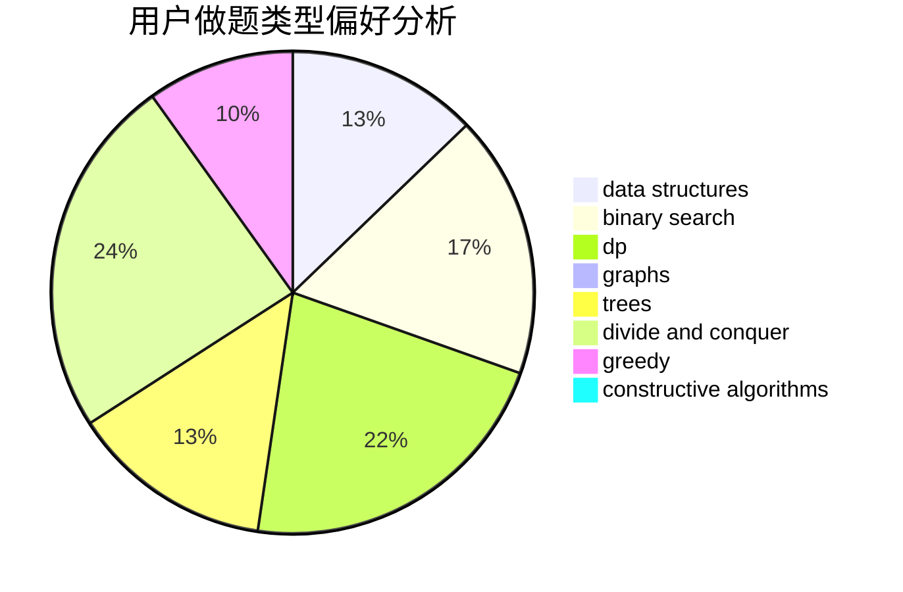
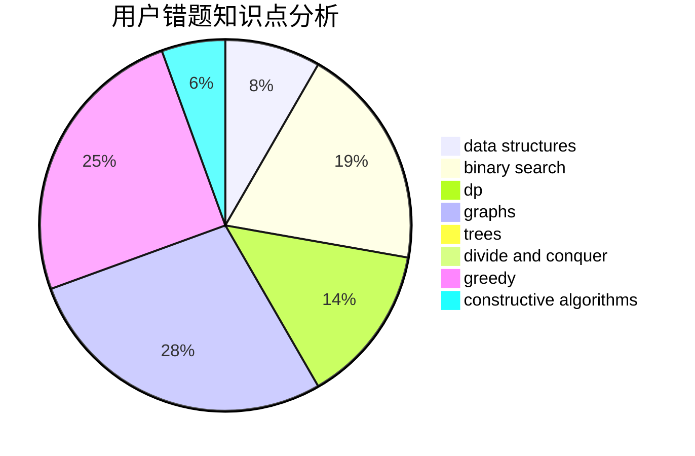

# Hayasaka_

<!-- tabs:start -->

#### **用户提交结果分析**

#### **用户做题类型偏好分析**

#### **用户错题知识点分析**

<!-- tabs:end -->
# 推荐题目
[1016B](https://codeforces.com/contest/1016/problem/B)		brute force,
                        implementation		  
[85A](https://codeforces.com/contest/85/problem/A)		constructive algorithms,
                        implementation		  
[13561](https://codeforces.com/contest/1356/problem/1)		dsu,graphs,sortings,trees		  
[1070E](https://codeforces.com/contest/1070/problem/E)		binary search,
                        data structures		  
[818E](https://codeforces.com/contest/818/problem/E)		binary search,
                        data structures,
                        number theory,
                        two pointers		  
[199E](https://codeforces.com/contest/199/problem/E)		dsu,graphs,sortings,trees		  
[3161](https://codeforces.com/contest/316/problem/1)		dsu,graphs,sortings,trees		  
[41E](https://codeforces.com/contest/41/problem/E)		constructive algorithms,
                        graphs,
                        greedy		  
[1137B](https://codeforces.com/contest/1137/problem/B)		greedy,
                        hashing,
                        strings		  
[717H](https://codeforces.com/contest/717/problem/H)		math,
                        probabilities		  
