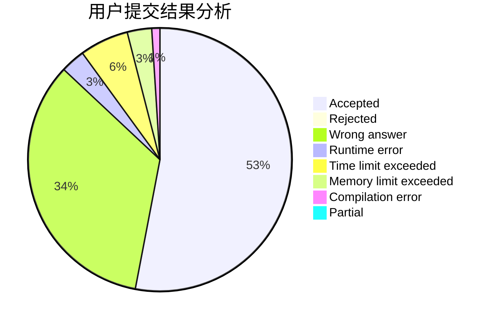
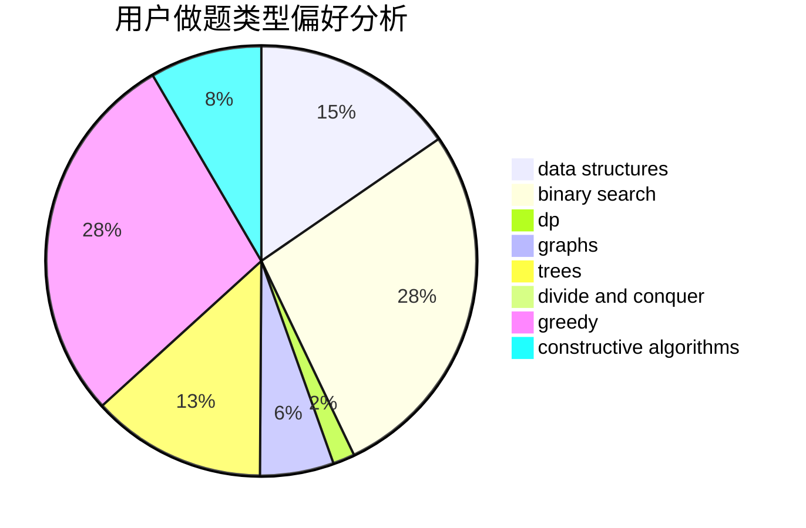
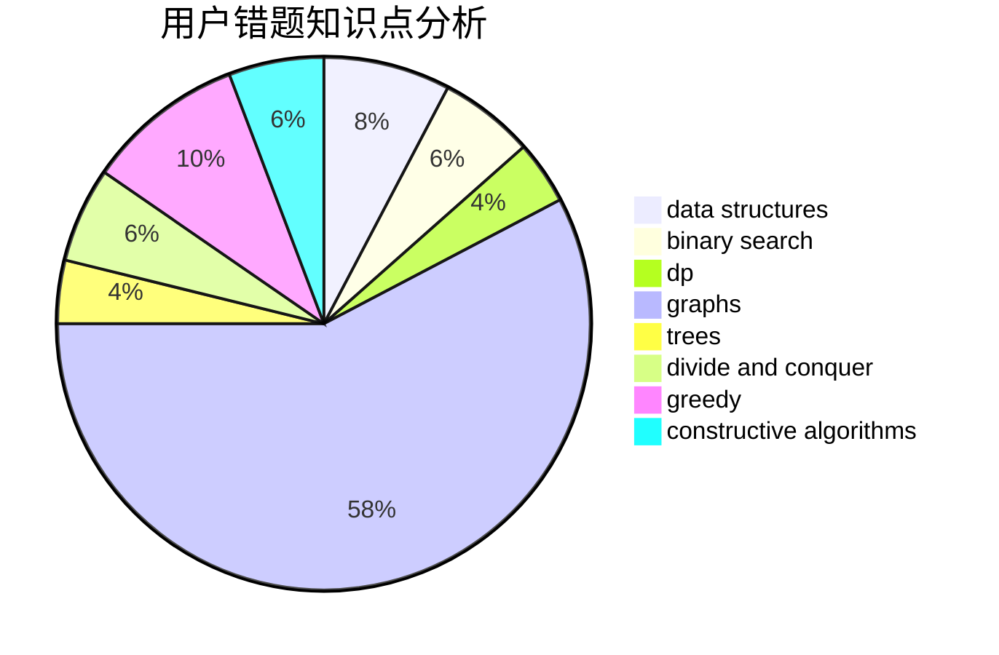

# Hazyknight

<!-- tabs:start -->

#### **用户提交结果分析**

#### **用户做题类型偏好分析**

#### **用户错题知识点分析**

<!-- tabs:end -->
# 推荐题目
[1204D1](https://codeforces.com/contest/1204D/problem/1)		brute force,
                        greedy,
                        strings		  
[1270H](https://codeforces.com/contest/1270/problem/H)		data structures		  
[796C](https://codeforces.com/contest/796/problem/C)		constructive algorithms,
                        data structures,
                        dp,
                        trees		  
[449B](https://codeforces.com/contest/449/problem/B)		graphs,
                        greedy,
                        shortest paths		  
[1165D](https://codeforces.com/contest/1165/problem/D)		math,
                        number theory		  
[1471D](https://codeforces.com/contest/1471/problem/D)		dsu,graphs,sortings,trees		  
[367D](https://codeforces.com/contest/367/problem/D)		bitmasks,
                        dfs and similar		  
[232B](https://codeforces.com/contest/232/problem/B)		bitmasks,
                        combinatorics,
                        dp,
                        math		  
[903A](https://codeforces.com/contest/903/problem/A)		greedy,
                        implementation		  
[877C](https://codeforces.com/contest/877/problem/C)		constructive algorithms		  
