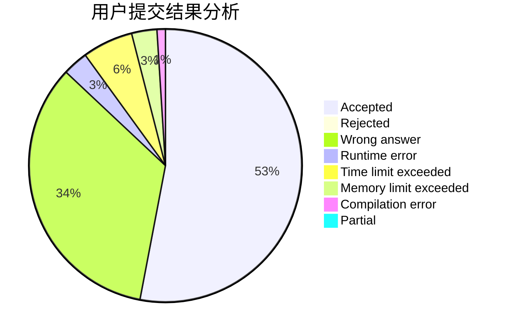
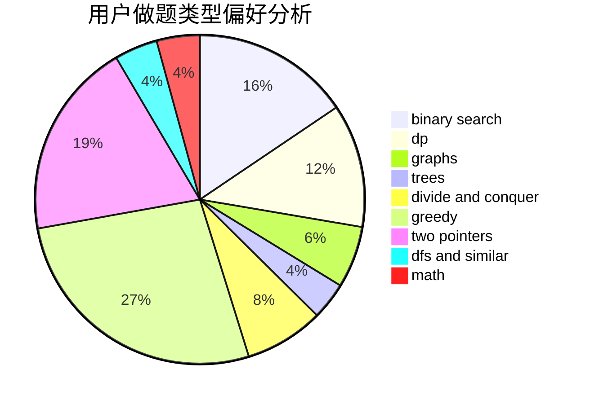

# Hazyknight

<!-- tabs:start -->

#### **用户提交结果分析**

#### **用户做题类型偏好分析**

<!-- tabs:end -->
# 推荐题目
[12092](https://codeforces.com/contest/1209/problem/2)
[1280A](https://codeforces.com/contest/1280/problem/A)
[810D](https://codeforces.com/contest/810/problem/D)
[468E](https://codeforces.com/contest/468/problem/E)
[1167F](https://codeforces.com/contest/1167/problem/F)
[147B](https://codeforces.com/contest/147/problem/B)
[398C](https://codeforces.com/contest/398/problem/C)
[254A](https://codeforces.com/contest/254/problem/A)
[919B](https://codeforces.com/contest/919/problem/B)
[898B](https://codeforces.com/contest/898/problem/B)
