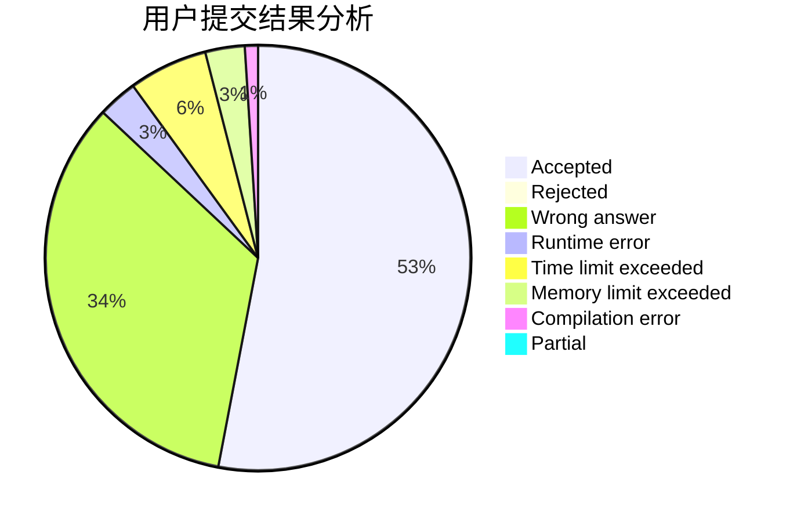
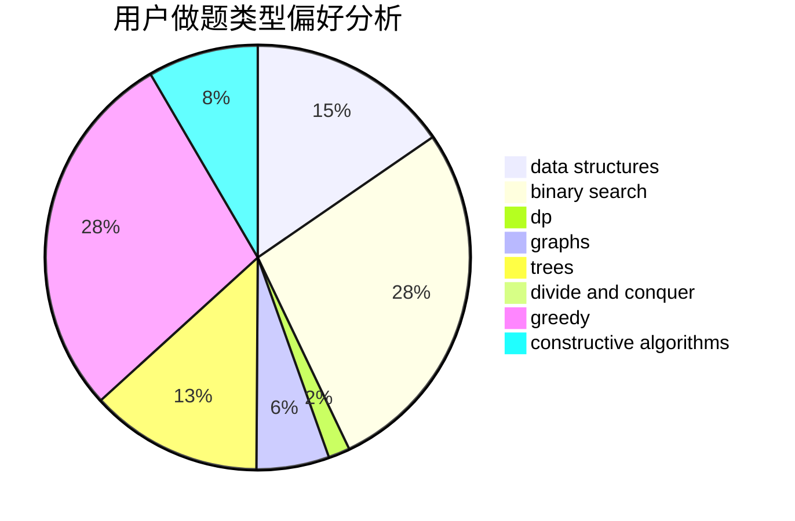
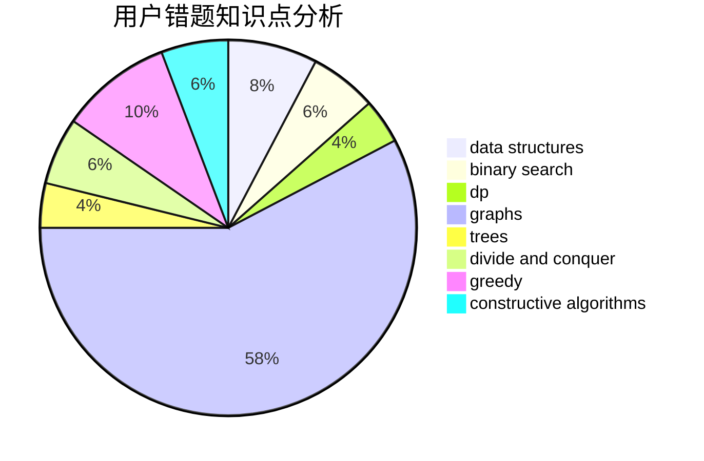

# Hazyknight
<!-- tabs:start -->
#### **用户提交结果分析**

#### **用户做题类型偏好分析**

#### **用户错题知识点分析**

<!-- tabs:end -->
# 推荐题目
[GCD Compression](http://codeforces.com/problemset/problem/1370/B)		constructive algorithms,
                        math,
                        number theory		  
[Topforces Strikes Back](http://codeforces.com/problemset/problem/1183/F)		brute force,
                        math,
                        sortings		  
[Boboniu Walks on Graph](https://codeforces.com/contest/1395/problem/E)		brute force,
                        dfs and similar,
                        graphs,
                        hashing		  
[Number of Components](http://codeforces.com/problemset/problem/1270/H)		data structures		  
[Slava and tanks](http://codeforces.com/problemset/problem/877/C)		constructive algorithms		  
[Strange Radiation](http://codeforces.com/problemset/problem/832/C)		binary search,
                        implementation,
                        math		  
[Jzzhu and Cities](http://codeforces.com/problemset/problem/449/B)		graphs,
                        greedy,
                        shortest paths		  
[A Cookie for You](http://codeforces.com/problemset/problem/1371/C)		greedy,
                        implementation,
                        math		  
[Sereja and Sets](http://codeforces.com/problemset/problem/367/D)		bitmasks,
                        dfs and similar		  
[Sea Battle](https://codeforces.com/contest/737/problem/B)		math		  
<!-- tabs:start -->
#### **data structures**
[GCD Compression](http://codeforces.com/problemset/problem/1270/H)		data structures		  
[Topforces Strikes Back](http://codeforces.com/problemset/problem/834/B)		data structures,
                        implementation		  
[Boboniu Walks on Graph](http://codeforces.com/problemset/problem/321/E)		data structures,
                        divide and conquer,
                        dp		  
[Number of Components](http://codeforces.com/problemset/problem/1213/B)		data structures,
                        implementation		  
[Slava and tanks](http://codeforces.com/problemset/problem/796/C)		constructive algorithms,
                        data structures,
                        dp,
                        trees		  
[Strange Radiation](http://codeforces.com/problemset/problem/176/E)		data structures,
                        dfs and similar,
                        trees		  
[Jzzhu and Cities](http://codeforces.com/problemset/problem/6/E)		binary search,
                        data structures,
                        dsu,
                        trees,
                        two pointers		  
[A Cookie for You](http://codeforces.com/problemset/problem/1009/F)		data structures,
                        dsu,
                        trees		  
[Sereja and Sets](http://codeforces.com/problemset/problem/1492/C)		binary search,
                        data structures,
                        dp,
                        greedy,
                        two pointers		  
[Sea Battle](http://codeforces.com/problemset/problem/1490/G)		binary search,
                        data structures,
                        math		  
#### **binary search**
[GCD Compression](http://codeforces.com/problemset/problem/832/C)		binary search,
                        implementation,
                        math		  
[Topforces Strikes Back](https://codeforces.com/contest/205/problem/C)		binary search,
                        combinatorics,
                        dp		  
[Boboniu Walks on Graph](http://codeforces.com/problemset/problem/1076/C)		binary search,
                        math		  
[Number of Components](http://codeforces.com/problemset/problem/335/A)		binary search,
                        constructive algorithms,
                        greedy		  
[Slava and tanks](http://codeforces.com/problemset/problem/6/E)		binary search,
                        data structures,
                        dsu,
                        trees,
                        two pointers		  
[Strange Radiation](http://codeforces.com/problemset/problem/1492/C)		binary search,
                        data structures,
                        dp,
                        greedy,
                        two pointers		  
[Jzzhu and Cities](http://codeforces.com/problemset/problem/1463/D)		binary search,
                        constructive algorithms,
                        greedy,
                        two pointers		  
[A Cookie for You](http://codeforces.com/problemset/problem/1490/G)		binary search,
                        data structures,
                        math		  
[Sereja and Sets](http://codeforces.com/problemset/problem/1479/D)		binary search,
                        bitmasks,
                        brute force,
                        data structures,
                        probabilities,
                        trees		  
[Sea Battle](http://codeforces.com/problemset/problem/1436/E)		binary search,
                        data structures,
                        two pointers		  
#### **dp**
[GCD Compression](https://codeforces.com/contest/205/problem/C)		binary search,
                        combinatorics,
                        dp		  
[Topforces Strikes Back](http://codeforces.com/problemset/problem/321/E)		data structures,
                        divide and conquer,
                        dp		  
[Boboniu Walks on Graph](http://codeforces.com/problemset/problem/796/C)		constructive algorithms,
                        data structures,
                        dp,
                        trees		  
[Number of Components](http://codeforces.com/problemset/problem/232/B)		bitmasks,
                        combinatorics,
                        dp,
                        math		  
[Slava and tanks](http://codeforces.com/problemset/problem/208/B)		dfs and similar,
                        dp		  
[Strange Radiation](http://codeforces.com/problemset/problem/1260/E)		brute force,
                        dp,
                        greedy		  
[Jzzhu and Cities](http://codeforces.com/problemset/problem/1492/C)		binary search,
                        data structures,
                        dp,
                        greedy,
                        two pointers		  
[A Cookie for You](https://codeforces.com/contest/1457/problem/C)		brute force,
                        dp,
                        implementation		  
[Sereja and Sets](http://codeforces.com/problemset/problem/1491/C)		brute force,
                        data structures,
                        dp,
                        greedy,
                        implementation		  
[Sea Battle](http://codeforces.com/problemset/problem/1437/C)		dp,
                        flows,
                        graph matchings,
                        greedy,
                        math,
                        sortings		  
#### **graph**
[GCD Compression](https://codeforces.com/contest/1395/problem/E)		brute force,
                        dfs and similar,
                        graphs,
                        hashing		  
[Topforces Strikes Back](http://codeforces.com/problemset/problem/449/B)		graphs,
                        greedy,
                        shortest paths		  
[Boboniu Walks on Graph](http://codeforces.com/problemset/problem/755/C)		dfs and similar,
                        dsu,
                        graphs,
                        interactive,
                        trees		  
[Number of Components](https://codeforces.com/contest/1471/problem/D)		bitmasks,
                        graphs,
                        hashing,
                        math,
                        number theory		  
[Slava and tanks](http://codeforces.com/problemset/problem/1487/C)		brute force,
                        constructive algorithms,
                        dfs and similar,
                        graphs,
                        greedy,
                        implementation,
                        math		  
[Strange Radiation](http://codeforces.com/problemset/problem/1437/C)		dp,
                        flows,
                        graph matchings,
                        greedy,
                        math,
                        sortings		  
[Jzzhu and Cities](http://codeforces.com/problemset/problem/1470/D)		constructive algorithms,
                        dfs and similar,
                        graph matchings,
                        graphs,
                        greedy		  
[A Cookie for You](http://codeforces.com/problemset/problem/1476/C)		dp,
                        graphs,
                        greedy		  
[Sereja and Sets](http://codeforces.com/problemset/problem/1304/D)		constructive algorithms,
                        graphs,
                        greedy,
                        two pointers		  
[Sea Battle](http://codeforces.com/problemset/problem/1475/C)		combinatorics,
                        graphs,
                        math		  
#### **trees**
[GCD Compression](http://codeforces.com/problemset/problem/796/C)		constructive algorithms,
                        data structures,
                        dp,
                        trees		  
[Topforces Strikes Back](http://codeforces.com/problemset/problem/755/C)		dfs and similar,
                        dsu,
                        graphs,
                        interactive,
                        trees		  
[Boboniu Walks on Graph](http://codeforces.com/problemset/problem/176/E)		data structures,
                        dfs and similar,
                        trees		  
[Number of Components](http://codeforces.com/problemset/problem/6/E)		binary search,
                        data structures,
                        dsu,
                        trees,
                        two pointers		  
[Slava and tanks](http://codeforces.com/problemset/problem/1009/F)		data structures,
                        dsu,
                        trees		  
[Strange Radiation](http://codeforces.com/problemset/problem/1479/D)		binary search,
                        bitmasks,
                        brute force,
                        data structures,
                        probabilities,
                        trees		  
[Jzzhu and Cities](http://codeforces.com/problemset/problem/1511/C)		brute force,
                        data structures,
                        implementation,
                        trees		  
[A Cookie for You](http://codeforces.com/problemset/problem/1499/F)		combinatorics,
                        dfs and similar,
                        dp,
                        trees		  
[Sereja and Sets](http://codeforces.com/problemset/problem/1491/E)		brute force,
                        dfs and similar,
                        divide and conquer,
                        number theory,
                        trees		  
[Sea Battle](http://codeforces.com/problemset/problem/1466/D)		data structures,
                        greedy,
                        sortings,
                        trees		  
#### **divide and conquer**
[GCD Compression](http://codeforces.com/problemset/problem/321/E)		data structures,
                        divide and conquer,
                        dp		  
[Topforces Strikes Back](http://codeforces.com/problemset/problem/1461/D)		binary search,
                        brute force,
                        data structures,
                        divide and conquer,
                        implementation,
                        sortings		  
[Boboniu Walks on Graph](http://codeforces.com/problemset/problem/1466/G)		combinatorics,
                        divide and conquer,
                        hashing,
                        math,
                        string suffix structures,
                        strings		  
[Number of Components](http://codeforces.com/problemset/problem/1490/D)		dfs and similar,
                        divide and conquer,
                        implementation		  
[Slava and tanks](https://codeforces.com/contest/1483/problem/C)		data structures,
                        divide and conquer,
                        dp		  
[Strange Radiation](http://codeforces.com/problemset/problem/1491/E)		brute force,
                        dfs and similar,
                        divide and conquer,
                        number theory,
                        trees		  
[Jzzhu and Cities](http://codeforces.com/problemset/problem/1303/G)		data structures,
                        divide and conquer,
                        geometry,
                        trees		  
[A Cookie for You](http://codeforces.com/problemset/problem/1494/D)		constructive algorithms,
                        data structures,
                        dfs and similar,
                        divide and conquer,
                        dsu,
                        greedy,
                        sortings,
                        trees		  
[Sereja and Sets](http://codeforces.com/problemset/problem/1482/E)		data structures,
                        divide and conquer,
                        dp		  
[Sea Battle](http://codeforces.com/problemset/problem/566/C)		dfs and similar,
                        divide and conquer,
                        trees		  
#### **greedy**
[GCD Compression](http://codeforces.com/problemset/problem/449/B)		graphs,
                        greedy,
                        shortest paths		  
[Topforces Strikes Back](http://codeforces.com/problemset/problem/1371/C)		greedy,
                        implementation,
                        math		  
[Boboniu Walks on Graph](http://codeforces.com/problemset/problem/903/A)		greedy,
                        implementation		  
[Number of Components](http://codeforces.com/problemset/problem/335/A)		binary search,
                        constructive algorithms,
                        greedy		  
[Slava and tanks](http://codeforces.com/problemset/problem/1260/E)		brute force,
                        dp,
                        greedy		  
[Strange Radiation](http://codeforces.com/problemset/problem/1153/C)		greedy,
                        strings		  
[Jzzhu and Cities](http://codeforces.com/problemset/problem/1204/D1)		brute force,
                        greedy,
                        strings		  
[A Cookie for You](http://codeforces.com/problemset/problem/1495/A)		geometry,
                        greedy,
                        math,
                        sortings		  
[Sereja and Sets](http://codeforces.com/problemset/problem/1492/C)		binary search,
                        data structures,
                        dp,
                        greedy,
                        two pointers		  
[Sea Battle](https://codeforces.com/contest/1496/problem/C)		geometry,
                        greedy,
                        math,
                        sortings		  
#### **constructive algorithms**
[GCD Compression](http://codeforces.com/problemset/problem/1370/B)		constructive algorithms,
                        math,
                        number theory		  
[Topforces Strikes Back](http://codeforces.com/problemset/problem/877/C)		constructive algorithms		  
[Boboniu Walks on Graph](http://codeforces.com/problemset/problem/183/A)		constructive algorithms,
                        math		  
[Number of Components](http://codeforces.com/problemset/problem/796/C)		constructive algorithms,
                        data structures,
                        dp,
                        trees		  
[Slava and tanks](http://codeforces.com/problemset/problem/271/E)		constructive algorithms,
                        math,
                        number theory		  
[Strange Radiation](http://codeforces.com/problemset/problem/335/A)		binary search,
                        constructive algorithms,
                        greedy		  
[Jzzhu and Cities](http://codeforces.com/problemset/problem/1421/C)		constructive algorithms,
                        strings		  
[A Cookie for You](http://codeforces.com/problemset/problem/1493/A)		constructive algorithms,
                        greedy		  
[Sereja and Sets](http://codeforces.com/problemset/problem/1463/D)		binary search,
                        constructive algorithms,
                        greedy,
                        two pointers		  
[Sea Battle](https://codeforces.com/contest/1456/problem/B)		bitmasks,
                        brute force,
                        constructive algorithms		  
#### **sortings**
[GCD Compression](http://codeforces.com/problemset/problem/1183/F)		brute force,
                        math,
                        sortings		  
[Topforces Strikes Back](http://codeforces.com/problemset/problem/1495/A)		geometry,
                        greedy,
                        math,
                        sortings		  
[Boboniu Walks on Graph](https://codeforces.com/contest/1496/problem/C)		geometry,
                        greedy,
                        math,
                        sortings		  
[Number of Components](http://codeforces.com/problemset/problem/1495/A)		geometry,
                        greedy,
                        math,
                        sortings		  
[Slava and tanks](http://codeforces.com/problemset/problem/1497/A)		brute force,
                        data structures,
                        greedy,
                        sortings		  
[Strange Radiation](http://codeforces.com/problemset/problem/1427/A)		math,
                        sortings		  
[Jzzhu and Cities](http://codeforces.com/problemset/problem/1461/D)		binary search,
                        brute force,
                        data structures,
                        divide and conquer,
                        implementation,
                        sortings		  
[A Cookie for You](http://codeforces.com/problemset/problem/1437/C)		dp,
                        flows,
                        graph matchings,
                        greedy,
                        math,
                        sortings		  
[Sereja and Sets](http://codeforces.com/problemset/problem/1473/A)		greedy,
                        implementation,
                        math,
                        sortings		  
[Sea Battle](http://codeforces.com/problemset/problem/1486/B)		binary search,
                        geometry,
                        shortest paths,
                        sortings		  
<!-- tabs:end -->
