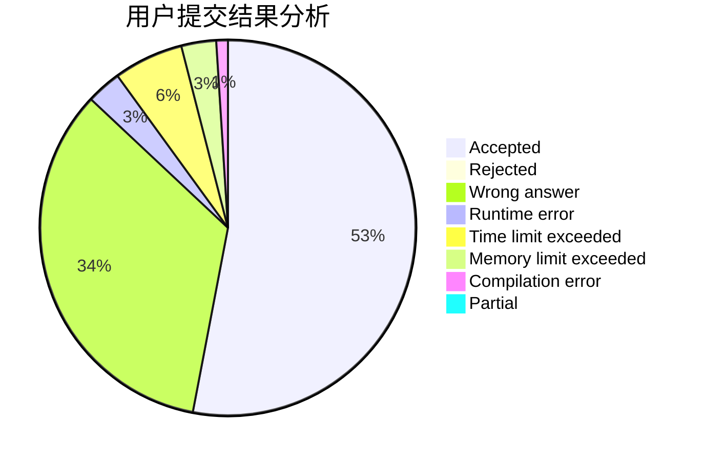
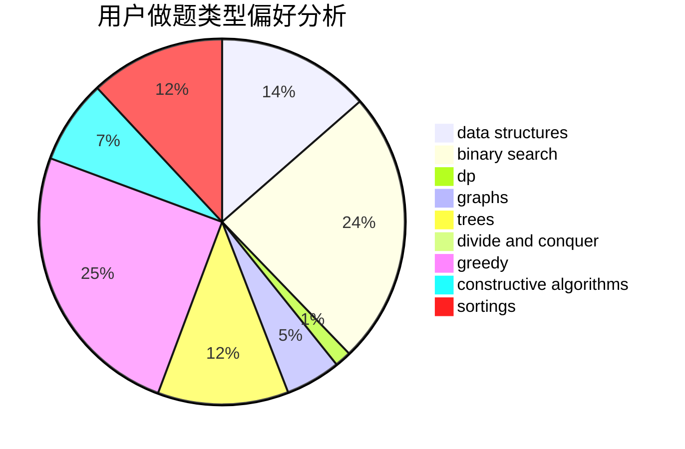
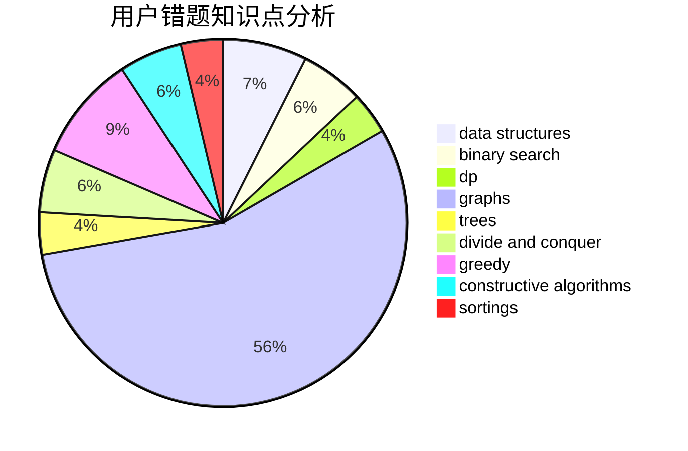

# Hazyknight
<!-- tabs:start -->
#### **用户提交结果分析**

#### **用户做题类型偏好分析**

#### **用户错题知识点分析**

<!-- tabs:end -->
# 推荐题目
[1370B](http://codeforces.com/problemset/problem/1370/B)		constructive algorithms,
                        math,
                        number theory		  
[1183F](http://codeforces.com/problemset/problem/1183/F)		brute force,
                        math,
                        sortings		  
[1395E](https://codeforces.com/contest/1395/problem/E)		brute force,
                        dfs and similar,
                        graphs,
                        hashing		  
[1270H](http://codeforces.com/problemset/problem/1270/H)		data structures		  
[877C](http://codeforces.com/problemset/problem/877/C)		constructive algorithms		  
[832C](http://codeforces.com/problemset/problem/832/C)		binary search,
                        implementation,
                        math		  
[449B](http://codeforces.com/problemset/problem/449/B)		graphs,
                        greedy,
                        shortest paths		  
[1371C](http://codeforces.com/problemset/problem/1371/C)		greedy,
                        implementation,
                        math		  
[367D](http://codeforces.com/problemset/problem/367/D)		bitmasks,
                        dfs and similar		  
[737B](https://codeforces.com/contest/737/problem/B)		math		  
<!-- tabs:start -->
#### **data structures**
[1270H](http://codeforces.com/problemset/problem/1270/H)		data structures		  
[834B](http://codeforces.com/problemset/problem/834/B)		data structures,
                        implementation		  
[321E](http://codeforces.com/problemset/problem/321/E)		data structures,
                        divide and conquer,
                        dp		  
[1213B](http://codeforces.com/problemset/problem/1213/B)		data structures,
                        implementation		  
[796C](http://codeforces.com/problemset/problem/796/C)		constructive algorithms,
                        data structures,
                        dp,
                        trees		  
[176E](http://codeforces.com/problemset/problem/176/E)		data structures,
                        dfs and similar,
                        trees		  
[6E](http://codeforces.com/problemset/problem/6/E)		binary search,
                        data structures,
                        dsu,
                        trees,
                        two pointers		  
[1009F](http://codeforces.com/problemset/problem/1009/F)		data structures,
                        dsu,
                        trees		  
[1492C](http://codeforces.com/problemset/problem/1492/C)		binary search,
                        data structures,
                        dp,
                        greedy,
                        two pointers		  
[1490G](http://codeforces.com/problemset/problem/1490/G)		binary search,
                        data structures,
                        math		  
#### **binary search**
[832C](http://codeforces.com/problemset/problem/832/C)		binary search,
                        implementation,
                        math		  
[205C](https://codeforces.com/contest/205/problem/C)		binary search,
                        combinatorics,
                        dp		  
[1076C](http://codeforces.com/problemset/problem/1076/C)		binary search,
                        math		  
[335A](http://codeforces.com/problemset/problem/335/A)		binary search,
                        constructive algorithms,
                        greedy		  
[6E](http://codeforces.com/problemset/problem/6/E)		binary search,
                        data structures,
                        dsu,
                        trees,
                        two pointers		  
[1492C](http://codeforces.com/problemset/problem/1492/C)		binary search,
                        data structures,
                        dp,
                        greedy,
                        two pointers		  
[1463D](http://codeforces.com/problemset/problem/1463/D)		binary search,
                        constructive algorithms,
                        greedy,
                        two pointers		  
[1490G](http://codeforces.com/problemset/problem/1490/G)		binary search,
                        data structures,
                        math		  
[1479D](http://codeforces.com/problemset/problem/1479/D)		binary search,
                        bitmasks,
                        brute force,
                        data structures,
                        probabilities,
                        trees		  
[1436E](http://codeforces.com/problemset/problem/1436/E)		binary search,
                        data structures,
                        two pointers		  
#### **dp**
[205C](https://codeforces.com/contest/205/problem/C)		binary search,
                        combinatorics,
                        dp		  
[321E](http://codeforces.com/problemset/problem/321/E)		data structures,
                        divide and conquer,
                        dp		  
[796C](http://codeforces.com/problemset/problem/796/C)		constructive algorithms,
                        data structures,
                        dp,
                        trees		  
[232B](http://codeforces.com/problemset/problem/232/B)		bitmasks,
                        combinatorics,
                        dp,
                        math		  
[208B](http://codeforces.com/problemset/problem/208/B)		dfs and similar,
                        dp		  
[1260E](http://codeforces.com/problemset/problem/1260/E)		brute force,
                        dp,
                        greedy		  
[1492C](http://codeforces.com/problemset/problem/1492/C)		binary search,
                        data structures,
                        dp,
                        greedy,
                        two pointers		  
[1457C](https://codeforces.com/contest/1457/problem/C)		brute force,
                        dp,
                        implementation		  
[1491C](http://codeforces.com/problemset/problem/1491/C)		brute force,
                        data structures,
                        dp,
                        greedy,
                        implementation		  
[1437C](http://codeforces.com/problemset/problem/1437/C)		dp,
                        flows,
                        graph matchings,
                        greedy,
                        math,
                        sortings		  
#### **graph**
[1395E](https://codeforces.com/contest/1395/problem/E)		brute force,
                        dfs and similar,
                        graphs,
                        hashing		  
[449B](http://codeforces.com/problemset/problem/449/B)		graphs,
                        greedy,
                        shortest paths		  
[755C](http://codeforces.com/problemset/problem/755/C)		dfs and similar,
                        dsu,
                        graphs,
                        interactive,
                        trees		  
[1471D](https://codeforces.com/contest/1471/problem/D)		bitmasks,
                        graphs,
                        hashing,
                        math,
                        number theory		  
[1487C](http://codeforces.com/problemset/problem/1487/C)		brute force,
                        constructive algorithms,
                        dfs and similar,
                        graphs,
                        greedy,
                        implementation,
                        math		  
[1437C](http://codeforces.com/problemset/problem/1437/C)		dp,
                        flows,
                        graph matchings,
                        greedy,
                        math,
                        sortings		  
[1470D](http://codeforces.com/problemset/problem/1470/D)		constructive algorithms,
                        dfs and similar,
                        graph matchings,
                        graphs,
                        greedy		  
[1476C](http://codeforces.com/problemset/problem/1476/C)		dp,
                        graphs,
                        greedy		  
[1304D](http://codeforces.com/problemset/problem/1304/D)		constructive algorithms,
                        graphs,
                        greedy,
                        two pointers		  
[1475C](http://codeforces.com/problemset/problem/1475/C)		combinatorics,
                        graphs,
                        math		  
#### **trees**
[796C](http://codeforces.com/problemset/problem/796/C)		constructive algorithms,
                        data structures,
                        dp,
                        trees		  
[755C](http://codeforces.com/problemset/problem/755/C)		dfs and similar,
                        dsu,
                        graphs,
                        interactive,
                        trees		  
[176E](http://codeforces.com/problemset/problem/176/E)		data structures,
                        dfs and similar,
                        trees		  
[6E](http://codeforces.com/problemset/problem/6/E)		binary search,
                        data structures,
                        dsu,
                        trees,
                        two pointers		  
[1009F](http://codeforces.com/problemset/problem/1009/F)		data structures,
                        dsu,
                        trees		  
[1479D](http://codeforces.com/problemset/problem/1479/D)		binary search,
                        bitmasks,
                        brute force,
                        data structures,
                        probabilities,
                        trees		  
[1511C](http://codeforces.com/problemset/problem/1511/C)		brute force,
                        data structures,
                        implementation,
                        trees		  
[1499F](http://codeforces.com/problemset/problem/1499/F)		combinatorics,
                        dfs and similar,
                        dp,
                        trees		  
[1491E](http://codeforces.com/problemset/problem/1491/E)		brute force,
                        dfs and similar,
                        divide and conquer,
                        number theory,
                        trees		  
[1466D](http://codeforces.com/problemset/problem/1466/D)		data structures,
                        greedy,
                        sortings,
                        trees		  
#### **divide and conquer**
[321E](http://codeforces.com/problemset/problem/321/E)		data structures,
                        divide and conquer,
                        dp		  
[1461D](http://codeforces.com/problemset/problem/1461/D)		binary search,
                        brute force,
                        data structures,
                        divide and conquer,
                        implementation,
                        sortings		  
[1466G](http://codeforces.com/problemset/problem/1466/G)		combinatorics,
                        divide and conquer,
                        hashing,
                        math,
                        string suffix structures,
                        strings		  
[1490D](http://codeforces.com/problemset/problem/1490/D)		dfs and similar,
                        divide and conquer,
                        implementation		  
[1483C](https://codeforces.com/contest/1483/problem/C)		data structures,
                        divide and conquer,
                        dp		  
[1491E](http://codeforces.com/problemset/problem/1491/E)		brute force,
                        dfs and similar,
                        divide and conquer,
                        number theory,
                        trees		  
[1303G](http://codeforces.com/problemset/problem/1303/G)		data structures,
                        divide and conquer,
                        geometry,
                        trees		  
[1494D](http://codeforces.com/problemset/problem/1494/D)		constructive algorithms,
                        data structures,
                        dfs and similar,
                        divide and conquer,
                        dsu,
                        greedy,
                        sortings,
                        trees		  
[1482E](http://codeforces.com/problemset/problem/1482/E)		data structures,
                        divide and conquer,
                        dp		  
[566C](http://codeforces.com/problemset/problem/566/C)		dfs and similar,
                        divide and conquer,
                        trees		  
#### **greedy**
[449B](http://codeforces.com/problemset/problem/449/B)		graphs,
                        greedy,
                        shortest paths		  
[1371C](http://codeforces.com/problemset/problem/1371/C)		greedy,
                        implementation,
                        math		  
[903A](http://codeforces.com/problemset/problem/903/A)		greedy,
                        implementation		  
[335A](http://codeforces.com/problemset/problem/335/A)		binary search,
                        constructive algorithms,
                        greedy		  
[1260E](http://codeforces.com/problemset/problem/1260/E)		brute force,
                        dp,
                        greedy		  
[1153C](http://codeforces.com/problemset/problem/1153/C)		greedy,
                        strings		  
[1204D1](http://codeforces.com/problemset/problem/1204/D1)		brute force,
                        greedy,
                        strings		  
[1495A](http://codeforces.com/problemset/problem/1495/A)		geometry,
                        greedy,
                        math,
                        sortings		  
[1492C](http://codeforces.com/problemset/problem/1492/C)		binary search,
                        data structures,
                        dp,
                        greedy,
                        two pointers		  
[1496C](https://codeforces.com/contest/1496/problem/C)		geometry,
                        greedy,
                        math,
                        sortings		  
#### **constructive algorithms**
[1370B](http://codeforces.com/problemset/problem/1370/B)		constructive algorithms,
                        math,
                        number theory		  
[877C](http://codeforces.com/problemset/problem/877/C)		constructive algorithms		  
[183A](http://codeforces.com/problemset/problem/183/A)		constructive algorithms,
                        math		  
[796C](http://codeforces.com/problemset/problem/796/C)		constructive algorithms,
                        data structures,
                        dp,
                        trees		  
[271E](http://codeforces.com/problemset/problem/271/E)		constructive algorithms,
                        math,
                        number theory		  
[335A](http://codeforces.com/problemset/problem/335/A)		binary search,
                        constructive algorithms,
                        greedy		  
[1421C](http://codeforces.com/problemset/problem/1421/C)		constructive algorithms,
                        strings		  
[1493A](http://codeforces.com/problemset/problem/1493/A)		constructive algorithms,
                        greedy		  
[1463D](http://codeforces.com/problemset/problem/1463/D)		binary search,
                        constructive algorithms,
                        greedy,
                        two pointers		  
[1456B](https://codeforces.com/contest/1456/problem/B)		bitmasks,
                        brute force,
                        constructive algorithms		  
#### **sortings**
[1183F](http://codeforces.com/problemset/problem/1183/F)		brute force,
                        math,
                        sortings		  
[1495A](http://codeforces.com/problemset/problem/1495/A)		geometry,
                        greedy,
                        math,
                        sortings		  
[1496C](https://codeforces.com/contest/1496/problem/C)		geometry,
                        greedy,
                        math,
                        sortings		  
[1495A](http://codeforces.com/problemset/problem/1495/A)		geometry,
                        greedy,
                        math,
                        sortings		  
[1497A](http://codeforces.com/problemset/problem/1497/A)		brute force,
                        data structures,
                        greedy,
                        sortings		  
[1427A](http://codeforces.com/problemset/problem/1427/A)		math,
                        sortings		  
[1461D](http://codeforces.com/problemset/problem/1461/D)		binary search,
                        brute force,
                        data structures,
                        divide and conquer,
                        implementation,
                        sortings		  
[1437C](http://codeforces.com/problemset/problem/1437/C)		dp,
                        flows,
                        graph matchings,
                        greedy,
                        math,
                        sortings		  
[1473A](http://codeforces.com/problemset/problem/1473/A)		greedy,
                        implementation,
                        math,
                        sortings		  
[1486B](http://codeforces.com/problemset/problem/1486/B)		binary search,
                        geometry,
                        shortest paths,
                        sortings		  
<!-- tabs:end -->
