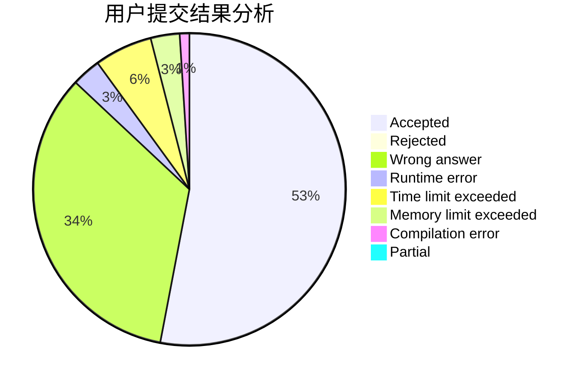
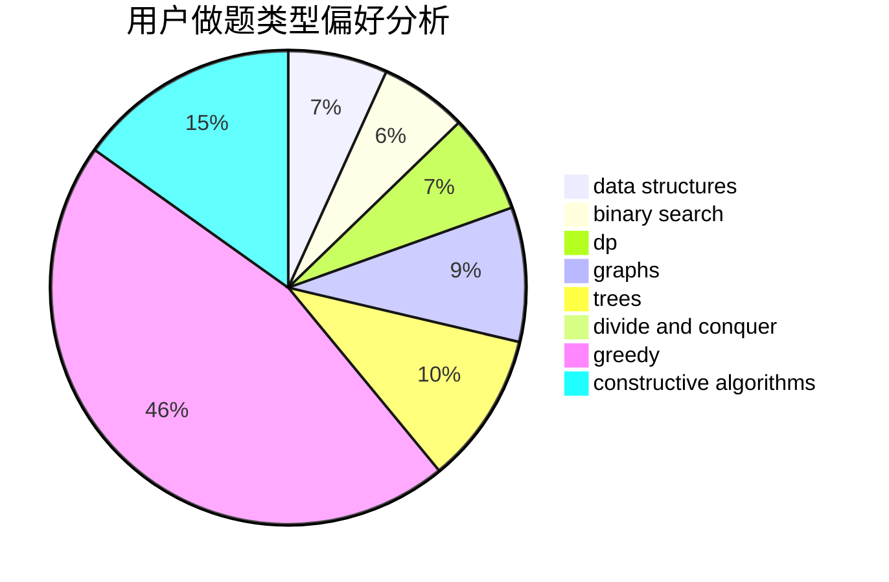
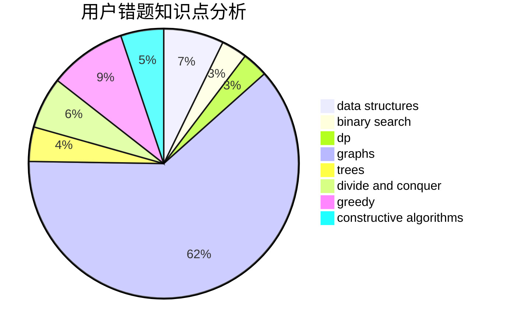

# Hazyknight

<!-- tabs:start -->

#### **用户提交结果分析**

#### **用户做题类型偏好分析**

#### **用户错题知识点分析**

<!-- tabs:end -->
# 推荐题目
[12092](https://codeforces.com/contest/1209/problem/2)		dsu,graphs,sortings,trees		  
[1280A](https://codeforces.com/contest/1280/problem/A)		implementation,
                        math		  
[810D](https://codeforces.com/contest/810/problem/D)		dsu,graphs,sortings,trees		  
[468E](https://codeforces.com/contest/468/problem/E)		dp,
                        graph matchings,
                        math,
                        meet-in-the-middle		  
[1167F](https://codeforces.com/contest/1167/problem/F)		combinatorics,
                        data structures,
                        math,
                        sortings		  
[147B](https://codeforces.com/contest/147/problem/B)		binary search,
                        graphs,
                        matrices		  
[398C](https://codeforces.com/contest/398/problem/C)		constructive algorithms		  
[254A](https://codeforces.com/contest/254/problem/A)		constructive algorithms,
                        sortings		  
[919B](https://codeforces.com/contest/919/problem/B)		binary search,
                        brute force,
                        dp,
                        implementation,
                        number theory		  
[898B](https://codeforces.com/contest/898/problem/B)		brute force,
                        implementation,
                        number theory		  
