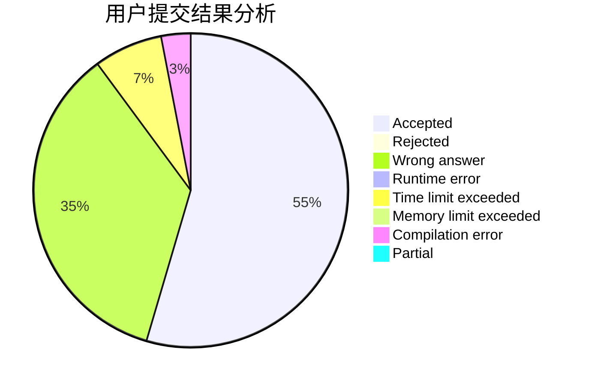
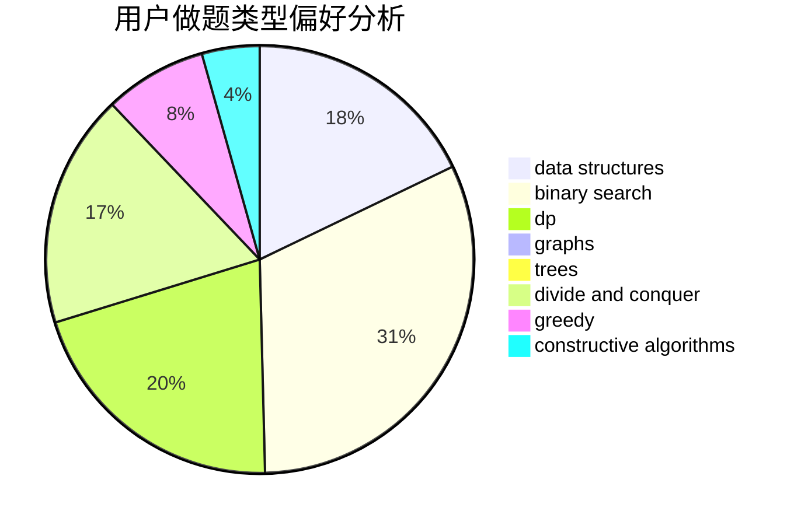
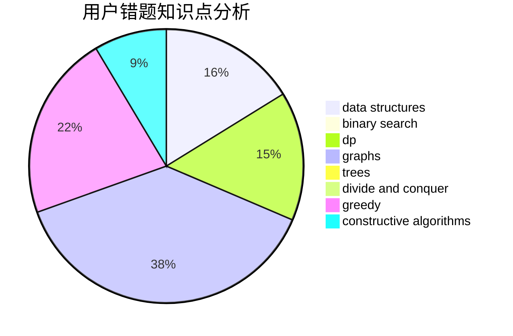

# He_Ren

<!-- tabs:start -->

#### **用户提交结果分析**

#### **用户做题类型偏好分析**

#### **用户错题知识点分析**

<!-- tabs:end -->
# 推荐题目
[1417E](https://codeforces.com/contest/1417/problem/E)		dsu,graphs,sortings,trees		  
[1251B](https://codeforces.com/contest/1251/problem/B)		greedy,
                        strings		  
[1131D](https://codeforces.com/contest/1131/problem/D)		dfs and similar,
                        dp,
                        dsu,
                        graphs,
                        greedy		  
[580E](https://codeforces.com/contest/580/problem/E)		data structures,
                        hashing,
                        strings		  
[570D](https://codeforces.com/contest/570/problem/D)		binary search,
                        bitmasks,
                        constructive algorithms,
                        dfs and similar,
                        graphs,
                        trees		  
[903D](https://codeforces.com/contest/903/problem/D)		data structures,
                        math		  
[527C](https://codeforces.com/contest/527/problem/C)		binary search,
                        data structures,
                        implementation		  
[30E](https://codeforces.com/contest/30/problem/E)		binary search,
                        constructive algorithms,
                        data structures,
                        greedy,
                        hashing,
                        strings		  
[1064C](https://codeforces.com/contest/1064/problem/C)		dsu,graphs,sortings,trees		  
[367E](https://codeforces.com/contest/367/problem/E)		combinatorics,
                        dp		  
