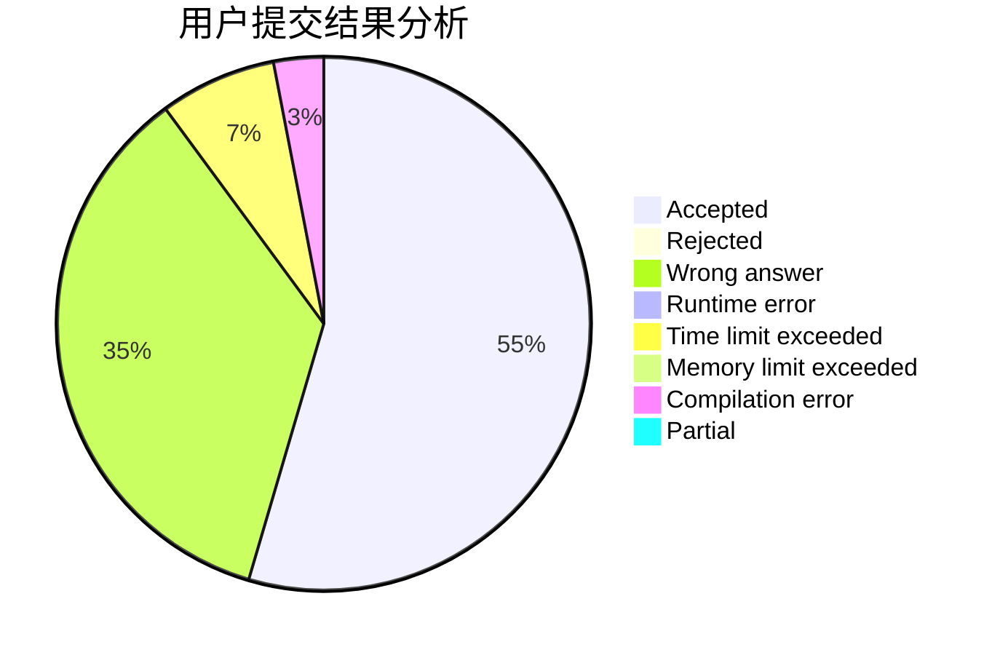
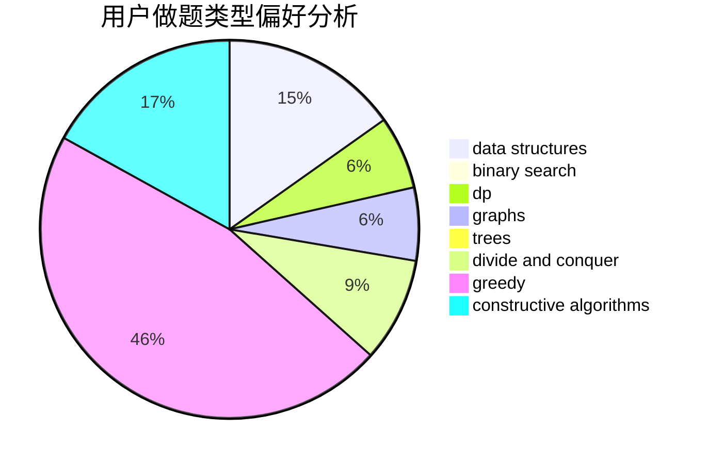
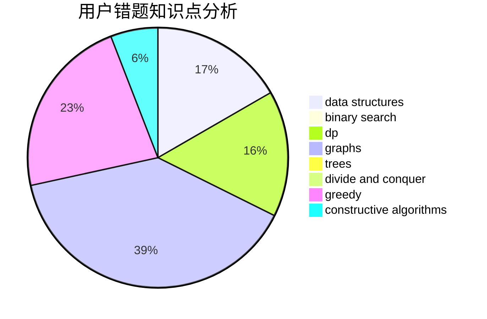

# He_Ren

<!-- tabs:start -->

#### **用户提交结果分析**

#### **用户做题类型偏好分析**

#### **用户错题知识点分析**

<!-- tabs:end -->
# 推荐题目
[1425B](https://codeforces.com/contest/1425/problem/B)		divide and conquer,
                        dp		  
[1256C](https://codeforces.com/contest/1256/problem/C)		greedy		  
[1133A](https://codeforces.com/contest/1133/problem/A)		implementation		  
[601A](https://codeforces.com/contest/601/problem/A)		graphs,
                        shortest paths		  
[591A](https://codeforces.com/contest/591/problem/A)		implementation,
                        math		  
[919D](https://codeforces.com/contest/919/problem/D)		dfs and similar,
                        dp,
                        graphs		  
[551C](https://codeforces.com/contest/551/problem/C)		binary search,
                        greedy		  
[333E](https://codeforces.com/contest/333/problem/E)		binary search,
                        bitmasks,
                        brute force,
                        geometry,
                        sortings		  
[1064F](https://codeforces.com/contest/1064/problem/F)		dsu,graphs,sortings,trees		  
[398E](https://codeforces.com/contest/398/problem/E)		nan		  
