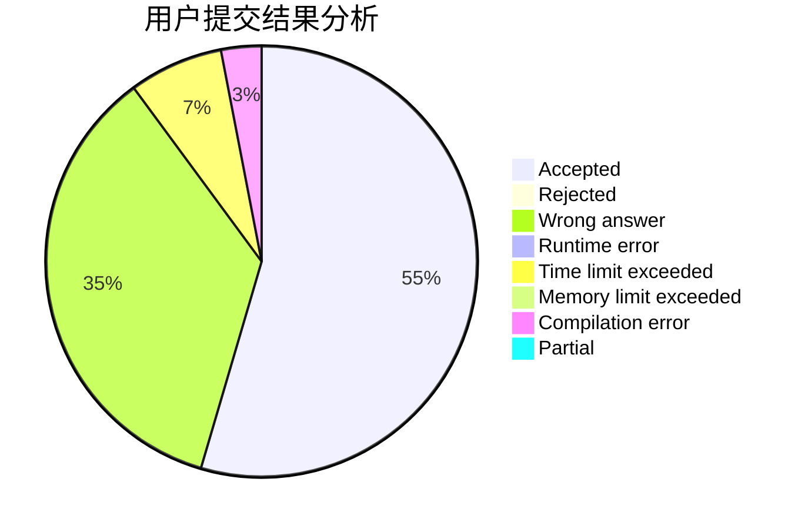
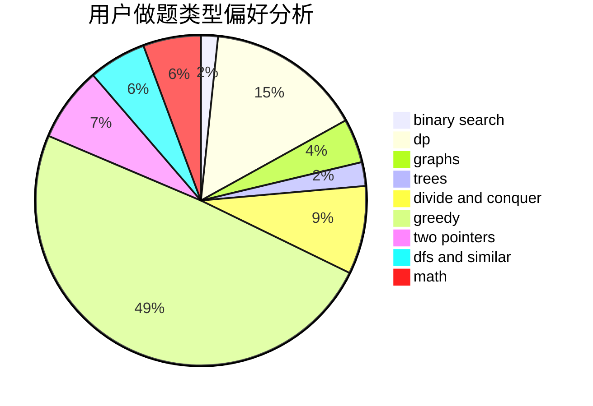

# He_Ren

<!-- tabs:start -->

#### **用户提交结果分析**

#### **用户做题类型偏好分析**

<!-- tabs:end -->
# 推荐题目
[1425B](https://codeforces.com/contest/1425/problem/B)
[1256C](https://codeforces.com/contest/1256/problem/C)
[1133A](https://codeforces.com/contest/1133/problem/A)
[601A](https://codeforces.com/contest/601/problem/A)
[591A](https://codeforces.com/contest/591/problem/A)
[919D](https://codeforces.com/contest/919/problem/D)
[551C](https://codeforces.com/contest/551/problem/C)
[333E](https://codeforces.com/contest/333/problem/E)
[1064F](https://codeforces.com/contest/1064/problem/F)
[398E](https://codeforces.com/contest/398/problem/E)
