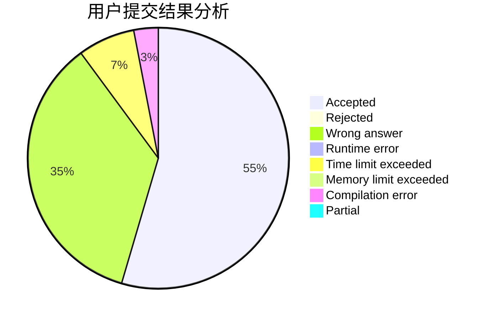
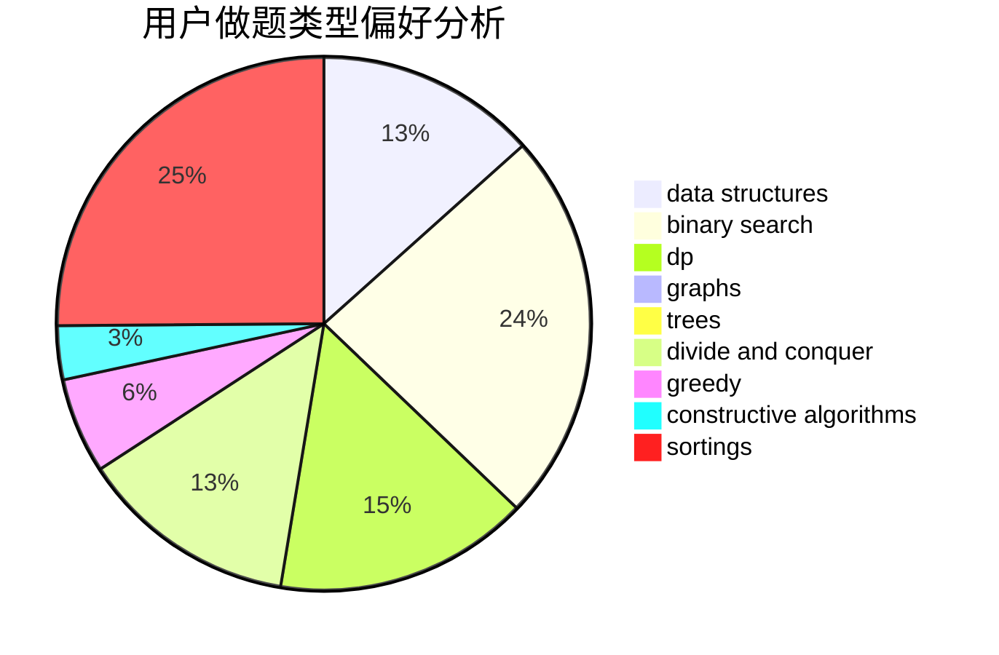
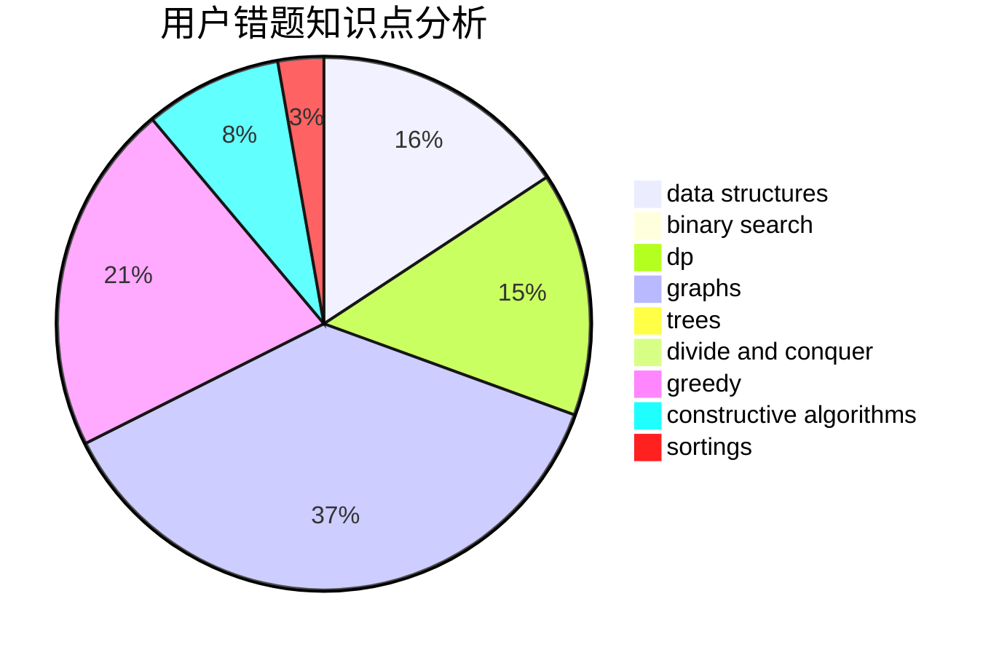

# He_Ren
<!-- tabs:start -->
#### **用户提交结果分析**

#### **用户做题类型偏好分析**

#### **用户错题知识点分析**

<!-- tabs:end -->
# 推荐题目
[1038C](http://codeforces.com/problemset/problem/1038/C)		greedy,
                        sortings		  
[1131D](http://codeforces.com/problemset/problem/1131/D)		dfs and similar,
                        dp,
                        dsu,
                        graphs,
                        greedy		  
[767A](http://codeforces.com/problemset/problem/767/A)		data structures,
                        implementation		  
[527C](http://codeforces.com/problemset/problem/527/C)		binary search,
                        data structures,
                        implementation		  
[1417E](https://codeforces.com/contest/1417/problem/E)		bitmasks,
                        data structures,
                        divide and conquer,
                        dp,
                        greedy,
                        math,
                        sortings,
                        strings,
                        trees		  
[903B](http://codeforces.com/problemset/problem/903/B)		greedy,
                        implementation		  
[1387B2](http://codeforces.com/problemset/problem/1387/B2)		*special problem,
                        dfs and similar,
                        trees		  
[903D](http://codeforces.com/problemset/problem/903/D)		data structures,
                        math		  
[1371E2](http://codeforces.com/problemset/problem/1371/E2)		binary search,
                        combinatorics,
                        dp,
                        math,
                        number theory,
                        sortings		  
[618E](http://codeforces.com/problemset/problem/618/E)		data structures,
                        geometry		  
<!-- tabs:start -->
#### **data structures**
[767A](http://codeforces.com/problemset/problem/767/A)		data structures,
                        implementation		  
[527C](http://codeforces.com/problemset/problem/527/C)		binary search,
                        data structures,
                        implementation		  
[1417E](https://codeforces.com/contest/1417/problem/E)		bitmasks,
                        data structures,
                        divide and conquer,
                        dp,
                        greedy,
                        math,
                        sortings,
                        strings,
                        trees		  
[903D](http://codeforces.com/problemset/problem/903/D)		data structures,
                        math		  
[618E](http://codeforces.com/problemset/problem/618/E)		data structures,
                        geometry		  
[1371F](http://codeforces.com/problemset/problem/1371/F)		data structures,
                        divide and conquer,
                        implementation		  
[580E](http://codeforces.com/problemset/problem/580/E)		data structures,
                        hashing,
                        strings		  
[30E](http://codeforces.com/problemset/problem/30/E)		binary search,
                        constructive algorithms,
                        data structures,
                        greedy,
                        hashing,
                        strings		  
[1386B](http://codeforces.com/problemset/problem/1386/B)		*special problem,
                        data structures,
                        geometry,
                        math,
                        sortings		  
[1287D](https://codeforces.com/contest/1287/problem/D)		constructive algorithms,
                        data structures,
                        dfs and similar,
                        graphs,
                        greedy,
                        trees		  
#### **binary search**
[527C](http://codeforces.com/problemset/problem/527/C)		binary search,
                        data structures,
                        implementation		  
[1371E2](http://codeforces.com/problemset/problem/1371/E2)		binary search,
                        combinatorics,
                        dp,
                        math,
                        number theory,
                        sortings		  
[570D](http://codeforces.com/problemset/problem/570/D)		binary search,
                        bitmasks,
                        constructive algorithms,
                        dfs and similar,
                        graphs,
                        trees		  
[30E](http://codeforces.com/problemset/problem/30/E)		binary search,
                        constructive algorithms,
                        data structures,
                        greedy,
                        hashing,
                        strings		  
[1492C](http://codeforces.com/problemset/problem/1492/C)		binary search,
                        data structures,
                        dp,
                        greedy,
                        two pointers		  
[1463D](http://codeforces.com/problemset/problem/1463/D)		binary search,
                        constructive algorithms,
                        greedy,
                        two pointers		  
[1490G](http://codeforces.com/problemset/problem/1490/G)		binary search,
                        data structures,
                        math		  
[1479D](http://codeforces.com/problemset/problem/1479/D)		binary search,
                        bitmasks,
                        brute force,
                        data structures,
                        probabilities,
                        trees		  
[1436E](http://codeforces.com/problemset/problem/1436/E)		binary search,
                        data structures,
                        two pointers		  
[1461D](http://codeforces.com/problemset/problem/1461/D)		binary search,
                        brute force,
                        data structures,
                        divide and conquer,
                        implementation,
                        sortings		  
#### **dp**
[1131D](http://codeforces.com/problemset/problem/1131/D)		dfs and similar,
                        dp,
                        dsu,
                        graphs,
                        greedy		  
[1417E](https://codeforces.com/contest/1417/problem/E)		bitmasks,
                        data structures,
                        divide and conquer,
                        dp,
                        greedy,
                        math,
                        sortings,
                        strings,
                        trees		  
[1371E2](http://codeforces.com/problemset/problem/1371/E2)		binary search,
                        combinatorics,
                        dp,
                        math,
                        number theory,
                        sortings		  
[367E](http://codeforces.com/problemset/problem/367/E)		combinatorics,
                        dp		  
[687C](http://codeforces.com/problemset/problem/687/C)		dp		  
[1491C](http://codeforces.com/problemset/problem/1491/C)		brute force,
                        data structures,
                        dp,
                        greedy,
                        implementation		  
[1492C](http://codeforces.com/problemset/problem/1492/C)		binary search,
                        data structures,
                        dp,
                        greedy,
                        two pointers		  
[1457C](https://codeforces.com/contest/1457/problem/C)		brute force,
                        dp,
                        implementation		  
[1491C](http://codeforces.com/problemset/problem/1491/C)		brute force,
                        data structures,
                        dp,
                        greedy,
                        implementation		  
[1437C](http://codeforces.com/problemset/problem/1437/C)		dp,
                        flows,
                        graph matchings,
                        greedy,
                        math,
                        sortings		  
#### **graph**
[1131D](http://codeforces.com/problemset/problem/1131/D)		dfs and similar,
                        dp,
                        dsu,
                        graphs,
                        greedy		  
[570D](http://codeforces.com/problemset/problem/570/D)		binary search,
                        bitmasks,
                        constructive algorithms,
                        dfs and similar,
                        graphs,
                        trees		  
[627F](http://codeforces.com/problemset/problem/627/F)		dfs and similar,
                        dsu,
                        graphs,
                        trees		  
[1513D](http://codeforces.com/problemset/problem/1513/D)		constructive algorithms,
                        dsu,
                        graphs,
                        greedy,
                        number theory,
                        sortings		  
[1287D](https://codeforces.com/contest/1287/problem/D)		constructive algorithms,
                        data structures,
                        dfs and similar,
                        graphs,
                        greedy,
                        trees		  
[1487C](http://codeforces.com/problemset/problem/1487/C)		brute force,
                        constructive algorithms,
                        dfs and similar,
                        graphs,
                        greedy,
                        implementation,
                        math		  
[1437C](http://codeforces.com/problemset/problem/1437/C)		dp,
                        flows,
                        graph matchings,
                        greedy,
                        math,
                        sortings		  
[1470D](http://codeforces.com/problemset/problem/1470/D)		constructive algorithms,
                        dfs and similar,
                        graph matchings,
                        graphs,
                        greedy		  
[1476C](http://codeforces.com/problemset/problem/1476/C)		dp,
                        graphs,
                        greedy		  
[1304D](http://codeforces.com/problemset/problem/1304/D)		constructive algorithms,
                        graphs,
                        greedy,
                        two pointers		  
#### **trees**
[1417E](https://codeforces.com/contest/1417/problem/E)		bitmasks,
                        data structures,
                        divide and conquer,
                        dp,
                        greedy,
                        math,
                        sortings,
                        strings,
                        trees		  
[1387B2](http://codeforces.com/problemset/problem/1387/B2)		*special problem,
                        dfs and similar,
                        trees		  
[570D](http://codeforces.com/problemset/problem/570/D)		binary search,
                        bitmasks,
                        constructive algorithms,
                        dfs and similar,
                        graphs,
                        trees		  
[627F](http://codeforces.com/problemset/problem/627/F)		dfs and similar,
                        dsu,
                        graphs,
                        trees		  
[1287D](https://codeforces.com/contest/1287/problem/D)		constructive algorithms,
                        data structures,
                        dfs and similar,
                        graphs,
                        greedy,
                        trees		  
[1479D](http://codeforces.com/problemset/problem/1479/D)		binary search,
                        bitmasks,
                        brute force,
                        data structures,
                        probabilities,
                        trees		  
[1511C](http://codeforces.com/problemset/problem/1511/C)		brute force,
                        data structures,
                        implementation,
                        trees		  
[1499F](http://codeforces.com/problemset/problem/1499/F)		combinatorics,
                        dfs and similar,
                        dp,
                        trees		  
[1491E](http://codeforces.com/problemset/problem/1491/E)		brute force,
                        dfs and similar,
                        divide and conquer,
                        number theory,
                        trees		  
[1466D](http://codeforces.com/problemset/problem/1466/D)		data structures,
                        greedy,
                        sortings,
                        trees		  
#### **divide and conquer**
[1417E](https://codeforces.com/contest/1417/problem/E)		bitmasks,
                        data structures,
                        divide and conquer,
                        dp,
                        greedy,
                        math,
                        sortings,
                        strings,
                        trees		  
[1371F](http://codeforces.com/problemset/problem/1371/F)		data structures,
                        divide and conquer,
                        implementation		  
[1461D](http://codeforces.com/problemset/problem/1461/D)		binary search,
                        brute force,
                        data structures,
                        divide and conquer,
                        implementation,
                        sortings		  
[1466G](http://codeforces.com/problemset/problem/1466/G)		combinatorics,
                        divide and conquer,
                        hashing,
                        math,
                        string suffix structures,
                        strings		  
[1490D](http://codeforces.com/problemset/problem/1490/D)		dfs and similar,
                        divide and conquer,
                        implementation		  
[1483C](https://codeforces.com/contest/1483/problem/C)		data structures,
                        divide and conquer,
                        dp		  
[1491E](http://codeforces.com/problemset/problem/1491/E)		brute force,
                        dfs and similar,
                        divide and conquer,
                        number theory,
                        trees		  
[1303G](http://codeforces.com/problemset/problem/1303/G)		data structures,
                        divide and conquer,
                        geometry,
                        trees		  
[1494D](http://codeforces.com/problemset/problem/1494/D)		constructive algorithms,
                        data structures,
                        dfs and similar,
                        divide and conquer,
                        dsu,
                        greedy,
                        sortings,
                        trees		  
[1482E](http://codeforces.com/problemset/problem/1482/E)		data structures,
                        divide and conquer,
                        dp		  
#### **greedy**
[1038C](http://codeforces.com/problemset/problem/1038/C)		greedy,
                        sortings		  
[1131D](http://codeforces.com/problemset/problem/1131/D)		dfs and similar,
                        dp,
                        dsu,
                        graphs,
                        greedy		  
[1417E](https://codeforces.com/contest/1417/problem/E)		bitmasks,
                        data structures,
                        divide and conquer,
                        dp,
                        greedy,
                        math,
                        sortings,
                        strings,
                        trees		  
[903B](http://codeforces.com/problemset/problem/903/B)		greedy,
                        implementation		  
[1251B](http://codeforces.com/problemset/problem/1251/B)		greedy,
                        strings		  
[853A](http://codeforces.com/problemset/problem/853/A)		greedy		  
[30E](http://codeforces.com/problemset/problem/30/E)		binary search,
                        constructive algorithms,
                        data structures,
                        greedy,
                        hashing,
                        strings		  
[665D](http://codeforces.com/problemset/problem/665/D)		constructive algorithms,
                        greedy,
                        number theory		  
[1265C](https://codeforces.com/contest/1265/problem/C)		greedy,
                        implementation		  
[1513D](http://codeforces.com/problemset/problem/1513/D)		constructive algorithms,
                        dsu,
                        graphs,
                        greedy,
                        number theory,
                        sortings		  
#### **constructive algorithms**
[570D](http://codeforces.com/problemset/problem/570/D)		binary search,
                        bitmasks,
                        constructive algorithms,
                        dfs and similar,
                        graphs,
                        trees		  
[1255C](http://codeforces.com/problemset/problem/1255/C)		constructive algorithms,
                        implementation		  
[30E](http://codeforces.com/problemset/problem/30/E)		binary search,
                        constructive algorithms,
                        data structures,
                        greedy,
                        hashing,
                        strings		  
[665D](http://codeforces.com/problemset/problem/665/D)		constructive algorithms,
                        greedy,
                        number theory		  
[1513D](http://codeforces.com/problemset/problem/1513/D)		constructive algorithms,
                        dsu,
                        graphs,
                        greedy,
                        number theory,
                        sortings		  
[1064C](https://codeforces.com/contest/1064/problem/C)		constructive algorithms,
                        strings		  
[1287D](https://codeforces.com/contest/1287/problem/D)		constructive algorithms,
                        data structures,
                        dfs and similar,
                        graphs,
                        greedy,
                        trees		  
[1493A](http://codeforces.com/problemset/problem/1493/A)		constructive algorithms,
                        greedy		  
[1463D](http://codeforces.com/problemset/problem/1463/D)		binary search,
                        constructive algorithms,
                        greedy,
                        two pointers		  
[1456B](https://codeforces.com/contest/1456/problem/B)		bitmasks,
                        brute force,
                        constructive algorithms		  
#### **sortings**
[1038C](http://codeforces.com/problemset/problem/1038/C)		greedy,
                        sortings		  
[1417E](https://codeforces.com/contest/1417/problem/E)		bitmasks,
                        data structures,
                        divide and conquer,
                        dp,
                        greedy,
                        math,
                        sortings,
                        strings,
                        trees		  
[1371E2](http://codeforces.com/problemset/problem/1371/E2)		binary search,
                        combinatorics,
                        dp,
                        math,
                        number theory,
                        sortings		  
[1386B](http://codeforces.com/problemset/problem/1386/B)		*special problem,
                        data structures,
                        geometry,
                        math,
                        sortings		  
[1513D](http://codeforces.com/problemset/problem/1513/D)		constructive algorithms,
                        dsu,
                        graphs,
                        greedy,
                        number theory,
                        sortings		  
[1496C](https://codeforces.com/contest/1496/problem/C)		geometry,
                        greedy,
                        math,
                        sortings		  
[1495A](http://codeforces.com/problemset/problem/1495/A)		geometry,
                        greedy,
                        math,
                        sortings		  
[1497A](http://codeforces.com/problemset/problem/1497/A)		brute force,
                        data structures,
                        greedy,
                        sortings		  
[1427A](http://codeforces.com/problemset/problem/1427/A)		math,
                        sortings		  
[1461D](http://codeforces.com/problemset/problem/1461/D)		binary search,
                        brute force,
                        data structures,
                        divide and conquer,
                        implementation,
                        sortings		  
<!-- tabs:end -->
